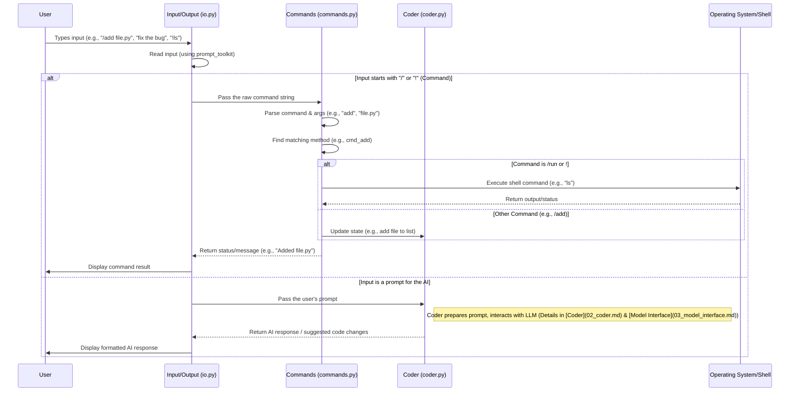

# Chapter 1: Input/Output (IO) & Commands

Welcome to the Aider codebase! This first chapter introduces you to how Aider interacts with you, the user, through the command line. Think of this as Aider's "face" – how it listens to you and how it talks back.

## What's the Big Idea? Talking to Aider

Imagine you want Aider to help you write some code. You need a way to tell it *what* file to work on and *what* changes to make. Then, you need to see what Aider suggests or what errors it encounters.

This chapter explores the part of Aider responsible for this conversation:

1.  **Getting your instructions:** Reading what you type in the terminal.
2.  **Showing you results:** Displaying messages, code suggestions, and confirmations.
3.  **Understanding special commands:** Handling instructions like `/add file.py` or `/run my_script.py`.

Let's say you want Aider to add a new file called `hello.py` to its "awareness" and then run it. The IO & Commands layer is what makes this possible:

*   You type: `/add hello.py`
*   Aider (via IO & Commands) understands this isn't a request for the AI, but a special instruction. It adds the file.
*   Aider (via IO & Commands) replies: `Added hello.py to the chat`
*   You type: `!python hello.py` (or `/run python hello.py`)
*   Aider (via IO & Commands) understands this is another special instruction to run a command. It runs the script.
*   Aider (via IO & Commands) shows you the output of `python hello.py`.

This layer acts like the messenger and interpreter between you and the deeper parts of Aider.

## Key Concepts: How the Conversation Works

Let's break down the components involved in this user interaction:

### 1. The Conversation Window (Your Terminal)

Think of your terminal window, after you start Aider, as a dedicated chat window. This is where the entire conversation happens. You type messages, Aider types back. Simple!

### 2. Typing Your Messages (Input Handling - `aider/io.py`)

When you type, Aider doesn't just passively read characters. It tries to be helpful:

*   **History:** Just like in your regular shell, you can press the `Up Arrow` key to access previous messages or commands you've typed. This saves you retyping!
*   **Autocompletion:** If you start typing a command like `/ad` and press `Tab`, Aider might suggest `/add`. It can also autocomplete filenames you've already added or that are in your project. This is handled by the `AutoCompleter` class within `aider/io.py`.
*   **Reading the Input:** The `InputOutput` class (often referred to as `io`) in `aider/io.py` is responsible for presenting the prompt (`> `) and reading your input line by line, using a library called `prompt_toolkit` for the fancy history and autocompletion features.

Here's a highly simplified view of how `io.py` gets input:

```python
# Simplified from aider/io.py - InputOutput class
class InputOutput:
    # ... other methods ...

    def get_input(self, ...):
        # ... setup completer, history, etc. ...
        self.rule() # Prints a visual separator line

        # Display which files are currently in chat
        show = self.format_files_for_input(...)
        show += self.prompt_prefix # Usually "> "

        try:
            # Use prompt_toolkit to get input with history & completion
            if self.prompt_session:
                line = self.prompt_session.prompt(
                    show,
                    # ... more options ...
                )
            else: # Fallback for simpler terminals
                line = input(show)

            # ... handle multi-line input ...

        except EOFError: # User pressed Ctrl+D
            raise
        # ... other error handling ...

        print() # Add a newline after input
        self.user_input(line) # Log the input
        return line
```

This snippet shows the core idea: display a prompt (potentially listing files), read a line using `prompt_toolkit` (if available), handle potential errors, and return the text the user typed.

### 3. Seeing Aider's Replies (Output Handling - `aider/io.py`)

When Aider or the AI model needs to tell you something, the `InputOutput` class in `aider/io.py` handles displaying it:

*   **Plain Messages:** Status updates like "Added file.py" or warnings.
*   **Formatted Code:** Code blocks suggested by the AI are often shown with syntax highlighting.
*   **Markdown:** AI explanations can be formatted using Markdown (like **bold** text, lists, etc.).
*   **Colors:** Different types of output (your input, Aider's messages, errors) can have distinct colors to make them easier to read. Libraries like `rich` are used for this pretty printing.

Here's a simplified look at how Aider might show a tool message:

```python
# Simplified from aider/io.py - InputOutput class
from rich.console import Console
from rich.text import Text

class InputOutput:
    def __init__(self, ...):
        # ... setup ...
        # Console handles fancy printing
        self.console = Console(...)
        self.tool_output_color = "blue" # Example color
        # ...

    def _tool_message(self, message="", color=None):
        # Log the message to chat history file (omitted for simplicity)
        # ...

        # Use rich library to print with color
        text = Text(message)
        style = dict(style=color) if self.pretty and color else dict()
        self.console.print(text, **style)

    def tool_output(self, *messages, log_only=False, bold=False):
        # ... log messages ...
        if log_only:
            return

        # Join multiple message parts if needed
        message_text = " ".join(map(str, messages))
        self._tool_message(message_text, self.tool_output_color)

    def tool_error(self, message=""):
        # Similar, but uses self.tool_error_color
        self._tool_message(message, self.tool_error_color)

```

This shows how messages are passed to the `rich` `Console` for potentially colored and formatted output in the terminal.

### 4. Special Instructions (Command Processing - `aider/commands.py`)

When your input starts with a `/` (like `/add`, `/run`, `/help`) or `!` (a shortcut for `/run`), Aider knows this isn't a prompt for the AI. Instead, it's a command for Aider itself.

The `Commands` class in `aider/commands.py` is responsible for:

*   **Identifying Commands:** Checking if the input starts with `/` or `!`.
*   **Matching Commands:** Finding the right function to handle the command (e.g., `/add` maps to the `cmd_add` method).
*   **Executing Commands:** Running the corresponding Python code (e.g., adding a file path to a list, running a shell command).
*   **Providing Help:** The `/help` command uses information within the `Commands` class to show you available commands.

Here's a simplified look at how the `Commands` class might handle running a command:

```python
# Simplified from aider/commands.py
class Commands:
    def __init__(self, io, coder, ...):
        self.io = io       # Reference to InputOutput object
        self.coder = coder # Reference to the Coder object (more in Ch 2)
        # ...

    # Method names starting with cmd_ become commands
    def cmd_add(self, args):
        "Add files to the chat..." # Docstring becomes help text
        filenames = args.split() # Basic parsing
        for fname in filenames:
            # ... logic to find the file and check validity ...
            abs_path = self.coder.abs_root_path(fname)
            if abs_path not in self.coder.abs_fnames:
                self.coder.abs_fnames.add(abs_path)
                self.io.tool_output(f"Added {fname} to the chat")
            else:
                self.io.tool_error(f"{fname} is already in the chat")

    def cmd_run(self, args):
        "Run a shell command..."
        exit_status, output = run_cmd(args, cwd=self.coder.root) # External function
        if output:
            self.io.tool_output(output) # Show the command output
        # ... potentially add output to chat history for the AI ...

    def run(self, inp):
        # Check if it's a shell command alias
        if inp.startswith("!"):
            return self.do_run("run", inp[1:]) # Call cmd_run

        # Check for slash commands
        if inp.startswith("/"):
            parts = inp.split(maxsplit=1)
            command_name = parts[0][1:] # Get "add" from "/add"
            args = parts[1] if len(parts) > 1 else ""

            # Find the method like 'cmd_add'
            cmd_method_name = f"cmd_{command_name.replace('-', '_')}"
            cmd_method = getattr(self, cmd_method_name, None)

            if cmd_method:
                return cmd_method(args) # Execute the command method
            else:
                self.io.tool_error(f"Invalid command: {parts[0]}")
```

This shows how input starting with `/` or `!` is parsed, matched to specific `cmd_...` methods within the `Commands` class, and then executed. The `Commands` class uses the `io` object to display results back to the user.

## Under the Hood: The Flow of Interaction

Let's visualize the typical flow when you interact with Aider:



This diagram illustrates how the `IO` module first receives your input. It checks if it's a command (starting with `/` or `!`).
*   **If it's a command:** It passes the command to the `Commands` module for processing. The `Commands` module might interact with the operating system (for `/run`) or modify Aider's internal state (like the list of files the [Coder](02_coder.md) knows about for `/add`). Finally, `Commands` tells `IO` what message to display back to you.
*   **If it's not a command:** It's treated as a prompt for the AI. `IO` passes it to the [Coder](02_coder.md) module (which we'll cover next), waits for the AI's response, and then uses its formatting abilities to display that response nicely.

## Conclusion

The Input/Output (IO) & Commands layer is Aider's user interface. It's responsible for the entire conversation flow you see in your terminal: getting your input (with helpful features like history and autocompletion), displaying Aider's responses (with colors and formatting), and handling special `/` commands that control Aider's behavior directly. It acts as the bridge between you and the core AI logic.

Now that you understand how Aider talks to you, let's dive into the brain behind the operation. In the next chapter, we'll explore the [Coder](02_coder.md), the central component that manages the AI interaction, understands your code, and applies the changes suggested by the language model.

[Next Chapter: Coder](02_coder.md)

---

Generated by [AI Codebase Knowledge Builder](https://github.com/The-Pocket/Tutorial-Codebase-Knowledge)