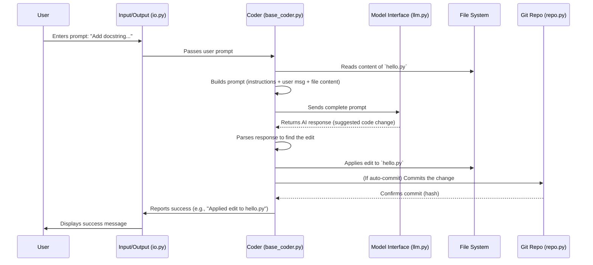

# Chapter 2: Coder - The Brain of Aider

Welcome back! In [Chapter 1: Input/Output (IO) & Commands](01_input_output__io____commands.md), we saw how Aider talks to you through the terminal. But what happens after you give Aider an instruction like "Refactor the `calculate_area` function in `shapes.py`"? How does Aider understand your code, talk to the AI, and actually make the changes?

That's where the **Coder** comes in. Think of the Coder as the central **brain** or **project manager** of Aider. It coordinates everything that needs to happen to fulfill your request.

## What's the Big Idea? Orchestrating Code Changes

Imagine you're a project manager. You get a request from a client (that's you, the user!). You need to:
1.  Understand the request.
2.  Gather the necessary documents (your code files).
3.  Consult an expert (the AI language model or LLM) for suggestions.
4.  Review the expert's suggestions.
5.  Apply the changes to the documents.
6.  Save the updated documents securely (using Git).

The `Coder` object in Aider does exactly this! It sits at the heart of the application, managing the flow of information and actions between you, the AI, your code files, and your Git repository.

**Use Case:** Let's say you tell Aider: `Add a docstring to the `greet` function in `hello.py`.`

The Coder is responsible for:
*   Getting this instruction (after the [IO & Commands](01_input_output__io____commands.md) layer passes it along).
*   Reading the current content of `hello.py`.
*   Possibly consulting a map of your whole project ([RepoMap](04_repomap.md)) for context.
*   Formatting a detailed request (a "prompt") for the AI, including your instruction and the code from `hello.py`.
*   Sending this prompt to the AI via the [Model Interface](03_model_interface.md).
*   Receiving the AI's suggestion (the code for the docstring, perhaps within specific edit markers).
*   Understanding how to apply this suggestion using the right [Edit Formats & Prompts](06_edit_formats___prompts.md).
*   Modifying the `hello.py` file on your computer.
*   Using [Git Integration](05_git_integration.md) to automatically commit this change to your repository (if configured).
*   Reporting back to you (via [IO & Commands](01_input_output__io____commands.md)) that the change was made.

## Key Concepts: How the Coder Manages the Process

The `Coder` handles several crucial tasks:

1.  **Managing Files:** It keeps track of which files you've `/add`ed to the chat. It reads their content to show the AI and writes changes back to them.
2.  **Conversation History:** It manages the ongoing conversation, including your messages and the AI's replies, ensuring the AI has context from previous turns.
3.  **Prompt Engineering:** It constructs the detailed prompts sent to the AI. This isn't just your message; it includes instructions on *how* the AI should format its response (the [Edit Formats & Prompts](06_edit_formats___prompts.md)), the content of relevant files, and potentially information from the [RepoMap](04_repomap.md).
4.  **AI Interaction:** It uses the [Model Interface](03_model_interface.md) to communicate with the chosen Large Language Model (LLM).
5.  **Response Parsing:** It takes the AI's raw response and extracts the actual code changes, understanding special formats like "edit blocks" or "unified diffs" (details in [Edit Formats & Prompts](06_edit_formats___prompts.md)).
6.  **Applying Edits:** It carefully applies the parsed changes to your local files.
7.  **Git Coordination:** It works with the [Git Integration](05_git_integration.md) component to commit changes, ensuring your work is saved version by version.
8.  **Strategy Selection (Specialized Coders):** Aider can use different strategies for editing code (like replacing the whole file vs. inserting small blocks). The main `Coder` logic can delegate tasks to more specialized "coder" classes (like `EditBlockCoder`, `WholeFileCoder`, etc.) based on the chosen strategy (`edit_format`).

## Under the Hood: A Step-by-Step Flow

Let's trace our example: `Add a docstring to the `greet` function in `hello.py`.`



This diagram shows the `Coder` acting as the central hub, coordinating between the user's request, the file system, the AI model, and the Git repository.

## Diving into the Code (Simplified)

The main logic for the Coder lives in `aider/coders/base_coder.py`. This `BaseCoder` class defines the core functionality, and specialized coders inherit from it.

### Choosing the Right Coder Strategy (`Coder.create`)

Aider doesn't always use the exact same `Coder`. Depending on the `edit_format` you choose (or the default for your model), it might use a specialized version. The `Coder.create` class method acts like a factory, picking the right tool for the job.

```python
# Simplified from aider/coders/base_coder.py

import aider.coders as coders # Imports all coder types

class Coder:
    # ... other methods ...

    @classmethod
    def create(
        self,
        main_model=None,
        edit_format=None,
        io=None,
        from_coder=None, # If switching from another coder
        **kwargs,
    ):
        # ... determine model and edit_format ...

        # Look through all available coder classes
        for coder_class in coders.__all__:
            # Check if the class has an 'edit_format' attribute matching the desired one
            if hasattr(coder_class, "edit_format") and coder_class.edit_format == edit_format:
                # Create an instance of that specific coder class
                res = coder_class(main_model, io, **kwargs)
                # ... store original arguments ...
                return res # Return the specialized coder

        # If no matching coder found, raise an error
        valid_formats = [...] # Get list of known formats
        raise UnknownEditFormat(edit_format, valid_formats)

    # ... more methods ...
```

This code snippet shows how Aider looks at the requested `edit_format` (like `diff`, `whole`, `editblock`) and finds the corresponding `Coder` class (e.g., `UnifiedDiffCoder`, `WholeFileCoder`, `EditBlockCoder`) from the list of available coders in `aider/coders/__init__.py`. This allows Aider to adapt its editing strategy.

### The Main Processing Loop (`Coder.run_one`)

Once a Coder is created, its `run` or `run_one` method handles the interaction cycle for a single user message.

```python
# Simplified from aider/coders/base_coder.py

class Coder:
    # ... initialization ...

    def run_one(self, user_message, preproc=True):
        self.init_before_message() # Reset state for this message

        if preproc:
            # Process commands like /add, /run first
            message = self.preproc_user_input(user_message)
        else:
            message = user_message

        # Keep processing as long as there's a message
        # (Might loop if the AI asks for clarification or reflects)
        while message:
            self.reflected_message = None # Reset reflection state

            # Send message to LLM and process stream/reply
            list(self.send_message(message)) # 'list' consumes the generator

            # If the AI asked to reflect (e.g., fix its own mistake)
            if self.reflected_message:
                message = self.reflected_message # Loop with the reflection
                self.num_reflections += 1
                # ... check reflection limit ...
            else:
                break # Normal exit

        # ... potentially run linting, testing, auto-commit ...
```

This simplified `run_one` method shows the core loop:
1.  Initialize things for the new message.
2.  Handle any special commands (like `/add`) first using `preproc_user_input`.
3.  If it's a regular message for the AI, call `send_message`.
4.  Handle potential "reflections" where the AI might correct itself or ask for more info (though less common now).
5.  After the AI replies, other actions like applying edits, linting, or committing happen (often triggered within or after `send_message`).

### Preparing and Sending the Message (`Coder.send_message`)

This is where the Coder gathers all context and talks to the AI.

```python
# Simplified from aider/coders/base_coder.py

class Coder:
    # ... other methods ...

    def send_message(self, user_prompt):
        self.io.llm_started() # Notify UI

        # Add user's message to the conversation history
        self.cur_messages += [
            dict(role="user", content=user_prompt),
        ]

        # --- Crucial Step: Formatting the request ---
        # This involves getting file content, repo map, system instructions etc.
        # It calls methods like get_files_content(), get_repo_map()
        chunks = self.format_messages()
        messages_to_send = chunks.all_messages()
        # --------------------------------------------

        if self.verbose:
            utils.show_messages(messages_to_send) # Log the prompt if verbose

        # --- Talk to the AI ---
        try:
            # Use the Model Interface to get the response
            # 'yield from' is used for streaming output
            yield from self.send(messages_to_send, functions=self.functions)
        except Exception as e:
            # ... handle errors like network issues, context limits ...
            self.io.tool_error(f"Error communicating with AI: {e}")
            return # Stop processing on error
        finally:
            self.io.llm_finished() # Notify UI
        # ----------------------

        # --- Process the Reply ---
        # (Logic continues after the 'yield from self.send')
        self.add_assistant_reply_to_cur_messages() # Store AI reply

        # Check for file mentions in the AI response
        self.check_for_file_mentions(self.partial_response_content)

        # Apply the actual code edits found in the reply
        edited_files = self.apply_updates()

        # Auto-commit if enabled and files were edited
        if edited_files and self.auto_commits:
            self.auto_commit(edited_files)

        # ... maybe run linters/tests ...
```

This snippet highlights key steps within `send_message`:
1.  Adding the user's input to the history.
2.  **Formatting the messages:** This crucial part gathers file contents (`get_files_content`), repo context (`get_repo_map`), system instructions, and history into the final list of messages sent to the AI. This happens inside `format_messages`.
3.  **Sending:** Calling `self.send` (which uses the [Model Interface](03_model_interface.md)) to interact with the LLM. It uses `yield from` to handle streaming responses.
4.  **Processing:** After the response is received, it's added to history, checked for file mentions, and `apply_updates` is called to modify files. Auto-commit might run after edits are applied.

### Applying the Changes (`Coder.apply_updates`)

After the AI responds with suggested changes, this method orchestrates applying them.

```python
# Simplified from aider/coder/base_coder.py

class Coder:
    # ... other methods ...

    def apply_updates(self):
        edited_paths = set()
        try:
            # 1. Parse the AI response based on the expected edit format
            #    This is specific to the Coder subclass (EditBlockCoder, etc.)
            edits = self.get_edits() # Returns a list of planned edits

            # 2. Check if we are allowed to edit these files (and maybe create them)
            #    Also handles committing dirty files *before* edits if needed.
            edits = self.prepare_to_edit(edits)

            # 3. Actually apply the changes to the files on disk
            #    This is also specific to the Coder subclass.
            self.apply_edits(edits)

            # Keep track of which files were successfully edited
            edited_paths = set(edit[0] for edit in edits if edit[0] is not None)

        except ValueError as err: # Handles poorly formatted AI responses
            self.num_malformed_responses += 1
            self.io.tool_error("The LLM did not conform to the edit format.")
            # ... provide help link ...
            self.reflected_message = str(err) # Ask AI to retry/fix
            return set() # No files edited
        except Exception as err: # General error handling
            self.io.tool_error(f"Error applying edits: {err}")
            return set()

        # Report success for each edited file
        for path in edited_paths:
            if not self.dry_run:
                self.io.tool_output(f"Applied edit to {path}")
            else:
                self.io.tool_output(f"Skipped applying edit to {path} (--dry-run)")

        return edited_paths # Return the set of relative paths that were modified
```

This shows the three main steps:
1.  `get_edits()`: Each Coder type knows how to parse the AI's response for its specific format (e.g., find `<<<<<<<` markers for edit blocks).
2.  `prepare_to_edit()`: Checks permissions, asks for confirmation if needed, and handles Git status.
3.  `apply_edits()`: Performs the file modifications (inserting lines, replacing sections, etc.).

## Conclusion

The `Coder` is truly the central orchestrator in Aider. It takes your requests, manages the context of your code files and conversation history, constructs intelligent prompts for the AI, processes the AI's suggestions using specific editing strategies, applies changes to your files, and coordinates with Git for version control. It's the component that turns your natural language instructions into actual code modifications.

Understanding the Coder's role is key to understanding how Aider works. Now that we've seen how the Coder manages the overall process and talks to the AI, let's look closer at *how* it actually communicates with the language model.

[Next Chapter: Model Interface](03_model_interface.md)

---

Generated by [AI Codebase Knowledge Builder](https://github.com/The-Pocket/Tutorial-Codebase-Knowledge)