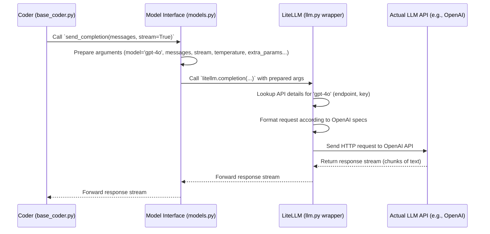

# Chapter 3: Model Interface - Aider's Universal Translator

Welcome back! In [Chapter 2: Coder](02_coder.md), we explored the "brain" of Aider, the `Coder`, which manages the conversation and decides *what* to ask the AI. But how does the Coder actually *talk* to the AI? Especially when there are so many different AI models like GPT-4o, Claude Sonnet, local models via Ollama, and others?

This chapter introduces the **Model Interface**, Aider's built-in **universal translator and phone system** for communicating with all these different Large Language Models (LLMs).

## What's the Big Idea? Talking to Any AI

Imagine the `Coder` needs help writing a Python function. It has the instructions and the relevant code snippets ready. Now, it needs to call an AI assistant.

*   **Problem:** If it calls OpenAI's GPT-4o, it needs to use OpenAI's specific phone number (API endpoint), speak OpenAI's "language" (request format), and use an OpenAI key. If it calls Anthropic's Claude, the phone number, language, and key are all different! Writing separate code for every single AI model would be a nightmare.
*   **Solution:** Aider uses a central **Model Interface**. The `Coder` just tells the Model Interface, "Hey, send this message to the model called 'gpt-4o'" (or 'claude-3-sonnet-20240229', or 'ollama/mistral'). The Model Interface handles all the details:
    *   Finding the right "phone number" (API endpoint) for 'gpt-4o'.
    *   Using the correct API key.
    *   Formatting the message exactly how 'gpt-4o' expects it.
    *   Understanding special features or limitations of 'gpt-4o' (like how large a message it can read).
    *   Receiving the answer and passing it back to the `Coder`.

Think of it like having a magical phone operator who knows how to connect to any phone number in the world, automatically translates your message into the right language, and relays the response back to you.

## Key Concepts: How the Translator Works

1.  **One Interface, Many Models:** The `Coder` interacts with a single, consistent interface regardless of the underlying LLM.
2.  **Provider Handling:** It knows the specifics for different companies (OpenAI, Anthropic, Google) and tools (OpenRouter, Ollama for local models).
3.  **API Key Management:** It finds and uses the correct API keys stored in your environment variables (like `OPENAI_API_KEY` or `ANTHROPIC_API_KEY`).
4.  **Request Formatting:** It takes the standard list of messages from the `Coder` and converts it into the precise format required by the target LLM's API.
5.  **Model-Specific Settings:** It's aware of details like:
    *   **Context Window:** How much text the model can handle at once.
    *   **Edit Formats:** Which ways of suggesting code changes the model works best with (covered more in [Edit Formats & Prompts](06_edit_formats___prompts.md)).
    *   **Special Parameters:** Some models have unique settings (like temperature, or newer features like "reasoning effort").
6.  **Response Processing:** It handles receiving the AI's answer, often as a stream of text chunks, and deals with potential communication errors.
7.  **The Magic Tool (`litellm`):** Under the hood, Aider uses a fantastic library called `litellm`. Think of `litellm` as the core translation engine that the Model Interface relies on. It knows the API details for hundreds of different models.

## Under the Hood: Calling the AI

Let's follow the `Coder` as it asks the Model Interface to talk to an AI.

**Use Case:** The `Coder` wants to send a prompt ("Write a Python function to add two numbers") to the `gpt-4o` model and get the response back.

**Flow:**



**Step-by-step:**

1.  The `Coder` has the list of messages (`messages`) it wants to send. It calls a method on the `Model` object (our Model Interface), like `send_completion`.
2.  The `Model` object (`aider/models.py`) takes these messages and adds other necessary information: the specific `model` name (`gpt-4o`), whether to `stream` the response, the `temperature` setting (randomness control), and any other `extra_params` specific to `gpt-4o`.
3.  The `Model` object then calls the core communication function, `litellm.completion(...)`, usually via a thin wrapper in `aider/llm.py`.
4.  `litellm` (the library) receives the request. It knows `gpt-4o` is an OpenAI model.
5.  `litellm` finds your `OPENAI_API_KEY` from the environment.
6.  `litellm` constructs the HTTP request in the exact format OpenAI expects.
7.  `litellm` sends the request to the official OpenAI API server.
8.  OpenAI processes the request and starts sending back the generated text in small chunks (because `stream=True`).
9.  `litellm` receives these chunks and passes them back.
10. The `Model` object receives the stream and passes it back to the `Coder`.
11. The `Coder` can then process the incoming text chunks, perhaps displaying them to the user via the [IO & Commands](01_input_output__io____commands.md) layer.

## Diving into the Code (Simplified)

Let's peek at the key files involved.

### `aider/llm.py`: The LiteLLM Wrapper

This file mainly sets up and imports the `litellm` library. It uses a clever trick (`LazyLiteLLM`) to avoid importing the potentially slow `litellm` library until it's actually needed.

```python
# Simplified from aider/llm.py
import importlib
import os

# Set some environment variables litellm uses
os.environ["OR_SITE_URL"] = "https://aider.chat"
os.environ["OR_APP_NAME"] = "Aider"
os.environ["LITELLM_MODE"] = "PRODUCTION" # Keeps litellm quiet

VERBOSE = False # Controls debug printing

class LazyLiteLLM:
    _lazy_module = None

    # This gets called when you try to use litellm (e.g., litellm.completion)
    def __getattr__(self, name):
        if self._lazy_module is None:
            if VERBOSE:
                print("Loading litellm...")
            # Actually import litellm the first time it's needed
            self._lazy_module = importlib.import_module("litellm")
            # Configure litellm settings
            self._lazy_module.suppress_debug_info = True
            self._lazy_module.set_verbose = False
            # ... more settings ...
        # Return the function/attribute from the real litellm module
        return getattr(self._lazy_module, name)

# Create the lazy loader instance
litellm = LazyLiteLLM()

# Make 'litellm' available for import from this file
__all__ = [litellm]
```

This code ensures that when other parts of Aider `import litellm` from `aider.llm`, they get this lazy loader. The actual (potentially slow) import of the real `litellm` library happens only the first time a function like `litellm.completion` is called.

### `aider/models.py`: Defining Model Behavior

This file contains the `Model` class, which represents a specific LLM and holds its settings and the logic to interact with it via `litellm`.

**1. Initializing a Model:**

When Aider starts, it creates a `Model` object for the chosen LLM (e.g., `gpt-4o`).

```python
# Simplified from aider/models.py
from aider.llm import litellm # Our lazy litellm
from dataclasses import dataclass, field # For settings
# ... other imports ...

# Dataclass to hold settings for a model type
@dataclass
class ModelSettings:
    name: str
    edit_format: str = "whole" # Default edit format
    use_repo_map: bool = False
    # ... many other settings ...
    extra_params: Optional[dict] = None # Model-specific API params


# Load built-in settings from a YAML file (not shown)
MODEL_SETTINGS = [...] # List of ModelSettings objects

class Model(ModelSettings): # Inherits settings structure
    def __init__(self, model_name, verbose=False):
        # Map aliases like '4o' to full name 'gpt-4o'
        self.name = MODEL_ALIASES.get(model_name, model_name)
        self.verbose = verbose

        # Get info like context window size from litellm/cache
        self.info = model_info_manager.get_model_info(self.name)

        # Load default & specific settings for this model
        self.configure_model_settings(self.name)
        # ... setup weak model, editor model etc ...

    def configure_model_settings(self, model_name):
        # Find settings matching this model name in MODEL_SETTINGS
        # Apply generic rules based on name (e.g., if 'gpt-4' in name)
        # Apply overrides from config files
        # ... logic to copy settings onto 'self' ...
        pass # Details omitted for simplicity
```

This shows that when you create a `Model('gpt-4o')`, it figures out the full name, fetches known information (like context size), and loads various settings (like the preferred `edit_format`) based on built-in knowledge and configuration files.

**2. Sending the Request:**

The core method used by the `Coder` is `send_completion`.

```python
# Simplified from aider/models.py (inside Model class)
import json
import hashlib

class Model:
    # ... __init__ and other methods ...

    def send_completion(self, messages, functions, stream, temperature=None):
        # Basic checks on messages (ensure alternating roles for some models)
        # ...

        # Prepare arguments for litellm
        kwargs = dict(
            model=self.name, # The specific model name (e.g., "gpt-4o")
            messages=messages, # The conversation history/prompt
            stream=stream, # True for streaming response
        )

        # Add temperature if the model supports it
        if self.use_temperature is not False:
            # ... determine temperature value ...
            kwargs["temperature"] = temperature

        # Add function/tool definitions if provided (less common for basic chat)
        if functions:
            # ... format tool definitions ...
            kwargs["tools"] = [...]
            kwargs["tool_choice"] = {...}

        # Add any extra API parameters specific to this model
        if self.extra_params:
            kwargs.update(self.extra_params)

        # Set a timeout for the request
        kwargs["timeout"] = request_timeout # e.g., 600 seconds

        if self.verbose:
            dump(kwargs) # Print the arguments if verbose mode is on

        # THE ACTUAL CALL to the LLM via litellm!
        response_hash, response = self.execute_litellm_completion(**kwargs)

        return response_hash, response # Return hash and the response/stream

    def execute_litellm_completion(self, **kwargs):
        # This is where the actual call to litellm happens
        # (May include retry logic, error handling - omitted here)
        try:
            # Calculate hash for caching (details omitted)
            key = json.dumps(kwargs, sort_keys=True).encode()
            hash_object = hashlib.sha1(key)

            # Call the magic function!
            res = litellm.completion(**kwargs)
            return hash_object, res
        except Exception as e:
            # Handle network errors, API errors, etc.
            print(f"Error calling LLM: {e}")
            raise # Or handle more gracefully
```

This `send_completion` method is the heart of the Model Interface. It meticulously prepares all the arguments (`model`, `messages`, `stream`, `temperature`, `extra_params`) needed by `litellm` and then makes the call via `litellm.completion`. It relies entirely on `litellm` to handle the provider-specific communication details.

## Conclusion

The Model Interface, primarily implemented in `aider/models.py` and leveraging the `litellm` library via `aider/llm.py`, acts as Aider's essential communication layer for talking to diverse LLMs. It abstracts away the complexities of different API protocols, key management, and model-specific parameters, allowing the [Coder](02_coder.md) to simply specify *which* model to talk to and *what* to say. This modular design makes it easy for Aider to support new models in the future.

Now that we understand how Aider talks to the AI, how does it give the AI enough *context* about your project? Especially in large codebases, the AI can't possibly see every file. In the next chapter, we'll explore the [RepoMap](04_repomap.md), Aider's way of providing a high-level map of your repository to the AI.

[Next Chapter: RepoMap](04_repomap.md)

---

Generated by [AI Codebase Knowledge Builder](https://github.com/The-Pocket/Tutorial-Codebase-Knowledge)