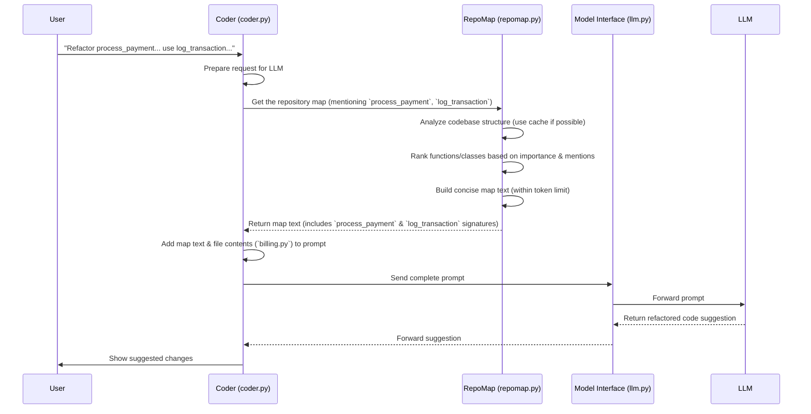

# Chapter 4: RepoMap - The Project Table of Contents

Welcome back! In the [previous chapter](03_model_interface.md), we saw how Aider uses the **Model Interface** to talk to different AI models like GPT-4o or Claude. It's like having a universal translator.

But just being able to talk isn't enough. Imagine asking a friend (the AI) to help organize a huge library (your code project). If you just say, "Find the book about dragons," your friend will be lost without knowing how the library is organized. They need a map or a catalog!

That's exactly the problem **RepoMap** solves for Aider.

## What's the Big Idea? Giving the AI a Map

Let's say your project has dozens or hundreds of files. You ask Aider:

`"Refactor the `process_payment` function in `billing.py` to use the `log_transaction` utility from `utils.py`."`

How does the AI know:
1.  What other functions or classes exist in `billing.py` that `process_payment` might interact with?
2.  What arguments does `log_transaction` in `utils.py` actually take? Does it even exist?

Reading *every single file* in your project for every request would be incredibly slow and expensive (it would use too many "tokens" - the units AI models use to measure text length).

**RepoMap** creates a concise summary or "map" of your entire project. It includes the important landmarks – like class names and function signatures (their names and the arguments they expect).

Think of it like giving the AI a **Table of Contents** and **Index** for your code:
*   **Table of Contents:** Shows the main files and the key structures (classes, functions) within them.
*   **Index:** Helps the AI quickly locate where important things (`log_transaction`) are defined.

This map gives the AI the crucial context about your project's structure without needing to see every line of code.

## Key Concepts: How the Map is Made

Making a useful map involves a few steps:

1.  **Scanning Files:** Aider looks at all the code files in your project's git repository.
2.  **Finding Landmarks (Parsing):** It uses a smart tool (called `tree-sitter`, which understands code structure like a grammar checker) to identify important pieces like:
    *   Class definitions (`class MyClass:`)
    *   Function definitions (`def my_function(arg1, arg2):`)
    *   Method definitions (functions inside classes)
3.  **Creating Snippets:** Instead of copying the whole function or class, RepoMap usually just grabs the definition line(s), like the function signature. This keeps the map concise.
4.  **Ranking Importance:** For large projects, even a map of just signatures can be too big! Aider cleverly ranks the importance of different code elements. It figures out which functions or classes are used most often by other parts of the code. It also pays extra attention to files you've added to the chat (`/add`) or identifiers you mention in your request.
5.  **Fitting the Budget:** Aider includes the most important snippets in the map, making sure it doesn't exceed a certain size (measured in tokens, often around 1000-2000 by default) so it fits within the AI's limits.

## How Aider Uses the RepoMap

Let's trace how RepoMap helps with our example request: `"Refactor `process_payment`... to use `log_transaction`..."`



1.  You give your instruction to the [Coder](02_coder.md).
2.  The Coder prepares to talk to the AI. It knows it needs context.
3.  The Coder asks the `RepoMap` component for a map, potentially highlighting identifiers like `process_payment` and `log_transaction`.
4.  The `RepoMap` component analyzes the project files (often using cached information from previous scans to be faster).
5.  It ranks the importance of code elements, giving a boost to the mentioned identifiers and the file `billing.py` (if added to chat).
6.  It creates the text version of the map, including snippets like `def process_payment(...)` from `billing.py` and `def log_transaction(...)` from `utils.py`.
7.  The Coder receives this map text.
8.  The Coder combines your request, the content of `billing.py`, and the RepoMap text into a single big prompt.
9.  This full prompt is sent to the AI via the [Model Interface](03_model_interface.md).
10. The AI now has enough context (the code to change *and* the map showing related parts like `log_transaction`) to make a good suggestion.

## Under the Hood: A Peek Inside `repomap.py`

The magic happens primarily within the `aider/repomap.py` file, specifically in the `RepoMap` class. Let's look at simplified versions of key methods.

**1. Initialization (`__init__`)**

When Aider starts, it creates a `RepoMap` object, setting up basic parameters.

```python
# Simplified from aider/repomap.py - RepoMap class
import os
from pathlib import Path
from diskcache import Cache # Used for caching analysis results

CACHE_VERSION = 4 # Changes if the cache format updates

class RepoMap:
    TAGS_CACHE_DIR = f".aider.tags.cache.v{CACHE_VERSION}"

    def __init__(
        self,
        map_tokens=1024, # Max size allowed for the map
        root=None,       # Project root directory
        main_model=None, # Reference to the main AI model (for token counting)
        io=None,         # Reference to Input/Output for messages
        verbose=False,
        # ... other parameters like refresh strategy ...
    ):
        self.io = io
        self.verbose = verbose
        self.root = root or os.getcwd() # Default to current directory
        self.max_map_tokens = map_tokens
        self.main_model = main_model
        self.tree_cache = {} # Cache for rendered code snippets
        self.map_cache = {}  # Cache for the final generated map text

        # Load or create a persistent cache on disk to store tags
        try:
            cache_path = Path(self.root) / self.TAGS_CACHE_DIR
            self.TAGS_CACHE = Cache(cache_path)
        except Exception as e:
            # Handle errors (e.g., disk issues) by falling back to in-memory dict
            self.io.tool_warning(f"Failed to use disk cache for RepoMap: {e}")
            self.TAGS_CACHE = dict()

        if self.verbose:
            self.io.tool_output("RepoMap initialized.")

```
This sets up where the project is (`root`), the maximum size of the map (`map_tokens`), and initializes caches to speed things up. The `TAGS_CACHE` is particularly important as it stores the raw analysis of each file so Aider doesn't have to re-parse unchanged files every time.

**2. Getting the Map (`get_repo_map`)**

This is the main function the Coder calls. It decides if a map is needed and orchestrates the process.

```python
# Simplified from aider/repomap.py - RepoMap class

class RepoMap:
    # ... __init__ ...

    def get_repo_map(
        self,
        chat_files,      # Files explicitly added to the chat
        other_files,     # Other files in the repo (potential context)
        mentioned_fnames=None, # Files mentioned by name
        mentioned_idents=None, # Identifiers (functions/classes) mentioned
        force_refresh=False,   # Ignore caches?
    ):
        # If map_tokens is 0, RepoMap is disabled
        if self.max_map_tokens <= 0:
            return None # Return nothing

        # If there are no other files to map, don't bother
        if not other_files:
            return None

        # ... (logic to potentially increase map_tokens if no files are in chat) ...

        try:
            # Call the function that does the heavy lifting: ranking and formatting
            files_listing = self.get_ranked_tags_map(
                chat_files,
                other_files,
                self.max_map_tokens, # Use the calculated budget
                mentioned_fnames,
                mentioned_idents,
                force_refresh,
            )
        except Exception as e: # Catch errors during map generation
            self.io.tool_error(f"Error generating repo map: {e}")
            self.max_map_tokens = 0 # Disable RepoMap if it fails badly
            return None

        if not files_listing:
            return None # No map content generated

        # ... (Add optional prefix like "Repo Map:\n") ...

        repo_content = files_listing # The final map string

        if self.verbose:
            # Estimate token count and report it
            num_tokens = self.token_count(repo_content)
            self.io.tool_output(f"Repo-map: {num_tokens} tokens")

        return repo_content
```
This function checks if a map should be generated, then calls `get_ranked_tags_map` to do the real work, handles errors, and formats the final output string.

**3. Ranking and Selecting (`get_ranked_tags_map`)**

This function (and helpers it calls like `get_ranked_tags`) is the core of RepoMap's intelligence. It figures out *what* to include in the map.

```python
# Simplified from aider/repomap.py - RepoMap class
import time

class RepoMap:
    # ... other methods ...

    # (Helper for token counting - simplified)
    def token_count(self, text):
        return self.main_model.token_count(text)

    # This handles caching and calls the uncached version
    def get_ranked_tags_map(
        self, chat_fnames, other_fnames, max_map_tokens,
        mentioned_fnames, mentioned_idents, force_refresh
    ):
        # Create a key based on inputs to check the cache
        cache_key = (
            tuple(sorted(chat_fnames)), tuple(sorted(other_fnames)), max_map_tokens,
            tuple(sorted(mentioned_fnames or [])), tuple(sorted(mentioned_idents or []))
        )

        # Check cache unless forced to refresh
        if not force_refresh and cache_key in self.map_cache:
            return self.map_cache[cache_key]

        # --- Cache miss or refresh needed ---
        start_time = time.time()

        # Call the function that actually builds the map
        result = self.get_ranked_tags_map_uncached(
            chat_fnames, other_fnames, max_map_tokens,
            mentioned_fnames, mentioned_idents
        )

        # Store result in cache for next time
        self.map_cache[cache_key] = result
        self.last_map = result # Store the most recent map

        if self.verbose:
            duration = time.time() - start_time
            self.io.tool_output(f"RepoMap generation took {duration:.2f}s")

        return result

    # Builds the map (simplified conceptual flow)
    def get_ranked_tags_map_uncached(
        self, chat_fnames, other_fnames, max_map_tokens,
        mentioned_fnames, mentioned_idents
    ):
        # 1. Get all tags (definitions/references) for all files
        #    Uses `get_tags` which uses tree-sitter & file modification time caching
        all_tags = []
        for fname in chat_fnames + other_fnames:
            rel_fname = self.get_rel_fname(fname) # Get relative path
            tags_for_file = self.get_tags(fname, rel_fname)
            all_tags.extend(tags_for_file)

        # 2. Analyze dependencies and rank tags/files (using graph algorithms like PageRank)
        #    Gives higher scores to tags in/referenced by chat_files or mentioned items.
        #    (This is the complex part, simplified here)
        ranked_tags = self.rank_tags_using_graph(all_tags, chat_fnames, mentioned_fnames, mentioned_idents)

        # 3. Convert the top-ranked tags into a text tree format
        #    Iteratively builds the tree, checking token count against max_map_tokens
        map_text = self.build_text_tree_from_tags(ranked_tags, max_map_tokens)

        return map_text # Return the final string

    # Placeholder for complex ranking logic
    def rank_tags_using_graph(self, all_tags, chat_fnames, mentioned_fnames, mentioned_idents):
        # ... uses networkx library and PageRank algorithm ...
        # ... assigns scores based on definitions, references, and personalization ...
        print("Simplified: Ranking tags...")
        # Return tags sorted by importance (most important first)
        return sorted(all_tags, key=lambda tag: tag.line) # Dummy sort for example

    # Placeholder for text generation logic
    def build_text_tree_from_tags(self, ranked_tags, max_map_tokens):
        # ... iterates through ranked_tags ...
        # ... adds file headers and code snippets (like function signatures) ...
        # ... stops when max_map_tokens is reached ...
        # ... uses self.render_tree() which uses grep-ast library ...
        map_content = ""
        current_tokens = 0
        for tag in ranked_tags:
            snippet = f"{tag.rel_fname}:\n... {tag.kind} {tag.name} at line {tag.line}\n"
            snippet_tokens = self.token_count(snippet)
            if current_tokens + snippet_tokens > max_map_tokens:
                break
            map_content += snippet
            current_tokens += snippet_tokens
        return map_content

```
This shows the caching layer (`get_ranked_tags_map`) and the core logic (`get_ranked_tags_map_uncached`). The key steps are gathering information (`get_tags`), ranking it (`rank_tags_using_graph`), and formatting the most important parts into text (`build_text_tree_from_tags`), all while respecting the `max_map_tokens` limit.

## Conclusion

The RepoMap is Aider's way of giving the AI essential context about your project without overwhelming it. By intelligently scanning your code, identifying key structures, and ranking them for relevance, it creates a concise "table of contents" that helps the AI understand the relationships between different parts of your code. This allows Aider to make more accurate and context-aware changes, especially in larger projects. It bridges the gap between your high-level request and the specific code scattered across your repository.

RepoMap relies heavily on the underlying Git repository to know which files are part of the project. In the next chapter, we'll dive into how Aider interacts directly with Git for tracking changes, committing code, and more.

[Next Chapter: Git Integration](05_git_integration.md)

---

Generated by [AI Codebase Knowledge Builder](https://github.com/The-Pocket/Tutorial-Codebase-Knowledge)