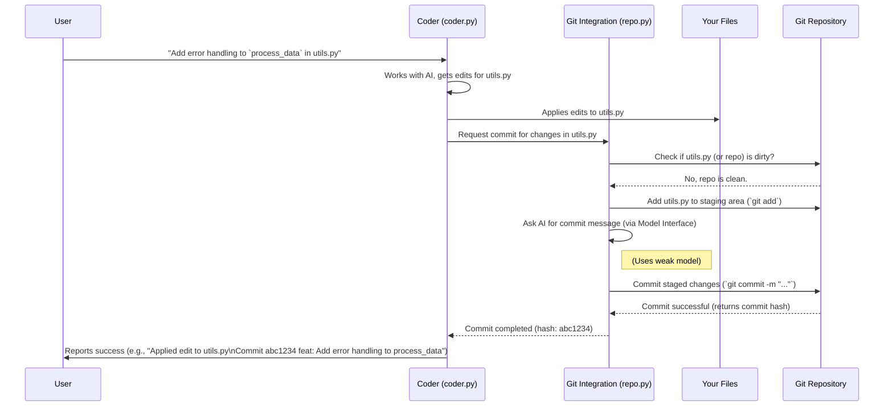
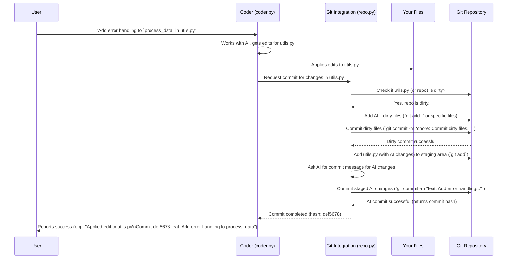

# Chapter 5: Git Integration - Your Safety Net for AI Edits

In the [previous chapter](04_repomap.md), we saw how Aider uses **RepoMap** to create a "table of contents" for your project, giving the AI crucial context. But what happens after the AI makes a change? How do we ensure that work isn't lost? What if the AI makes a mistake?

This is where **Git Integration** comes in. Think of it as Aider's built-in **safety net and meticulous librarian**, automatically saving the AI's work using the power of Git, the most popular version control system.

## What's the Big Idea? Never Lose Work, Easily Undo Mistakes

Imagine you ask Aider to refactor a tricky function. The AI makes the changes, and they look good... at first. Later, you realize the change introduced a subtle bug! Or maybe you just want to compare the AI's version with your original code. Without Git Integration, this could be difficult.

Aider's Git Integration solves this by:

1.  **Automatically Saving Changes:** Every time Aider successfully applies a change suggested by the AI, it automatically saves a snapshot of that change using a `git commit`. It's like hitting "Save" in your editor, but it keeps a full history!
2.  **Keeping Your Work Safe:** What if you were already editing a file (`file.py`) and hadn't saved *your* changes yet (we call this a "dirty" file)? Aider is smart! Before applying the AI's changes to `file.py`, it will first save *your* current work in a separate commit. This ensures your edits are safe and distinct from the AI's edits.
3.  **Enabling Easy Undos:** Made a change you regret? Just type `/undo` in the Aider chat. Because every AI change is saved as a commit, `/undo` can easily revert your project back to the state it was in before the last AI edit.

**Use Case:** Let's say you ask Aider to add comments to `calculator.py`.

*   Aider and the AI figure out the comments.
*   Aider applies the comments to `calculator.py`.
*   **Git Integration steps in:** It automatically creates a `git commit` with a message like "feat: Add comments to calculator functions".
*   Later, you decide you didn't like those comments. You type `/undo`.
*   **Git Integration steps in again:** It uses Git to revert that last commit, restoring `calculator.py` to how it was before the comments were added.

This automatic saving and undo capability makes experimenting with AI much safer and more manageable.

## Key Concepts: How Aider Uses Git

Let's break down the core ideas:

### 1. Auto-Commits: Saving Every AI Step

After the [Coder](02_coder.md) successfully applies changes suggested by the AI to one or more files, it tells the Git Integration component to save this new version.

*   **What it does:** Creates a `git commit`. This is a permanent snapshot of your project at that specific moment.
*   **Commit Message:** Aider even asks the AI to generate a descriptive commit message (like "fix: Correct calculation in total_price") so you can understand what each change did later.
*   **Why it's great:** You get a detailed history of every change the AI made, which you can review using standard Git tools (like `git log`). It ensures no AI work is accidentally lost.

### 2. Handling "Dirty" Files: Protecting Your Work

A "dirty" file is one that has changes you've made but haven't committed to Git yet.

*   **The Problem:** If Aider just blindly applied AI changes on top of your uncommitted work, it could create a mess, making it hard to separate your edits from the AI's.
*   **Aider's Solution:** Before applying any AI edits to a dirty file, Aider first commits *your* existing changes. It usually uses a commit message like "chore: Commit dirty files before Aider edits".
*   **Why it's great:** This keeps your work safe and separate. The Git history will clearly show "your changes" followed by "Aider's changes".

### 3. The `/undo` Command: Your Time Machine

This is one of the most useful commands, powered entirely by Git Integration.

*   **What it does:** When you type `/undo`, Aider uses Git to revert the very last commit *that Aider made*.
*   **How it works:** It finds the commit hash (a unique ID for the commit) of the last AI change and uses a Git command (`git revert` or `git reset`) to undo it.
*   **Why it's great:** Instantly go back one step if the AI's change wasn't what you wanted. No manual file editing is needed! (This command is handled by the [Input/Output (IO) & Commands](01_input_output__io____commands.md) layer, which then tells the Git layer what to do).

## How Aider Uses Git: A Typical Flow

Let's trace the Git interactions when you ask Aider to modify `utils.py`, which you *haven't* touched recently (it's not "dirty").



Now, what if `utils.py` *was* dirty (you had uncommitted changes)?



These diagrams show how Git Integration acts as a crucial step *after* the Coder applies edits, ensuring changes are safely stored in Git, handling any pre-existing user edits first.

## Under the Hood: A Peek Inside `aider/repo.py`

The core logic for interacting with Git resides in the `GitRepo` class within `aider/repo.py`. It uses the `GitPython` library to talk to your local Git repository.

**1. Initialization (`__init__`)**

When Aider starts in a project with a `.git` directory, it creates a `GitRepo` object.

```python
# Simplified from aider/repo.py - GitRepo class
try:
    import git # The GitPython library
except ImportError:
    git = None # Handle case where GitPython isn't installed

import os
from pathlib import Path
from aider import utils # Aider utility functions

class GitRepo:
    repo = None # This will hold the GitPython Repo object

    def __init__(
        self,
        io, # Input/Output for messages
        fnames, # List of files Aider is initially aware of
        git_dname=None, # Optional explicit path to .git dir
        # ... other parameters like models, commit settings ...
    ):
        self.io = io
        # ... store other settings ...

        # --- Find the Git Repository ---
        repo_path = None
        if git is not None: # Check if GitPython is available
            try:
                # Figure out the root directory of the git repo
                # Searches upwards from the current files/directory
                check_path = git_dname or (fnames and fnames[0]) or "."
                repo_instance = git.Repo(check_path, search_parent_directories=True)
                repo_path = repo_instance.working_dir
                self.repo = repo_instance # Store the repo object
                self.root = utils.safe_abs_path(self.repo.working_tree_dir)
                self.io.tool_output(f"Git repo found at {self.root}")
            except (git.exc.InvalidGitRepositoryError, git.exc.GitCommandNotFound):
                self.io.tool_warning("Git repository not found or git command missing.")
                self.repo = None # Indicate no repo is available
            except Exception as e:
                self.io.tool_error(f"Error initializing Git: {e}")
                self.repo = None
        else:
            self.io.tool_warning("GitPython not installed. Git integration disabled.")

        # If no repo found, Aider will largely disable Git features
        if not self.repo:
            raise FileNotFoundError("Could not find Git repository.")

        # ... rest of init ...
```
This snippet shows how Aider uses the `GitPython` library to find the `.git` directory associated with your project files and establish a connection to it. If it can't find one, Git features will be limited.

**2. Checking for Dirty Files (`is_dirty`)**

Before committing, Aider needs to know if there are uncommitted changes.

```python
# Simplified from aider/repo.py - GitRepo class

class GitRepo:
    # ... other methods ...

    def is_dirty(self, path=None):
        """Checks if the repo or a specific file has uncommitted changes."""
        if not self.repo:
            return False # No repo, can't be dirty in Git terms

        # If checking a specific file that isn't tracked, consider it "dirty"
        # because applying AI changes would be like adding a new file.
        if path and not self.path_in_repo(path):
            return True

        # Ask GitPython if the working directory or specific path is dirty
        try:
            return self.repo.is_dirty(path=path)
        except Exception as e:
            self.io.tool_error(f"Error checking git status: {e}")
            return False # Be cautious, assume not dirty if check fails
```
This method uses the connected `self.repo` object (from GitPython) to quickly check the status of the repository or a specific file.

**3. Committing Changes (`commit`)**

This is the core function for saving changes.

```python
# Simplified from aider/repo.py - GitRepo class

class GitRepo:
    # ... other methods ...

    def commit(self, fnames=None, context=None, message=None, aider_edits=False):
        """Commits specified files or all changes if fnames is None."""
        if not self.repo:
            self.io.tool_error("Cannot commit: Git repository not available.")
            return None, None

        # Check if there's anything to commit
        # (Simplified check - actual code checks diffs)
        if not fnames and not self.repo.is_dirty():
            self.io.tool_output("No changes to commit.")
            return None, None

        # --- Stage the files ---
        files_to_add = fnames or []
        if not files_to_add: # If no specific files, add all changes
             try:
                 self.repo.git.add(update=True) # Stage modified/deleted
                 self.repo.git.add(A=True)      # Stage new files
             except Exception as e:
                 self.io.tool_error(f"Error staging all files: {e}")
                 return None, None
        else: # Stage only specified files
            for fname in files_to_add:
                try:
                    # Convert to absolute path relative to repo root
                    abs_path = self.abs_root_path(fname)
                    self.repo.git.add(str(abs_path))
                except Exception as e:
                    self.io.tool_error(f"Error staging {fname}: {e}")
                    # Decide whether to continue or fail here

        # --- Determine Commit Message ---
        commit_message = message # Use provided message if available
        if not commit_message:
            # If no message, generate one using the AI (simplified concept)
            diffs = self.get_diffs(fnames) # Get the changes
            commit_message = self.get_commit_message(diffs, context) # Ask LLM

        if not commit_message:
            commit_message = "Aider commit (message generation failed)"

        # Add prefix like "aider: " if configured (details omitted)

        # --- Perform the Commit ---
        try:
            # Use GitPython's command wrapper: git.commit(...)
            commit_cmd_args = ["-m", commit_message]
            # Add --no-verify by default (can be configured)
            if not self.git_commit_verify:
                 commit_cmd_args.append("--no-verify")

            # Execute the commit
            self.repo.git.commit(*commit_cmd_args)

            commit_hash = self.get_head_commit_sha(short=True) # Get commit ID
            self.io.tool_output(f"Commit {commit_hash} {commit_message}", bold=True)
            return commit_hash, commit_message
        except Exception as e:
            self.io.tool_error(f"Unable to commit: {e}")
            return None, None # Indicate failure

    def get_commit_message(self, diffs, context):
        # Simplified: In reality, this prepares a prompt and calls the
        # LLM via the Model Interface to generate a good message.
        self.io.tool_output("Generating commit message...")
        # Placeholder for LLM call
        return f"feat: Apply changes based on context"

    def get_head_commit_sha(self, short=False):
        # Gets the SHA (unique ID) of the latest commit
        try:
            commit = self.repo.head.commit
            return commit.hexsha[:7] if short else commit.hexsha
        except Exception:
            return None # Handle errors or detached HEAD state
```
This simplified `commit` method shows the main steps:
1.  Check if there's a repository and changes.
2.  Stage the files (`git add`).
3.  Determine the commit message (either provided or generated by the AI).
4.  Execute the commit (`git commit`).
5.  Report the result (commit hash and message).

## Conclusion

Aider's Git Integration (`aider/repo.py`) is a cornerstone of its workflow, acting as an automatic version control assistant. By seamlessly committing AI-generated changes and carefully handling your own uncommitted work, it provides a robust safety net. This allows you to confidently leverage AI for coding tasks, knowing that every step is saved and easily reversible with commands like `/undo`. It transforms Git from a manual tool into an automated part of the AI development process.

Now that we understand how Aider manages context ([RepoMap](04_repomap.md)) and saves its work ([Git Integration](05_git_integration.md)), how does it actually instruct the AI on *how* to format the code changes it suggests? In the next chapter, we'll explore the different ways Aider asks the AI to present code edits.

[Next Chapter: Edit Formats & Prompts](06_edit_formats___prompts.md)

---

Generated by [AI Codebase Knowledge Builder](https://github.com/The-Pocket/Tutorial-Codebase-Knowledge)