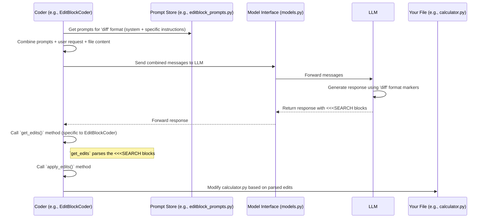

# Chapter 6: Edit Formats & Prompts

Welcome back! In [Chapter 5: Git Integration](05_git_integration.md), we learned how Aider acts like a careful librarian, automatically saving every AI-suggested change using Git, providing a safety net. We know the AI makes suggestions, and Aider saves them. But *how* does Aider tell the AI *exactly* how to format those suggestions so Aider can understand and apply them?

Imagine you're asking a smart assistant (the AI) to revise a paragraph in a document (your code file). You wouldn't just say "fix it". You might say, "Please rewrite the second sentence to be clearer" or "Replace the word 'good' with 'excellent'". You need to give specific instructions on *how* to present the change. Aider does the same with the AI.

This chapter explores **Edit Formats & Prompts**: the specific ways Aider asks the AI to provide code changes and the core instructions (prompts) it gives the AI to guide its behavior and formatting.

## What's the Big Idea? Speaking the AI's Language (Templates & Instructions)

Different AI models (like GPT-4o, Claude Sonnet, etc.) have different strengths and sometimes interpret instructions differently. Asking one model to "just send the whole file back" might work great, while another might get confused or lazy and only send back a small, incomplete snippet.

Aider needs a reliable way to get code edits back from *any* AI model it talks to using the [Model Interface](03_model_interface.md).

**The Problem:** How can Aider guarantee that the AI's suggested code change for `hello.py` is presented in a way that Aider's automated tools can precisely understand and apply to the actual `hello.py` file?

**The Solution:** Aider defines specific **Edit Formats** (like templates for suggesting changes) and uses detailed **Prompts** (instruction manuals) to tell the AI *which* template to use and *how* to fill it out.

**Use Case:** Let's say you ask Aider: `Add a print statement saying "Processing..." inside the main function in calculator.py`.

Aider needs to tell the AI:
1.  "You are a helpful coding assistant." (Basic Role - Prompt)
2.  "I need you to edit `calculator.py`." (Context)
3.  "Here's the current content of `calculator.py`." (Code Context)
4.  "Add the print statement 'Processing...' inside the main function." (User Request)
5.  "When you show me the change, please format it using the 'diff' style, like this: `<<<<<<< SEARCH ... ======= ... >>>>>>> REPLACE`." (Specific Edit Format Instruction - Prompt)

The Edit Formats & Prompts abstraction is responsible for defining step 5 – the template and the instruction to use it.

## Key Concepts: Templates and Instructions

### 1. Edit Formats: The Templates for Changes

Think of these as different ways the AI can "submit" its suggested code changes. Aider supports several formats, chosen based on the AI model being used or user configuration:

*   **`whole` Format:**
    *   **Analogy:** Sending back the *entire revised document*.
    *   **How it works:** The AI sends the complete, updated content of the file.
    *   **Pros:** Simple for the AI.
    *   **Cons:** Can be slow and use lots of "tokens" (the AI's measure of work) if the file is large, even for a small change.
    *   **Example AI Response:**
        ```text
        calculator.py
        ```python
        def main():
            print("Processing...") # <-- The added line
            # ... rest of the calculator code ...
        ```
        ```

*   **`diff` Format (Search/Replace Blocks):**
    *   **Analogy:** Sending specific instructions like "Find this paragraph: [...] and replace it with this paragraph: [...]".
    *   **How it works:** The AI sends blocks marked with `<<<<<<< SEARCH`, `=======`, and `>>>>>>> REPLACE`. Aider finds the `SEARCH` block in the original file and replaces it with the `REPLACE` block.
    *   **Pros:** Very efficient for small changes; only sends the changed parts.
    *   **Cons:** AI needs to be careful to match the `SEARCH` block exactly.
    *   **Example AI Response:**
        ```text
        calculator.py
        ```
        <<<<<<< SEARCH
        def main():
            # ... original code inside main ...
        =======
        def main():
            print("Processing...") # <-- The added line
            # ... original code inside main ...
        >>>>>>> REPLACE
        ```
        ```

*   **`udiff` Format (Unified Diff):**
    *   **Analogy:** Sending a standard "track changes" report like programmers often use.
    *   **How it works:** The AI sends changes in the standard [unified diff format](https://en.wikipedia.org/wiki/Diff#Unified_format), marked with `---`, `+++`, `@@`, lines starting with `+` (additions), and lines starting with `-` (deletions).
    *   **Pros:** Efficient, standard format, sometimes helps certain models avoid being "lazy".
    *   **Cons:** Can be slightly more complex for the AI to generate perfectly.
    *   **Example AI Response:**
        ```diff
        --- a/calculator.py
        +++ b/calculator.py
        @@ -1,2 +1,3 @@
         def main():
        +    print("Processing...") # <-- The added line
             # ... original code inside main ...
        ```

*   **(Other formats like `diff-fenced`, `editor-diff` exist for specific models or modes but follow similar principles.)**

### 2. Prompts: The Instruction Manual

Prompts are the detailed instructions Aider gives the AI, usually at the very beginning of their conversation (as a "system prompt") and sometimes reinforced later. These instructions cover:

*   **The AI's Role:** "You are an expert AI pair programmer..."
*   **General Behavior:** "Implement code fully, don't leave comments like `// TODO: Implement this`", "Pay attention to the user's request."
*   **Format Instructions:** This is crucial. Aider explicitly tells the AI *how* to format its response using the chosen Edit Format. For example, if using the `diff` format, the prompt includes instructions like:

    > "Use `<<<<<<< SEARCH` blocks to specify edits..." (Simplified example)

These prompts ensure the AI understands its job *and* the specific template it needs to use for suggesting code changes.

## How it Solves the Use Case: Adding the Print Statement

Let's revisit: `Add a print statement saying "Processing..." inside the main function in calculator.py`. Assume Aider is configured to use the `diff` format for the current AI model.

1.  The [Coder](02_coder.md) receives your request.
2.  The Coder decides to use the `diff` edit format.
3.  The Coder gathers:
    *   Its system prompt (telling the AI its role).
    *   Specific instructions for the `diff` format (explaining the `<<<<<<< SEARCH` syntax).
    *   Your request ("Add a print statement...").
    *   The content of `calculator.py`.
    *   Maybe context from the [RepoMap](04_repomap.md).
4.  This combined package is sent to the AI via the [Model Interface](03_model_interface.md).
5.  The AI reads all instructions. It understands it needs to add the print statement *and* format the change using the `<<<<<<< SEARCH...` block.
6.  The AI sends back a response containing the `diff` block shown in the example earlier.
7.  The Coder receives this response. Because it knows it asked for the `diff` format, it looks for those specific markers (`<<<<<<<`, `=======`, `>>>>>>>`).
8.  The Coder extracts the `SEARCH` and `REPLACE` content and applies the change to `calculator.py`.

Success! By using a specific format and clear prompts, Aider ensured the AI's suggestion was understandable and actionable.

## Under the Hood: Prompts and Parsers

How does Aider manage these different formats and instructions internally?

**Conceptual Flow:**



This diagram shows that the specific type of [Coder](02_coder.md) (like `EditBlockCoder` for the `diff` format) knows which prompts to fetch and how to parse the AI's response according to that format's rules.

**Code Structure:**

1.  **Storing Prompts:** The text for system prompts and format-specific instructions is often stored in dedicated Python files or classes.
    *   `aider/coders/base_prompts.py`: Contains general prompts used by many Coder types.
    *   `aider/coders/editblock_prompts.py`: Contains prompts specifically for the `diff` (search/replace) format.
    *   `aider/coders/udiff_prompts.py`: Contains prompts for the `udiff` format.
    *   `aider/coders/wholefile_prompts.py`: Contains prompts for the `whole` file format.

    Let's look at a tiny snippet from `base_prompts.py` setting a general tone:

    ```python
    # Simplified from aider/coders/base_prompts.py
    class CoderPrompts:
        lazy_prompt = """You are diligent and tireless!
    You NEVER leave comments describing code without implementing it!
    You always COMPLETELY IMPLEMENT the needed code!
    """
        # ... other prompts ...
    ```
    This tells the AI a general rule: don't be lazy!

    And a snippet from `editblock_prompts.py` explaining the format:

    ```python
    # Simplified from aider/coders/editblock_prompts.py
    class EditBlockPrompts:
        main_system = """...
    To suggest changes to a file, use this format:

    path/to/filename.ext
    ```
    <<<<<<< SEARCH
    # code to be replaced
    =======
    # new code replacing the SEARCH block
    >>>>>>> REPLACE
    ```

    The SEARCH block must be *exactly* the same as the existing lines in the file...
    """
        # ... other prompts ...
    ```
    This explicitly shows the AI the `<<<<<<< SEARCH` format it must use.

2.  **Choosing and Using Prompts:** The [Coder](02_coder.md) (specifically, the subclass chosen by `Coder.create` based on the `edit_format`) loads the appropriate prompts and includes them when formatting the messages sent to the LLM (inside methods like `format_messages`, called by `send_message` discussed in Chapter 2).

3.  **Parsing the Response (`get_edits`):** Each Coder subclass has a method, usually called `get_edits`, responsible for parsing the AI's response according to the *expected* format.

    *   `EditBlockCoder` (`aider/coders/editblock_coder.py`) looks for `<<<<<<< SEARCH`, `=======`, `>>>>>>> REPLACE`.
    *   `WholeFileCoder` (`aider/coders/wholefile_coder.py`) looks for filenames followed by fenced code blocks (```).
    *   `UnifiedDiffCoder` (`aider/coders/udiff_coder.py`) looks for `---`, `+++`, `@@` markers inside ````diff` blocks.

    Here's a highly simplified idea of what `get_edits` in `EditBlockCoder` does:

    ```python
    # Conceptual simplification of aider/coders/editblock_coder.py
    class EditBlockCoder(Coder):
        # ... other methods ...

        def get_edits(self):
            # Get the raw text response from the AI
            content = self.partial_response_content

            # Use regular expressions or string splitting to find blocks:
            # - Find filename before the block
            # - Find "<<<<<<< SEARCH" marker
            # - Extract text until "======="
            # - Find "=======" marker
            # - Extract text until ">>>>>>> REPLACE"
            # - Find ">>>>>>> REPLACE" marker

            # Example: (Pseudocode)
            found_edits = []
            blocks = find_search_replace_blocks(content) # Imaginary function
            for block in blocks:
                filename = block.filename
                search_text = block.search_part
                replace_text = block.replace_part
                found_edits.append( (filename, search_text, replace_text) )

            # Return a list of tuples: (filepath, original_text, updated_text)
            return found_edits
    ```
    This method's job is purely to interpret the AI's response based on the rules of the `diff` format.

## Conclusion

Edit Formats and Prompts are the crucial link that ensures Aider and the AI can communicate effectively about code changes. By defining clear templates (`whole`, `diff`, `udiff`) for how the AI should present edits and providing explicit instructions (Prompts) on how to use them, Aider makes the AI's suggestions machine-readable and reliable. This abstraction allows Aider to work flexibly with different AI models, choosing the communication style best suited for each one.

But how can *you*, the user, control which edit format Aider uses, or tweak other settings like which AI model to talk to? In the next chapter, we'll explore how Aider manages its settings.

[Next Chapter: Configuration Management](07_configuration_management.md)

---

Generated by [AI Codebase Knowledge Builder](https://github.com/The-Pocket/Tutorial-Codebase-Knowledge)