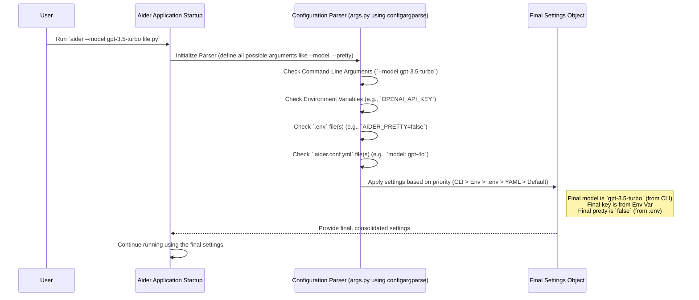

# Chapter 7: Configuration Management

Welcome to the final chapter in our core concepts tour! In [Chapter 6: Edit Formats & Prompts](06_edit_formats___prompts.md), we saw how Aider instructs the AI on how to format code changes. But how do *you* instruct Aider itself? How do you tell it which AI model to use, provide your secret API keys, or change the colors it uses in the terminal?

This chapter explores **Configuration Management** – Aider's system for gathering all your preferences and settings to customize how it runs. Think of it as Aider's "Settings Panel," collecting choices from different places to get everything just right.

## What's the Big Idea? Setting Up Aider Your Way

Imagine you just installed Aider. You want to use the powerful `gpt-4o` model, and you have an API key from OpenAI that you need to tell Aider about. You probably don't want to type `--model gpt-4o` and `--openai-api-key YOUR_KEY_HERE` *every single time* you start Aider!

**The Problem:** How can you set up Aider with your preferred model, API keys, and other settings so you don't have to specify them repeatedly on the command line?

**The Solution:** Aider looks for settings in multiple places, allowing you to "set it and forget it" for common configurations. It checks:

1.  **Command-Line Arguments:** Things you type directly when starting Aider (e.g., `aider --model gpt-4o my_file.py`).
2.  **Environment Variables:** Special variables set in your operating system (e.g., `OPENAI_API_KEY`).
3.  **`.env` Files:** A file named `.env` in your project directory where you can store settings like API keys.
4.  **`.aider.conf.yml` Files:** A more structured configuration file (using YAML format) often placed in your project root or home directory for detailed settings.

This system lets you choose the most convenient way to manage your preferences.

## Key Concepts: Where Aider Finds Settings

Let's break down how Aider gathers its instructions:

### 1. Sources of Settings

*   **Command-Line Arguments (`aider --option value`):**
    *   **What:** Options you type directly when running `aider`.
    *   **Example:** `aider --model gpt-4o --pretty no` (Use `gpt-4o` model, disable pretty colors).
    *   **Best For:** Settings you want to change frequently or just for a single run.
*   **Environment Variables (`EXPORT VAR=value` or `set VAR=value`):**
    *   **What:** Variables set in your terminal session or system-wide. Aider automatically looks for variables starting with `AIDER_` (like `AIDER_MODEL`) and also standard ones like `OPENAI_API_KEY`.
    *   **Example:** `export OPENAI_API_KEY="sk-..."` then `aider my_file.py`.
    *   **Best For:** Sensitive information like API keys, settings you want to apply broadly across your system.
*   **`.env` File:**
    *   **What:** A plain text file named `.env` usually placed in the root directory of your project. You list settings like `VARIABLE=value`.
    *   **Example (`.env` file content):**
        ```dotenv
        # Use this model by default for this project
        AIDER_MODEL=claude-3-haiku-20240307
        OPENAI_API_KEY="sk-..."
        ANTHROPIC_API_KEY="sk-..."
        ```
    *   **Best For:** Project-specific settings, especially API keys. Remember to add `.env` to your `.gitignore` file so you don't accidentally commit secrets!
*   **`.aider.conf.yml` File:**
    *   **What:** A YAML file for more structured configuration. Aider looks for it in your home directory, project root, and current directory.
    *   **Example (`.aider.conf.yml` file content):**
        ```yaml
        # Default model for most projects
        model: gpt-4o

        # Use specific colors
        user-input-color: "#33ff33"
        assistant-output-color: "#66ccff"

        # Always auto-commit changes
        auto-commits: true
        ```
    *   **Best For:** Less sensitive settings, detailed configurations, setting defaults across multiple projects (if placed in home directory).

### 2. Priority: Which Setting Wins? (The Rule of Specificity)

What happens if you set the model in your `.aider.conf.yml` but also specify a *different* model on the command line? Aider follows a clear priority order – the most specific instruction wins:

1.  **Command-Line Argument:** (Highest Priority) What you type directly overrides everything else.
2.  **Environment Variable:** Overrides settings from config files.
3.  **`.env` File:** Overrides the YAML config file.
4.  **`.aider.conf.yml` File(s):** Settings here are used if not overridden by the above. If multiple YAML files exist (home, git root, cwd), they are loaded in that order, with later files overriding earlier ones.
5.  **Aider Defaults:** (Lowest Priority) If a setting isn't specified anywhere, Aider uses its built-in default value.

**Analogy:** Think about getting dressed.
*   Aider's default might be a T-shirt (`Default`).
*   Your general preference in `.aider.conf.yml` might be a sweater (`.aider.conf.yml`).
*   Your `.env` file for *this project* might specify a raincoat (`.env`).
*   Your system environment variable suggests wearing gloves (`Environment Variable`).
*   But right before you leave, you decide to wear sunglasses (`Command-Line Argument`).

You'll end up wearing: Sunglasses (highest priority), Gloves (next highest), a Raincoat (from `.env`), and maybe the underlying sweater/T-shirt parts that weren't overridden. The most specific, last-minute decision (command line) takes precedence for any direct conflicts (like what headwear).

### 3. What Can You Configure?

You can control many aspects of Aider's behavior, including:

*   **Models:** `--model`, `--weak-model` (for commit messages).
*   **API Keys:** `--openai-api-key`, `--anthropic-api-key`, or via environment variables / `.env`.
*   **Behavior:** `--auto-commits`, `--pretty`, `--stream`, `--edit-format`.
*   **Files:** History file locations (`--input-history-file`, `--chat-history-file`).
*   **Appearance:** Colors (`--user-input-color`, etc.), code themes (`--code-theme`).
*   **Git:** `--dirty-commits`, `--git-commit-verify`.
*   *...and many more!* Use `aider --help` to see the full list.

## How Aider Solves the Use Case: Setting Your Model and Key

Let's solve our original problem: always use `gpt-4o` and set the OpenAI API key without typing it every time. You have options:

*   **Option 1: Using `.env` (Recommended for Keys)**
    Create a file named `.env` in your project's root directory:
    ```dotenv
    OPENAI_API_KEY="sk-YourActualKeyHereReplaceThis"
    AIDER_MODEL="gpt-4o"
    ```
    Now, just run `aider your_file.py`. Aider will automatically pick up these settings. (Don't forget to add `.env` to `.gitignore`!)

*   **Option 2: Using `.aider.conf.yml` (Good for Non-Secrets)**
    Create `.aider.conf.yml` in your home directory or project root:
    ```yaml
    model: gpt-4o
    # API keys are better suited for .env or environment variables
    # openai-api-key: "sk-YourKey" # Works, but less secure if committed
    ```
    You'd still need to provide the API key via `.env` or an environment variable.

*   **Option 3: Using Environment Variables**
    In your terminal:
    ```bash
    export OPENAI_API_KEY="sk-YourActualKeyHereReplaceThis"
    export AIDER_MODEL="gpt-4o"
    # Now run aider
    aider your_file.py
    ```
    This works, but you might need to set it every time you open a new terminal unless you add it to your shell's startup file (like `.bashrc` or `.zshrc`).

*   **Option 4: Command Line (Overrides others)**
    `aider --model gpt-4o --openai-api-key "sk-..." your_file.py`
    This works but requires typing it every time. It's useful if you want to temporarily use *different* settings than your usual defaults found in files or environment variables.

## Under the Hood: Parsing the Settings

How does Aider manage all these sources and priorities internally? It relies heavily on a Python library called `configargparse`.

**Startup Flow:**



This diagram shows that when Aider starts, the configuration parser checks each source in order of *increasing* priority. The `configargparse` library automatically handles overriding values based on where they were found, resulting in the final set of settings used by the application.

**Code Dive (`aider/args.py`)**

The core logic for defining arguments and setting up the parser is in `aider/args.py`.

1.  **Setting up the Parser:** Aider uses `configargparse` which extends Python's standard `argparse` to automatically handle environment variables and config files.

    ```python
    # Simplified from aider/args.py
    import configargparse
    import os

    # Define locations for config files
    default_config_files = [
        os.path.expanduser("~/.aider.conf.yml"), # Home directory
        # ... logic to find .aider.conf.yml in git root ...
        ".aider.conf.yml", # Current directory
    ]

    def get_parser(default_config_files, git_root):
        parser = configargparse.ArgumentParser(
            description="aider is AI pair programming in your terminal",
            # Tell configargparse where to look for YAML config files
            default_config_files=default_config_files,
            config_file_parser_class=configargparse.YAMLConfigFileParser,
            # Automatically look for environment variables prefixed with AIDER_
            auto_env_var_prefix="AIDER_",
            # ... other options ...
        )
        # ... arguments are added below ...
        return parser

    # Find the git root (simplified)
    git_root = "." # Assume current dir for simplicity
    parser = get_parser(default_config_files, git_root)

    ```
    This setup tells `configargparse` where to find YAML files (`default_config_files`) and to automatically check environment variables starting with `AIDER_` (`auto_env_var_prefix`). It also implicitly handles `.env` files (via `python-dotenv`, loaded separately but coordinated).

2.  **Defining Arguments:** Each command-line option (and its corresponding environment variable and config file key) is defined.

    ```python
    # Simplified from aider/args.py - inside get_parser function

        # Define the --model argument
        group = parser.add_argument_group("Main model")
        group.add_argument(
            "--model",
            metavar="MODEL", # Placeholder text in help message
            default=None,    # Default value if not set anywhere
            help="Specify the model to use for the main chat",
            # Note: env_var="AIDER_MODEL" is implicitly added by auto_env_var_prefix
        )

        # Define the --openai-api-key argument
        group = parser.add_argument_group("API Keys and settings")
        group.add_argument(
            "--openai-api-key",
            help="Specify the OpenAI API key",
            # For keys, often read directly from env vars like OPENAI_API_KEY
            # configargparse can map these too, or they can be handled separately.
            # Aider looks for OPENAI_API_KEY environment variable directly.
        )

        # Define a boolean flag like --auto-commits
        group = parser.add_argument_group("Git settings")
        group.add_argument(
            "--auto-commits",
            action=argparse.BooleanOptionalAction, # Allows --auto-commits / --no-auto-commits
            default=True, # Default is True if not specified
            help="Enable/disable auto commit of LLM changes (default: True)",
            # Implicitly checks AIDER_AUTO_COMMITS env var
            # Reads 'auto-commits: false' from YAML
        )
    ```
    For each setting like `--model`, `configargparse` knows to check:
    *   The command line: `aider --model gpt-4o ...`
    *   The environment: `AIDER_MODEL=gpt-4o`
    *   Config files: `model: gpt-4o` in `.aider.conf.yml`
    It uses the priority rules to decide the final value. API keys like `OPENAI_API_KEY` are often handled specially by checking standard environment variable names directly.

3.  **Parsing:** When Aider starts, it calls `parser.parse_args()`. This triggers `configargparse` to read all the sources, apply the priority rules, and return an object containing the final settings.

This setup allows Aider to offer flexible configuration options without complex manual parsing logic.

## Conclusion

Configuration management is the backbone of customizing Aider to fit your workflow and environment. By understanding the different places Aider looks for settings (command line, environment variables, `.env` files, `.aider.conf.yml`) and the priority rules it follows, you can effectively control everything from the AI model used to the color of the text in your terminal. This flexibility allows you to set sensible defaults while still being able to override them easily for specific tasks or projects.

This concludes our journey through the core concepts of the Aider codebase. We hope this tour has given you a clearer picture of how Aider takes your requests, interacts with AI models, understands your code, manages changes safely with Git, and adapts to your preferences through configuration. Happy coding with Aider!

---

Generated by [AI Codebase Knowledge Builder](https://github.com/The-Pocket/Tutorial-Codebase-Knowledge)