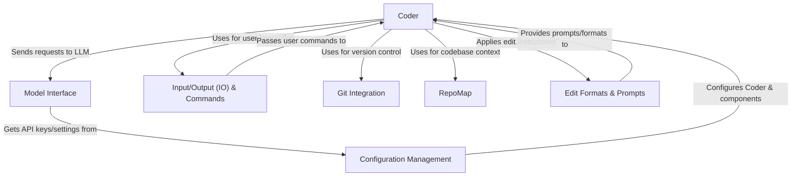

# Tutorial: main

Aider is an AI pair programming tool that runs in your terminal. It lets you chat with an AI assistant (like GPT-4o or Claude) to *write and edit code*. Aider manages your code files, automatically saves changes using **git**, and provides the AI with a *summary map* of your entire codebase for better context. You can configure which AI model to use, how code edits are formatted, and various other settings.

**Source Repository:** [https://github.com/Aider-AI/aider/tree/main](https://github.com/Aider-AI/aider/tree/main)

## Chapters

1. [Input/Output (IO) & Commands](01_input_output__io____commands.md)
2. [Coder](02_coder.md)
3. [Model Interface](03_model_interface.md)
4. [RepoMap](04_repomap.md)
5. [Git Integration](05_git_integration.md)
6. [Edit Formats & Prompts](06_edit_formats___prompts.md)
7. [Configuration Management](07_configuration_management.md)

---

Generated by [AI Codebase Knowledge Builder](https://github.com/The-Pocket/Tutorial-Codebase-Knowledge)