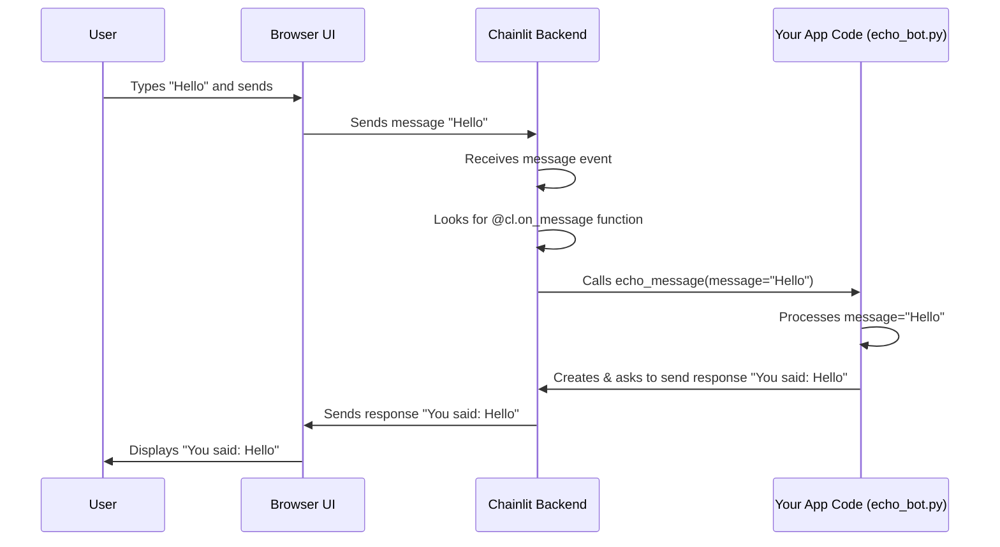

# Chapter 1: Callbacks (`@cl.*` decorators)

Welcome to the Chainlit tutorial! If you've ever wondered how a chat application knows *what* to do when you start chatting or send a message, you're in the right place. This chapter introduces **Callbacks**, the fundamental building blocks for creating interactive Chainlit apps.

**Motivation: Making Your App React**

Imagine you want to build a simple chat application. What's the first thing it should do? Maybe greet the user? And what should happen when the user types something and hits Enter? Perhaps the app should respond.

How do we tell our code *when* to perform these actions? We need a way to say:
"**When** the user starts a chat, run this piece of code."
"**When** the user sends a message, run that piece of code."

This is exactly what Callbacks solve in Chainlit. They allow your application to react automatically to specific events.

**Use Case: The Friendly Echo Bot**

Let's aim to build a very simple bot:
1.  When a user connects, it says "Hi there! Welcome."
2.  Whatever the user types, the bot repeats it back (like an echo).

This simple example uses the core idea of reacting to events.

**What are Callbacks? The `@cl.*` Decorators**

In Chainlit, Callbacks are special Python functions you write. You mark these functions with special tags called **Decorators** (they look like `@something` placed right before the function definition). These decorators tell Chainlit: "Hey, this function is special. Run it automatically when *this specific thing* happens."

Think of it like setting up automatic email replies:
*   `@cl.on_chat_start` is like an "Auto-Reply for New Conversations" – it runs once when a user first connects.
*   `@cl.on_message` is like an "Auto-Reply for Every Incoming Email" – it runs every time the user sends a new message.

These decorators, starting with `@cl.`, are the main way you define the behavior of your Chainlit application.

**Key Callback Decorators in Action**

Let's see how to use these decorators to build our Friendly Echo Bot.

1.  **Greeting the User: `@cl.on_chat_start`**

   This decorator marks a function that Chainlit will run automatically as soon as a user opens your chat application in their browser.

   ```python
   import chainlit as cl

   @cl.on_chat_start
   async def start_chat():
       """
       This function runs when a new chat session starts.
       It sends a welcome message to the user.
       """
       await cl.Message(content="Hi there! Welcome.").send()
   ```

   *   `import chainlit as cl`: This line imports the Chainlit library, giving us access to tools like decorators (`@cl.on_chat_start`) and message handling (`cl.Message`).
   *   `@cl.on_chat_start`: This is the decorator telling Chainlit to run the `start_chat` function when a user connects.
   *   `async def start_chat():`: We define an `async` function. Chainlit works heavily with asynchronous operations (think tasks that can run in the background without blocking everything else), so many callbacks need to be `async`.
   *   `await cl.Message(content="Hi there! Welcome.").send()`: This creates a new chat message with the content "Hi there! Welcome." and sends it to the user interface. The `await` keyword is used because sending a message is an asynchronous operation.

2.  **Echoing the User: `@cl.on_message`**

   This decorator marks a function that Chainlit runs every single time the user sends a message.

   ```python
   import chainlit as cl

   @cl.on_message
   async def echo_message(message: cl.Message):
       """
       This function runs every time a user sends a message.
       It takes the user's message as input and sends it back.
       """
       # Create the response message
       response_message = cl.Message(content=f"You said: {message.content}")

       # Send the response back to the user
       await response_message.send()
   ```

   *   `@cl.on_message`: This decorator tells Chainlit to run `echo_message` whenever a new message arrives from the user.
   *   `async def echo_message(message: cl.Message):`: Notice this function takes an argument: `message`. Chainlit automatically provides the user's incoming message as a `cl.Message` object to this function. This object contains the text the user sent (`message.content`) and other details. We'll explore the `Message` object more in [Message & Step](02_message___step.md).
   *   `response_message = cl.Message(content=f"You said: {message.content}")`: We create a *new* message object. Its content includes the text from the user's original message (`message.content`).
   *   `await response_message.send()`: We send our newly created response message back to the UI.

**Putting It Together: `echo_bot.py`**

Now, let's combine these into a single file named `echo_bot.py`:

```python
import chainlit as cl

# Runs when the chat starts
@cl.on_chat_start
async def start_chat():
    """Sends a welcome message."""
    await cl.Message(content="Hi there! Welcome.").send()

# Runs whenever a user sends a message
@cl.on_message
async def echo_message(message: cl.Message):
    """Echoes the user's message."""
    response_content = f"You said: {message.content}"
    await cl.Message(content=response_content).send()

```

**Running the Bot**

1.  Save the code above as `echo_bot.py`.
2.  Open your terminal or command prompt.
3.  Run the command: `chainlit run echo_bot.py -w`
    *   `chainlit run`: Tells Chainlit to execute your application file.
    *   `echo_bot.py`: The name of your file.
    *   `-w`: (Optional) Stands for "watch". This automatically restarts your app if you save changes to the file, which is very handy during development.

Your browser should open, showing the Chainlit interface.

*   You'll immediately see "Hi there! Welcome." (from `@cl.on_chat_start`).
*   Type "Hello bot!" and press Enter.
*   You'll see "You said: Hello bot!" appear (from `@cl.on_message`).

**How It Works Internally (A Peek Under the Hood)**

You might be wondering *how* Chainlit knows to call your functions. It's like a receptionist waiting for calls or visitors.

1.  **Registration:** When Chainlit starts, it reads your Python file (`echo_bot.py`). It sees the `@cl.on_chat_start` and `@cl.on_message` decorators and makes a note: "Aha! The developer wants the `start_chat` function to run on chat start, and `echo_message` to run on new messages." It registers these functions internally.
2.  **Listening for Events:** The Chainlit backend server constantly listens for events from the user's browser (the UI). These events include "a new user connected" or "a new message was sent".
3.  **Matching Events to Callbacks:** When an event happens (e.g., a new user connects), Chainlit checks its internal notes: "Do I have a function registered for the 'chat start' event?" Yes, it has `start_chat`.
4.  **Execution:** Chainlit then calls (executes) the registered function (`start_chat()` or `echo_message(incoming_message)`). If the function is `async`, Chainlit handles running it correctly.
5.  **Sending Results:** If your callback function sends a message (like `cl.Message(...).send()`), Chainlit takes that message and sends it back to the user's browser to be displayed.

Here's a simplified diagram showing the flow for receiving a message:



**Deeper Dive (Code Reference)**

If you peek inside the Chainlit library code (specifically `chainlit/callbacks.py`), you'll see how these decorators work. For example:

```python
# Simplified from chainlit/callbacks.py

# Stores configuration, including registered callbacks
from chainlit.config import config
# Utility to wrap user functions (handles async, etc.)
from chainlit.utils import wrap_user_function

def on_chat_start(func: Callable) -> Callable:
    """Hook to react to the user websocket connection event."""
    # Register the user's function (after wrapping it)
    # 'func' here is the function you defined (e.g., start_chat)
    config.code.on_chat_start = wrap_user_function(func, with_task=True)
    return func # Return the original function

def on_message(func: Callable) -> Callable:
    """Framework agnostic decorator to react to messages coming from the UI."""
    # ... (similar logic, slightly more complex for handling the message arg) ...
    config.code.on_message = wrap_user_function(...) # Simplified
    return func
```

Essentially, the decorator takes your function (`func`), potentially wraps it with some helper logic using `wrap_user_function` (like making sure `async` functions are handled correctly), and then stores a reference to it in Chainlit's internal configuration (`config.code`). When the corresponding event occurs, Chainlit looks up the function in the configuration and runs it.

**Other Callbacks**

Chainlit provides many other decorators for different events, such as:

*   `@cl.on_chat_end`: Runs when a user disconnects.
*   `@cl.on_app_startup` / `@cl.on_app_shutdown`: Run when the entire Chainlit application starts or stops (useful for loading models or cleaning up resources).
*   `@cl.action_callback("my_action_id")`: Runs when a user clicks a button (an [Action](04_action.md)) you defined.
*   And more for handling authentication, audio input, settings changes, etc.

They all follow the same pattern: define a function and decorate it with the appropriate `@cl.*` tag to make it react to a specific event.

**Conclusion**

Callbacks, marked by `@cl.*` decorators, are the heart of Chainlit's event-driven nature. They allow you to define *what* your application should do *when* specific things happen, like a user starting a chat (`@cl.on_chat_start`) or sending a message (`@cl.on_message`). By writing functions and decorating them, you give life and interactivity to your chat applications.

We've seen how to send simple text messages back to the user. But messages can be much more complex, and you often need to structure your bot's thinking process into logical steps. In the next chapter, we'll dive deeper into the `Message` object and introduce `Step`s to organize your application's logic.

**Next Up:** [Message & Step](02_message___step.md)

---

Generated by [AI Codebase Knowledge Builder](https://github.com/The-Pocket/Tutorial-Codebase-Knowledge)