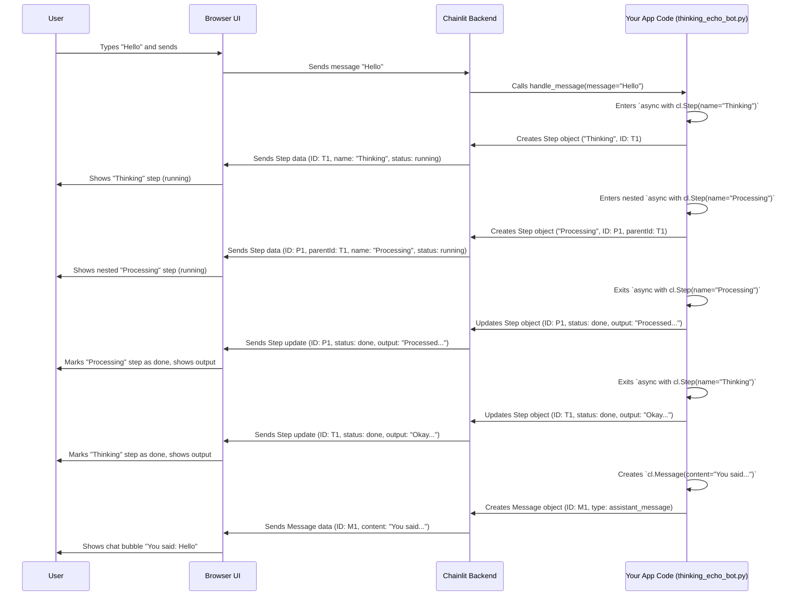

# Chapter 2: Message & Step

In [Chapter 1: Callbacks (`@cl.*` decorators)](01_callbacks____cl____decorators_.md), we learned how to make our Chainlit app react to events like starting a chat or receiving a message. We used `cl.Message` to send replies back to the user. Now, let's dive deeper into `Message` and introduce its close cousin, `Step`. These are the fundamental building blocks for structuring your app's interactions and backend logic.

**Motivation: Seeing How the Bot Thinks**

Imagine our echo bot from Chapter 1. It instantly repeats what you say. But what if the bot needed to do some work first? Maybe it needs to:
1.  Receive your message.
2.  "Think" about it (e.g., call an external tool or API).
3.  Formulate a response based on the thinking process.
4.  Send the final response.

Wouldn't it be cool if the user could *see* this thinking process? Maybe a little expandable section appears showing "Okay, I'm thinking..." and then "Calling the lookup tool..." before the final answer arrives. This helps users understand what the bot is doing and builds trust.

This is where `Message` and `Step` shine. `Message` represents the visible chat bubbles, while `Step` represents any distinct part of the backend process, including those "thinking" moments.

**Use Case: The "Thinking" Echo Bot**

Let's upgrade our echo bot:
1.  When a user sends a message "Hello".
2.  The bot should show a "Thinking..." step.
3.  Inside "Thinking...", it should show another step "Processing input...".
4.  Finally, it sends back a `Message`: "You said: Hello".

This seems simple, but it introduces the idea of visualizing the backend flow.

**Key Concepts: Message vs. Step**

1.  **`cl.Message`: The Chat Bubble**

    We've already met `cl.Message`! It's the object you create to represent something directly visible in the chat interface – like a user's question or the bot's answer.

    Think of it as the **speech bubble** in a comic strip. It's the direct dialogue.

    ```python
    import chainlit as cl

    # In an @cl.on_message function...
    async def handle_message(incoming_message: cl.Message):
        # 'incoming_message' is a Message object from the user
        user_text = incoming_message.content

        # Create a *new* Message object to send back
        response_msg = cl.Message(content=f"You sent: {user_text}")

        # Send it to the UI
        await response_msg.send()
    ```

    *   `cl.Message(content=...)`: Creates a message object. You provide the text content.
    *   `await response_msg.send()`: Sends this message to the chat interface, where it appears as a new bubble.

2.  **`cl.Step`: The Process Panel**

    `cl.Step` is a more general concept. It represents *any* distinct part of your backend process that you want to visualize. This could be:
    *   Calling a function.
    *   Running a complex calculation.
    *   Calling an external API or tool (like a weather API or a database lookup).
    *   Executing a specific part of a larger AI agent (like a "thought" in a Chain of Thought).

    Think of `Step`s as the **panels** in a comic strip. Some panels contain speech bubbles (`Message`s), but other panels might show actions, internal thoughts, or scene changes.

    Crucially, **Steps can be nested**. This allows you to show hierarchical processes. For example, a main "Thinking" step could contain sub-steps like "Parsing Input", "Calling Tool A", and "Formatting Output".

    You typically use `cl.Step` with Python's `async with` statement:

    ```python
    import chainlit as cl
    import asyncio

    # In an @cl.on_message or @cl.on_chat_start function...
    async def complex_process():
        # Start a top-level step named "Thinking"
        async with cl.Step(name="Thinking", type="run") as thinking_step:
            thinking_step.output = "Starting the process..." # Initial text in the step
            await asyncio.sleep(1) # Simulate work

            # Start a nested step inside "Thinking"
            async with cl.Step(name="Sub-Process A", type="tool") as sub_step_a:
                sub_step_a.input = "Data for Tool A"
                await asyncio.sleep(0.5) # Simulate tool call
                sub_step_a.output = "Result from Tool A"
                # When this 'with' block ends, the step is automatically marked as complete

            thinking_step.output = "Finished thinking!" # Update the top-level step text
            # When this 'with' block ends, the "Thinking" step is marked complete
    ```
    *   `async with cl.Step(name="...", type="...") as step_variable:`: This starts a step.
        *   `name`: The label shown in the UI for this step (e.g., "Thinking", "Calling Weather API").
        *   `type`: Categorizes the step (e.g., `"run"` for general processing, `"tool"` for tool calls, `"llm"` for language model calls). This affects the icon and display.
        *   `step_variable`: A variable (`thinking_step`, `sub_step_a`) that lets you interact with the step (like setting its `input` or `output` text).
    *   Code inside the `async with` block runs *within* that step.
    *   Nested `async with cl.Step(...)` creates child steps visually indented under the parent.
    *   `step.input = "..."` / `step.output = "..."`: You can set the input and output displayed within the step panel in the UI.
    *   When the `async with` block finishes, the step is automatically marked as completed in the UI.

3.  **How They Relate**

    *   **Visibility:** `Message`s are *always* shown as prominent chat bubbles. `Step`s are usually shown as collapsible/expandable sections in the UI, often nested, detailing the process.
    *   **Purpose:** `Message` is for dialogue. `Step` is for visualizing backend execution flow and structure.
    *   **Under the Hood:** Technically, a `Message` is a specific *type* of `Step` (like `type="user_message"` or `type="assistant_message"`). This means they share some common properties (like an ID, creation time, etc.) but are handled differently by the UI. You generally use `cl.Message` for chat bubbles and `cl.Step` for visualizing other processing.

**Building the "Thinking" Echo Bot**

Let's implement the use case:

```python
# thinking_echo_bot.py
import chainlit as cl
import asyncio

@cl.on_chat_start
async def start():
    await cl.Message(content="Hello! I'm the Thinking Echo Bot. Tell me something!").send()

@cl.on_message
async def handle_message(message: cl.Message):
    # 1. Start the main "Thinking" step
    async with cl.Step(name="Thinking", type="run") as thinking_step:
        thinking_step.output = "Hmm, let me process that..."
        await asyncio.sleep(1) # Simulate initial thought

        # 2. Start a nested "Processing" step
        async with cl.Step(name="Processing Input", type="tool") as processing_step:
            processing_step.input = message.content # Show what we're processing
            await asyncio.sleep(1.5) # Simulate work
            processed_content = message.content # In reality, we might modify it
            processing_step.output = f"Processed: '{processed_content}'"

        # 3. Update the main step's output
        thinking_step.output = "Okay, I've processed it!"
        await asyncio.sleep(0.5)

        # 4. Send the final Message (outside the Thinking step, but logically follows)
        response_content = f"You said: {processed_content}"
        await cl.Message(content=response_content).send()

```

**Running the Bot:**

1.  Save the code as `thinking_echo_bot.py`.
2.  Run `chainlit run thinking_echo_bot.py -w` in your terminal.
3.  Open the chat in your browser. You'll see the welcome message.
4.  Type "Hello there!" and press Enter.

**What You'll See:**

*   A collapsible step labeled "Thinking" will appear, initially showing "Hmm, let me process that...".
*   Inside "Thinking", another nested step "Processing Input" will appear, showing "Hello there!" as input.
*   After a short delay, "Processing Input" will show "Processed: 'Hello there!'" as output and complete (often marked with a checkmark).
*   Then, "Thinking" will update its text to "Okay, I've processed it!" and complete.
*   Finally, a new chat bubble (`Message`) will appear below the steps: "You said: Hello there!".

You've successfully visualized the bot's internal process!

**How It Works Internally (A Simplified Look)**

When you use `cl.Message(...).send()` or `async with cl.Step(...)`:

1.  **Object Creation:** Your Python code creates a `Message` or `Step` object. This object holds information like content, name, type, ID, parent ID (if nested), timestamps, etc.
2.  **Serialization:** The object's data is converted into a format (like JSON) that can be sent over the network. This is the `StepDict` you might see referenced in the code.
3.  **Emission:** The Chainlit backend uses an internal component (the [Emitter](07_emitter.md)) to send this data package over the websocket connection to the user's browser (the Chainlit UI).
4.  **UI Rendering:** The Chainlit frontend receives the data package. It understands whether it's a chat bubble (`Message`) or a process panel (`Step`) based on the `type` and other fields. It then renders the appropriate UI element (a chat bubble, an expandable step panel, etc.).
5.  **Updates (`.update()`):** When a step finishes (exiting the `async with` block) or you manually call `.update()` or stream tokens, new data packages are sent to the UI to update the appearance of the existing element (e.g., marking a step complete, changing its text, adding tokens).



**Deeper Dive (Code References)**

*   **`chainlit/message.py`**: Defines the `Message` class and its variants (`ErrorMessage`, `AskUserMessage`, etc.).
    *   `Message.__init__(...)`: Sets up the message content, author, etc. It calls `super().__post_init__()` which sets the `thread_id` and potentially a `parent_id` based on the current step context (`local_steps`).
    *   `Message.send()`: Prepares the message (`to_dict()`), potentially persists it, adds it to the chat context (`chat_context`), and uses the `context.emitter` to send it to the UI (`emitter.send_step`). It also handles sending associated [Actions](04_action.md) or [Elements](03_element.md).
    *   `Message.stream_token()`: Sends partial content updates for streaming responses.

*   **`chainlit/step.py`**: Defines the `Step` class and the `@cl.step` decorator.
    *   `Step.__init__(...)`: Initializes the step's properties (name, type, id, parent_id).
    *   `Step.__aenter__()` (for `async with`): Records the start time, determines the `parent_id` from the context (`local_steps`), adds itself to the current context stack, and calls `self.send()` to initially display the step in the UI.
    *   `Step.__aexit__(...)`: Records the end time, potentially sets error state, removes itself from the context stack, and calls `self.update()` to mark the step as completed in the UI.
    *   `Step.send()` / `Step.update()`: Similar to `Message`, they prepare the data (`to_dict()`), interact with the data layer if configured, and use the `context.emitter` to send/update the step in the UI. It also checks `config.ui.cot` to potentially hide non-message steps.
    *   `@cl.step` decorator: A convenient way to automatically wrap a function call within a `Step` context manager.

**Conclusion**

`Message` and `Step` are your primary tools for structuring the flow and visualization of your Chainlit application.

*   Use `cl.Message` for the direct chat dialogue (user inputs, final bot replies).
*   Use `cl.Step` (often with `async with`) to represent and visualize distinct backend processing stages, like function calls, tool usage, or logical phases. Nest steps to show detailed workflows like "Chain of Thought".

By combining Messages and Steps, you can create applications that are not only interactive but also transparent about their inner workings.

Messages and Steps often contain more than just plain text. What if you want to display an image, a table, or a plot within a message or a step? That's where Elements come in.

**Next Up:** [Element](03_element.md)

---

Generated by [AI Codebase Knowledge Builder](https://github.com/The-Pocket/Tutorial-Codebase-Knowledge)