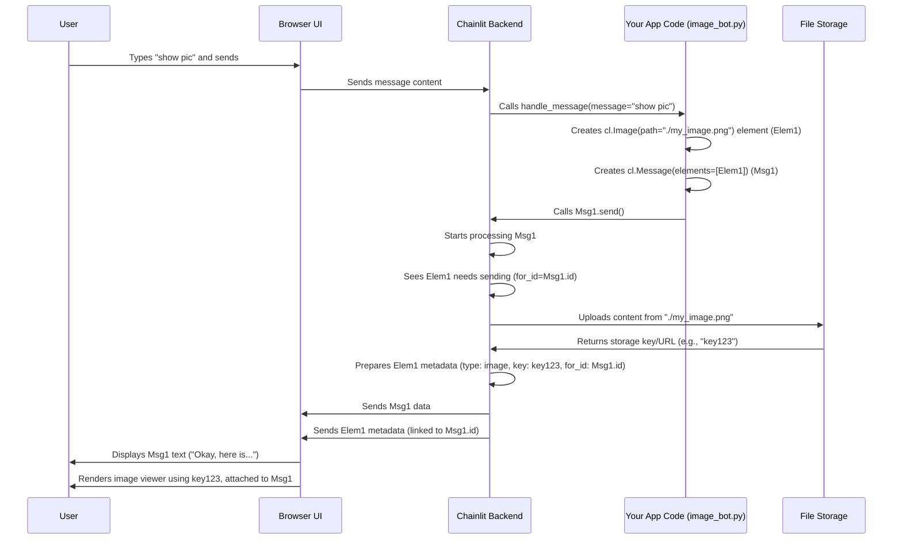

# Chapter 3: Element

In [Chapter 2: Message & Step](02_message___step.md), we learned how to send text messages (`cl.Message`) back and forth and visualize the thinking process using `cl.Step`. But chat applications are often more than just text! What if you want your bot to show an image, play an audio clip, let the user download a file, or display a data table?

This is where **Elements** come in. They are Chainlit's way of handling all non-textual content.

**Motivation: More Than Just Words**

Imagine you're building a bot that helps users analyze data. You might want it to:
*   Show a graph (a plot) visualizing the data.
*   Display the raw data in a table (like a spreadsheet).
*   Let the user download the analysis report as a PDF file.

Or, maybe you want a fun bot that can:
*   Show a random cat picture when asked.
*   Play a short sound effect.

Plain text messages can't do this. We need a way to "attach" or embed richer content into our chat interface. `Element` is the abstraction that solves this.

**Use Case: The Image Display Bot**

Let's build a very simple bot that does one thing:
1.  When the user types "show me a picture",
2.  The bot displays a specific image in the chat.

This basic task requires us to create and send an `Element`.

**Key Concepts: What are Elements?**

Think of Elements like attachments in an email or rich media embeds in a modern chat app (like sending a photo or a file in WhatsApp or Slack).

In Chainlit, an `Element` is a Python object representing some piece of non-textual content. You create an instance of a specific Element type (like `cl.Image`, `cl.Audio`, `cl.File`) and then send it to the UI.

1.  **Types of Elements:** Chainlit comes with built-in support for various types of content:
    *   `cl.Image`: Displays an image (JPG, PNG, GIF, etc.).
    *   `cl.Audio`: Embeds an audio player (MP3, WAV, etc.).
    *   `cl.Video`: Embeds a video player (MP4, WebM, etc.).
    *   `cl.Pdf`: Embeds a PDF viewer or provides a download link.
    *   `cl.File`: Provides a download link for any file type.
    *   `cl.Text`: Displays plain text or code in a dedicated block (useful for log files or snippets).
    *   `cl.Pyplot`: Displays plots generated using Matplotlib.
    *   `cl.Plotly`: Displays interactive plots generated using Plotly.
    *   `cl.Dataframe`: Displays Pandas DataFrames as interactive tables.
    *   `cl.TaskList`: Shows a list of tasks with statuses (we saw this briefly with `Step`).
    *   `cl.CustomElement`: Allows integration with custom React components (Advanced).

2.  **Creating Elements:** You typically create an element by providing:
    *   `content`: The raw bytes of the file (e.g., reading an image file into memory).
    *   `path`: The local file path to the content on the server.
    *   `url`: A URL pointing to the content hosted elsewhere online.

    You also usually give it a `name`, which is often used as the display name or filename.

    ```python
    import chainlit as cl

    # Example: Create an Image element from a URL
    cat_image = cl.Image(
        name="cute_cat.jpg",
        url="https://cataas.com/cat", # A public URL for a cat image
        display="inline", # Show it directly in the chat flow
        size="medium"     # Control the display size
    )

    # Example: Create a Text element from local content
    log_content = "INFO: Process started.\nWARNING: Low disk space.\nINFO: Process finished."
    log_file = cl.Text(
        name="process_log.txt",
        content=log_content,
        language="text",   # Helps with formatting/syntax highlighting
        display="inline"
    )

    # Example: Create a File element from a local path
    report_file = cl.File(
        name="analysis_report.pdf",
        path="./reports/final_report.pdf", # Path on the server
        display="inline"
    )
    ```
    *   `name`: A user-friendly name for the element.
    *   `url`, `path`, `content`: Where to get the element's data. You usually provide only one of these.
    *   `display`: How to show the element. Common options:
        *   `"inline"`: Show directly within the chat message stream (default).
        *   `"side"`: Show in the element sidebar panel.
        *   `"page"`: Show fullscreen (less common for basic elements).
    *   `size`: For visual elements like images/plots (`"small"`, `"medium"`, `"large"`).
    *   `language`: For `cl.Text`, specifies the language for syntax highlighting.

3.  **Sending Elements:** Elements usually aren't sent alone. They are typically associated with a `cl.Message` or sometimes displayed independently in the sidebar.

    *   **With a Message:** You pass a list of elements to the `cl.Message` constructor. When the message is sent, the elements are sent along with it and linked to that message in the UI.

      ```python
      # Inside an @cl.on_message function, assuming 'cat_image' was created as above
      await cl.Message(
          content="Here is the cat picture you asked for!",
          elements=[cat_image] # Pass the element in a list
      ).send()
      ```

    *   **To the Sidebar:** You can use `cl.ElementSidebar` to display elements in a separate panel next to the chat.

      ```python
      import chainlit as cl

      # Assuming 'log_file' and 'report_file' were created as above
      await cl.ElementSidebar.set_elements([log_file, report_file])
      ```
      This opens (or updates) the sidebar panel to show these elements.

**Solving the Use Case: The Image Display Bot**

Let's implement the bot that shows a picture when asked.

```python
# image_bot.py
import chainlit as cl

@cl.on_chat_start
async def start():
    await cl.Message(
        content="Hello! I can show you a picture. Just ask!"
    ).send()

@cl.on_message
async def handle_message(message: cl.Message):
    user_input = message.content.lower() # Get user text, ignore case

    if "show me a picture" in user_input:
        # 1. Create the Image Element
        image_element = cl.Image(
            name="example_image.png",
            url="https://raw.githubusercontent.com/Chainlit/chainlit/main/docs/public/chainlit_banner.png", # A public URL to an image
            display="inline",
            size="large"
        )

        # 2. Create a Message and attach the Element
        response_message = cl.Message(
            content="Okay, here is a picture!",
            elements=[image_element] # Attach the element here
        )

        # 3. Send the Message (with the Element)
        await response_message.send()
    else:
        # Default reply if the command wasn't recognized
        await cl.Message(
            content="Sorry, I didn't understand that. Try asking 'show me a picture'."
        ).send()

```

**Running the Bot:**

1.  Save the code as `image_bot.py`.
2.  Run `chainlit run image_bot.py -w` in your terminal.
3.  Open the chat in your browser.
4.  Type "show me a picture" and press Enter.

**What You'll See:**

*   The bot's reply "Okay, here is a picture!" will appear.
*   Right below (or embedded within) that message bubble, you'll see the Chainlit banner image displayed.

**How It Works Internally (A Simplified Look)**

What happens when you create and send an element with a message?

1.  **Element Creation:** Your Python code creates an `Element` object (e.g., `cl.Image`). It stores the details like name, type, display settings, and where to find the content (URL, path, or the content itself).
2.  **Message Association:** When you create `cl.Message(..., elements=[my_element])`, the message object keeps a reference to the element object(s).
3.  **Message Sending:** You call `await my_message.send()`.
4.  **Element Processing (Inside `message.send()`):**
    *   The `message.send()` method iterates through its list of associated elements.
    *   For each element, it calls that element's own `send()` method, passing the message's ID (`for_id=message.id`).
5.  **Element Persistence/URL Handling (Inside `element.send()`):**
    *   The `element.send()` method checks if the content needs to be uploaded.
        *   If `url` is provided, Chainlit assumes the content is already accessible online.
        *   If `path` or `content` is provided, Chainlit needs to make this content accessible to the user's browser. It typically uploads the content to its configured storage (either built-in or external like S3) and gets back a unique key (`chainlit_key` or `object_key`) or generates an internal URL. This happens via `context.session.persist_file()`.
    *   It determines the `mime` type (e.g., `image/png`, `application/pdf`) if not already specified.
6.  **Serialization & Emission:** The element's final metadata (ID, type, name, display settings, the URL or key pointing to the content, the `for_id` linking it to the message, mime type) is packaged up (serialized, often into JSON).
7.  **Sending to UI:** The Chainlit backend uses the [Emitter](07_emitter.md) to send this element metadata package over the websocket to the user's browser (the Chainlit UI).
8.  **UI Rendering:** The Chainlit frontend receives the data package. It sees the `type` (`image`, `file`, `audio`, etc.) and the `for_id`. It renders the appropriate UI component (an `` tag, an `<audio>` player, a download button) and visually links it to the chat message with the matching ID. If `display` is `"side"`, it puts it in the sidebar instead.

Here's a simplified diagram showing the flow for sending a message with an image element based on a local path:



**Deeper Dive (Code References)**

*   **`chainlit/element.py`**: Defines the base `Element` dataclass and its various subclasses (`Image`, `Audio`, `File`, `Plotly`, etc.).
    *   The `Element` dataclass holds common fields like `id`, `thread_id`, `type`, `name`, `url`, `path`, `content`, `display`, `size`, `for_id`, `mime`.
    *   Subclasses like `Image` often just set the `type` and might add specific fields (like `size`).
    *   `Element.send(for_id)`: This is the core method. It calls `_create()` to handle persistence if needed, figures out the MIME type, and then uses `context.emitter.send_element(self.to_dict())` to send the metadata to the UI.
    *   `Element._create()`: Calls `context.session.persist_file()` if `url` isn't provided, uploading the `content` or `path` content and storing the resulting `chainlit_key`.
    *   `Element.from_dict()`: Used internally to recreate Element objects from stored data.

*   **`chainlit/message.py`**: Shows how messages handle elements.
    *   `Message.__init__(..., elements: Optional[List[ElementBased]] = None, ...)`: The constructor takes a list of elements.
    *   `Message.send()`: After sending the message text itself (`super().send()`), it loops through `self.elements` and calls `element.send(for_id=self.id)` for each one.

*   **`chainlit/sidebar.py`**:
    *   `ElementSidebar.set_elements(elements)`: Sends each element using `element.send(..., persist=False)` (since sidebar elements aren't usually tied to a specific message history) and then emits a `set_sidebar_elements` event to the UI with the list of element dictionaries.

**Conclusion**

Elements (`cl.Image`, `cl.Audio`, `cl.File`, etc.) are essential for making your Chainlit applications richer and more informative than plain text allows. You create them with content, a path, or a URL, and then typically attach them to a `cl.Message` before sending, or display them using `cl.ElementSidebar`. This allows you to easily incorporate images, audio, video, files, plots, and tables into your chat interactions.

Now that we can send text ([Message & Step](02_message___step.md)) and rich media (Elements), how do we let the user interact in ways other than just typing messages? What if we want to add buttons to a message? That's where Actions come in.

**Next Up:** [Action](04_action.md)

---

Generated by [AI Codebase Knowledge Builder](https://github.com/The-Pocket/Tutorial-Codebase-Knowledge)