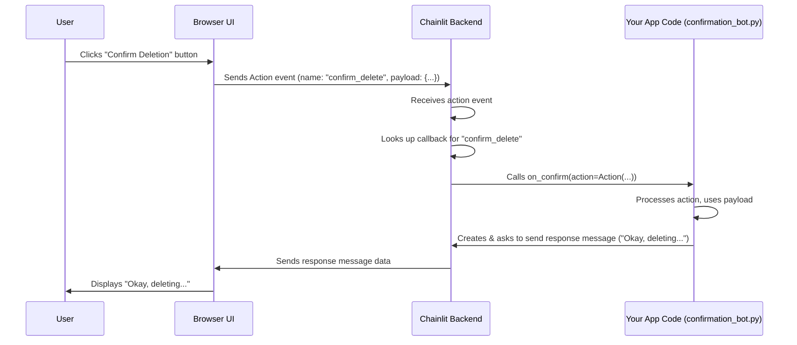

# Chapter 4: Action

In the previous chapter, [Element](03_element.md), we learned how to display rich content like images, files, and plots alongside our text messages. Now, let's think about how users can interact with our app *besides* just typing messages. What if we want to present the user with specific choices as buttons they can click?

This is where **Actions** come in. They are interactive buttons you can attach to messages.

**Motivation: Giving Users Buttons to Press**

Imagine you're building a chatbot that performs potentially important tasks, like deleting a file or confirming an order. Before proceeding, you might want to ask the user for confirmation: "Are you sure you want to proceed?"

Instead of relying on the user typing "yes" or "no" (which they might misspell or phrase differently), wouldn't it be better to show them clear "Yes" and "No" buttons right there in the chat? Clicking "Yes" would continue the task, while clicking "No" would cancel it.

Actions allow you to create exactly this kind of button-based interaction. They provide a structured way for users to trigger specific backend logic directly from the chat interface.

**Use Case: The Confirmation Bot**

Let's build a bot that asks for confirmation:
1.  When the user types "delete my data", the bot sends a message: "Are you sure you want to delete your data?" with two buttons: "Confirm Deletion" and "Cancel".
2.  If the user clicks "Confirm Deletion", the bot sends a message "Okay, deleting your data... (Not really!)".
3.  If the user clicks "Cancel", the bot sends a message "Deletion cancelled."

This simple example demonstrates the core idea: buttons triggering different backend functions.

**Key Concepts: Actions and Callbacks**

1.  **`cl.Action`: The Button Object**

    An `Action` object in Chainlit represents a single clickable button in the UI. You create it like any other Python object.

    ```python
    import chainlit as cl

    # Create an action button
    confirm_action = cl.Action(
        name="confirm_delete",  # Internal name used to link to the callback
        label="Confirm Deletion", # Text displayed on the button
        payload={"user_id": "123", "file": "data.txt"} # Optional data to pass
    )

    cancel_action = cl.Action(
        name="cancel_delete",
        label="Cancel",
        payload={} # No extra data needed for cancel
    )
    ```
    *   `name`: A unique *internal* identifier for this action. This name is crucial because it links the button click to the correct function on the backend. Think of it as the button's ID.
    *   `label`: The text that the user sees *on* the button (e.g., "Confirm", "Cancel", "View Details").
    *   `payload` (optional): A dictionary containing extra data you want to send to the backend function when this button is clicked. Useful for passing context, like which item to delete or which option was chosen.
    *   `tooltip` (optional): Text shown when hovering over the button.
    *   `icon` (optional): Name of a Lucid icon to display next to the label.

2.  **Attaching Actions to Messages**

    Actions don't appear on their own; they are attached to a `cl.Message`. You do this by passing a list of `Action` objects to the `actions` parameter when creating a `cl.Message`.

    ```python
    import chainlit as cl

    # Assume confirm_action and cancel_action are created as above

    # Create a message and attach the actions
    confirmation_message = cl.Message(
        content="Are you sure you want to delete your data?",
        actions=[confirm_action, cancel_action] # Pass the actions in a list
    )

    # Send the message (inside an @cl.on_message or similar function)
    # await confirmation_message.send()
    ```
    When this message is sent, the UI will display the text "Are you sure..." and below it, the two buttons "Confirm Deletion" and "Cancel".

3.  **`@cl.action_callback`: The Button's Function**

    So, you have a button in the UI. What happens when the user clicks it? This is where the `@cl.action_callback` decorator comes in. You use it to designate a specific Python function that should run when a button with a matching `name` is clicked.

    Think of it like connecting a wire from the button to the function. The `name` you give the `cl.Action` must exactly match the string you pass to the `@cl.action_callback` decorator.

    ```python
    import chainlit as cl

    @cl.action_callback("confirm_delete") # Matches the 'name' of confirm_action
    async def handle_confirm(action: cl.Action):
        """
        This function runs when the button with name="confirm_delete" is clicked.
        """
        # You can access the action's payload
        user_id = action.payload.get("user_id")
        file_to_delete = action.payload.get("file")

        await cl.Message(
            content=f"Okay, deleting {file_to_delete} for user {user_id}... (Not really!)"
        ).send()
        # Maybe remove the original buttons after click
        await action.remove()


    @cl.action_callback("cancel_delete") # Matches the 'name' of cancel_action
    async def handle_cancel(action: cl.Action):
        """
        This function runs when the button with name="cancel_delete" is clicked.
        """
        await cl.Message(content="Deletion cancelled.").send()
        # Optionally remove the buttons
        await action.remove()

    ```
    *   `@cl.action_callback("action_name")`: This decorator registers the function below it. Chainlit knows to call this function whenever a user clicks an Action button whose `name` attribute is `"action_name"`.
    *   `async def handle_confirm(action: cl.Action):`: The decorated function *must* accept one argument, which will be the `cl.Action` object that was clicked. This object contains the `name`, `label`, and crucially, the `payload` you originally set.
    *   `action.payload.get(...)`: Inside the callback, you can access the data you sent with the button.
    *   `await action.remove()`: It's often good practice to remove the action buttons after one has been clicked, so the user can't click them again. `action.remove()` tells the UI to hide the specific button that was clicked. You might need to remove other related buttons manually if needed.

**Solving the Use Case: The Confirmation Bot**

Let's put all the pieces together for our confirmation bot.

```python
# confirmation_bot.py
import chainlit as cl

@cl.on_chat_start
async def start():
    await cl.Message(
        content="Hello! I can pretend to delete data. Try typing 'delete my data'."
    ).send()

@cl.on_message
async def handle_message(message: cl.Message):
    user_input = message.content.lower()

    if "delete my data" in user_input:
        # 1. Create the Action buttons
        confirm_action = cl.Action(
            name="confirm_delete", # Must match the decorator name
            label="Confirm Deletion",
            payload={"user_id": "user123", "file": "important_data.txt"} # Example data
        )
        cancel_action = cl.Action(
            name="cancel_delete", # Must match the decorator name
            label="Cancel"
        )

        # 2. Send the message with the actions attached
        await cl.Message(
            content="Are you sure you want to delete your data?",
            actions=[confirm_action, cancel_action]
        ).send()
    else:
        await cl.Message(
            content="Sorry, I didn't understand that. Try 'delete my data'."
        ).send()

# 3. Define the callback for the 'confirm_delete' action
@cl.action_callback("confirm_delete")
async def on_confirm(action: cl.Action):
    # Access payload data sent with the action
    user_id = action.payload.get("user_id", "unknown user")
    file = action.payload.get("file", "some data")

    await cl.Message(
        content=f"Okay, deleting '{file}' for {user_id}... (Not really!)"
    ).send()

    # Optionally, disable the button after click
    # await action.remove() # This removes just the clicked button

# 4. Define the callback for the 'cancel_delete' action
@cl.action_callback("cancel_delete")
async def on_cancel(action: cl.Action):
    await cl.Message(content="Deletion cancelled.").send()
    # Optionally, disable the button after click
    # await action.remove() # This removes just the clicked button

```

**Running the Bot:**

1.  Save the code as `confirmation_bot.py`.
2.  Run `chainlit run confirmation_bot.py -w` in your terminal.
3.  Open the chat in your browser.
4.  Type "delete my data" and press Enter.

**What You'll See:**

*   The message "Are you sure you want to delete your data?" appears.
*   Below it, two buttons: "Confirm Deletion" and "Cancel".
*   Click "Confirm Deletion".
*   A new message appears: "Okay, deleting 'important_data.txt' for user123... (Not really!)".
*   Click "Cancel".
*   A new message appears: "Deletion cancelled."

**How It Works Internally (A Simplified Look)**

When a user clicks an Action button:

1.  **UI Click Event:** The user clicks the button (e.g., "Confirm Deletion") in their browser (Chainlit UI).
2.  **Action Event to Backend:** The UI sends a message over the websocket connection to the Chainlit Backend. This message essentially says: "Hey, the user clicked an Action!" It includes the `name` of the action ("confirm_delete") and its `payload`.
3.  **Callback Lookup:** The Chainlit Backend receives this event. It looks into its registry of functions that were decorated with `@cl.action_callback`. It searches for the function registered with the name "confirm_delete".
4.  **Callback Execution:** The Backend finds the matching function (our `on_confirm` function). It then calls (executes) this function, passing the `cl.Action` object (reconstructed from the name and payload received from the UI) as the argument.
5.  **Response (Optional):** If the callback function sends new messages (like `cl.Message(...).send()`), the Backend sends these back to the UI to be displayed. If the callback calls `action.remove()`, the Backend sends a command to the UI to hide that specific button.

Here's a sequence diagram illustrating the flow:



**Deeper Dive (Code References)**

*   **`chainlit/action.py`**: Defines the `Action` dataclass. It includes fields like `name`, `label`, `payload`, `id`, and `forId` (which links it to the message it's attached to). The `send()` method prepares the action data and uses the [Emitter](07_emitter.md) to send it to the UI. The `remove()` method tells the emitter to remove the action from the UI.
*   **`chainlit/callbacks.py`**: Contains the `action_callback` decorator function. This decorator takes the `name` argument and registers the decorated function (`func`) in `config.code.action_callbacks[name]`.
*   **`chainlit/message.py`**: The `Message.send()` method iterates through the `actions` list provided during initialization and calls `action.send(for_id=self.id)` for each one, linking them to the message ID.
*   **`chainlit/server.py`**: Defines the FastAPI HTTP endpoint `/project/action` (usually accessed via the websocket bridge). When the UI sends an action event, this endpoint receives it, looks up the corresponding callback function in `config.code.action_callbacks` using the action's `name`, and executes it, passing the `Action` object.

**Conclusion**

Actions (`cl.Action`) provide a powerful way to make your Chainlit applications more interactive by adding buttons to messages. By defining `Action` objects with unique `name`s and corresponding callback functions decorated with `@cl.action_callback("name")`, you can allow users to trigger specific backend logic with a simple click. This is great for confirmations, offering choices, or initiating predefined tasks.

We've now covered the main ways to communicate with the user (Messages, Steps, Elements) and let them interact (text input, Actions). But how does Chainlit keep track of the conversation state for each user? How does it know which user is which, and manage data specific to their ongoing chat? That's where Context and Session come in.

**Next Up:** [Context & Session](05_context___session.md)

---

Generated by [AI Codebase Knowledge Builder](https://github.com/The-Pocket/Tutorial-Codebase-Knowledge)