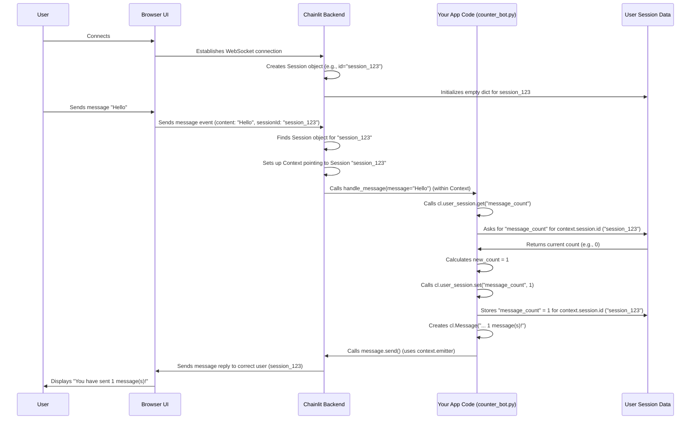

# Chapter 5: Context & Session

In [Chapter 4: Action](04_action.md), we saw how to add interactive buttons (`cl.Action`) to our messages, allowing users to trigger specific backend logic with a click. We've built up ways to send messages, visualize processes, display rich media, and handle button interactions.

But wait a minute. How does Chainlit handle *multiple* users chatting with our application at the same time? If one user sends a message, how does the app know which conversation history to update, or where to send the reply? If we need to remember something specific to a user (like their name or a setting they chose), where do we store that information so it doesn't get mixed up with other users?

This is where **Context** and **Session** come into play. They are the fundamental concepts for managing the state associated with each individual user's interaction.

**Motivation: Remembering Things for Each User**

Imagine you want to build a simple bot that counts how many messages a user has sent *during their current chat*.

1.  When the user connects, the counter starts at 0.
2.  Every time the user sends a message, the counter increases by 1.
3.  The bot replies, telling the user their current message count.

This seems straightforward, but think about it:
*   If Alice and Bob are both chatting with the bot simultaneously, Alice's count should be independent of Bob's count.
*   When Alice sends her 3rd message, the bot needs to know *her* current count is 2 and update it to 3. It shouldn't look at Bob's count.
*   Where does the bot store Alice's count? Where does it store Bob's count?

We need a mechanism to keep track of information *per user connection* and ensure that when our code runs (like inside `@cl.on_message`), it operates on the correct user's data and sends replies back to the right person. Context and Session provide this mechanism.

**Use Case: The Message Counter Bot**

Let's build this counter bot:
1.  Starts counting at 0 when a user connects.
2.  Increments the count for each message sent by that user.
3.  Replies with "You have sent X message(s)!"

This requires storing a counter specific to each user's session.

**Key Concepts: Session, Context, and `user_session`**

1.  **Session: The User's Backpack** 🎒

    Think of a `Session` as a backpack assigned to each user when they connect to your Chainlit app. This backpack holds everything related to *that specific user's interaction* for the duration of their connection.

    What's inside the backpack (`Session` object)?
    *   **A Unique ID:** Like a name tag on the backpack (`session.id`).
    *   **Connection Details:** How the user is connected (e.g., websocket information).
    *   **Environment Variables:** Any specific settings loaded for that user (`session.user_env`).
    *   **Uploaded Files:** Files the user has uploaded during the session (`session.files`).
    *   **User Information:** Details about the logged-in user, if applicable (`session.user`).
    *   **A Pocket for Your Stuff:** A special dictionary where *you* can store custom data for this session (we'll get to this!).

    Every user gets their own separate backpack (Session). Alice's session is distinct from Bob's session.

2.  **Context: Knowing Whose Backpack to Use** 🧑‍🏫

    Now, imagine you are the bot's brain (the code running in the backend). When a message comes in, how do you know *which* user's backpack (Session) to look inside? This is where the `Context` comes in.

    The `Context` is like the librarian knowing *which patron they are currently helping*. Before Chainlit runs your code (like an `@cl.on_message` function), it sets up the `Context` to point to the *correct active Session* for the user who triggered the event (e.g., sent the message).

    The `Context` provides access to:
    *   **The Current `Session`:** (`context.session`) - The backpack of the user we're dealing with right now.
    *   **The `Emitter`:** (`context.emitter`) - The channel to send messages *back* to that specific user's browser. (We'll cover the [Emitter](07_emitter.md) in more detail later).

    Essentially, the `Context` ensures your code operates within the scope of the correct user. When you call `cl.Message(...).send()`, the `Context` uses the `emitter` associated with the current user's `Session` to send the message to the right place.

3.  **`user_session`: The Backpack's Easy-Access Pocket** ኪስ

    The `Session` backpack holds lots of technical details. But often, you just need a simple place to store custom information for the user, like our message counter. Chainlit provides a very convenient way to do this: `cl.user_session`.

    Think of `cl.user_session` as a special, easy-to-reach pocket *inside* the current user's backpack (Session). It behaves just like a Python dictionary, but it's automatically tied to the current user's session via the `Context`.

    You can easily:
    *   **Store data:** `cl.user_session.set("my_key", my_value)`
    *   **Retrieve data:** `value = cl.user_session.get("my_key", default_value)`

    Behind the scenes, `cl.user_session` uses the `context.session.id` to make sure it's reading and writing data for the *correct* user.

    For our counter bot, `cl.user_session` is the perfect place to store the message count for each user.

**Solving the Use Case: The Message Counter Bot**

Let's use `cl.user_session` to build our counter.

```python
# counter_bot.py
import chainlit as cl

@cl.on_chat_start
async def start_chat():
    """
    This runs when a user connects.
    Initialize the message count to 0 in their session.
    """
    cl.user_session.set("message_count", 0) # Store 0 for the key "message_count"

    await cl.Message(
        content="Hi! I'll count how many messages you send."
    ).send()

@cl.on_message
async def handle_message(message: cl.Message):
    """
    This runs every time a user sends a message.
    Increment their count and reply.
    """
    # 1. Get the current count for this user from the session
    # If "message_count" isn't set yet, default to 0
    current_count = cl.user_session.get("message_count", 0)

    # 2. Increment the count
    new_count = current_count + 1

    # 3. Store the new count back into the session for this user
    cl.user_session.set("message_count", new_count)

    # 4. Send the reply
    await cl.Message(
        content=f"You have sent {new_count} message(s)!"
    ).send()

```

**Running the Bot:**

1.  Save the code as `counter_bot.py`.
2.  Run `chainlit run counter_bot.py -w` in your terminal.
3.  Open the chat in your browser.
4.  Send some messages:
    *   You type: "Hello" -> Bot replies: "You have sent 1 message(s)!"
    *   You type: "How are you?" -> Bot replies: "You have sent 2 message(s)!"
    *   You type: "Goodbye" -> Bot replies: "You have sent 3 message(s)!"

**Try This:** Open the same chat application in a *different browser tab* or window. This will create a *new session*. Send messages there. You'll see its counter starts from 1 and increments independently of the first tab. This demonstrates that `user_session` keeps the data separate for each session!

**How It Works Internally (A Simplified Look)**

How does Chainlit magically manage this separation using Context and Session?

1.  **User Connects:** When a user opens the app in their browser, a websocket connection is established. The Chainlit backend creates a unique `Session` object (like `WebsocketSession`) for this connection, giving it a unique `session.id`. It also potentially loads user info, environment variables, etc.
2.  **Event Occurs:** The user performs an action, like sending a message. The browser sends the message content and the session ID over the websocket to the backend.
3.  **Context Setup:** The backend receives the event. It uses the session ID to find the corresponding `Session` object. It then creates or updates a `Context` object (`ChainlitContext`) for the current task, linking it to this specific `Session` and its associated `Emitter`. This `Context` is made available implicitly to your code (using Python's `ContextVar`).
4.  **Callback Execution:** Chainlit finds the right callback function (e.g., the one decorated with `@cl.on_message`) and runs it.
5.  **`user_session` Access:** Inside your callback, when you call `cl.user_session.get("message_count")`:
    *   `cl.user_session` internally calls `get_context()` to find the current `Context`.
    *   It accesses `context.session.id` to get the unique ID for the *current* user's session.
    *   It looks up a global dictionary (`user_sessions` in `user_session.py`) using this session ID to find the dictionary specific to *this* user.
    *   It retrieves the value associated with the key `"message_count"` from that user-specific dictionary.
    *   `cl.user_session.set(...)` works similarly, updating the value in the correct user's dictionary.
6.  **Sending Response:** When your code calls `cl.Message(...).send()`, it also uses the `Context` to get the correct `emitter` for the current session, ensuring the reply goes back to the right user.

Here's a simplified sequence diagram:



**Deeper Dive (Code References)**

*   **`chainlit/session.py`**: Defines the `BaseSession`, `HTTPSession`, and `WebsocketSession` classes. These hold core session information like `id`, `thread_id`, `user`, `user_env`, `files`, `chat_settings`, etc. Note the `WebsocketSession` also holds the `emit` and `emit_call` functions for communication. The global dictionaries `ws_sessions_id` and `ws_sessions_sid` map session IDs and socket IDs to `WebsocketSession` instances.
    ```python
    # Simplified from chainlit/session.py
    class WebsocketSession(BaseSession):
        def __init__(
            self,
            id: str, # Unique Session ID
            socket_id: str, # Current websocket ID
            emit: Callable, # Function to send data
            # ... other params like user, user_env, etc.
        ):
            super().__init__(id=id, ...)
            self.socket_id = socket_id
            self.emit = emit
            # ... store other params ...

    # Global dictionaries to find sessions
    ws_sessions_id: Dict[str, WebsocketSession] = {}
    ws_sessions_sid: Dict[str, WebsocketSession] = {}
    ```

*   **`chainlit/context.py`**: Defines `ChainlitContext` which holds the current `session` and `emitter`. It uses `contextvars.ContextVar` (`context_var`) to make the current context available implicitly within an execution scope (like a callback). Functions like `init_ws_context` are called by the framework to set the context when an event arrives. `get_context()` retrieves the currently set context. `context` is a lazy proxy to `get_context()`.
    ```python
    # Simplified from chainlit/context.py
    from contextvars import ContextVar
    from chainlit.session import WebsocketSession, HTTPSession
    from chainlit.emitter import BaseChainlitEmitter

    class ChainlitContext:
        session: Union["HTTPSession", "WebsocketSession"]
        emitter: "BaseChainlitEmitter"
        # ... other properties ...

    context_var: ContextVar[ChainlitContext] = ContextVar("chainlit")

    def get_context() -> ChainlitContext:
        try:
            return context_var.get() # Get context for current task
        except LookupError:
            raise ChainlitContextException("Chainlit context not found")

    # context is used like: context.session, context.emitter
    context: ChainlitContext = LazyProxy(get_context, ...)
    ```

*   **`chainlit/user_session.py`**: Defines the `UserSession` class (exposed as `cl.user_session`). Its `get` and `set` methods use the global `user_sessions` dictionary (mapping `session.id` to user data dictionaries) and the current `context` to access the correct user's data.
    ```python
    # Simplified from chainlit/user_session.py
    from chainlit.context import context

    # Global storage: maps session_id -> user's custom data dict
    user_sessions: Dict[str, Dict] = {}

    class UserSession:
        def get(self, key, default=None):
            session_id = context.session.id # Get current user's session ID from context
            if session_id not in user_sessions:
                user_sessions[session_id] = {} # Initialize if first time
            return user_sessions[session_id].get(key, default)

        def set(self, key, value):
            session_id = context.session.id # Get current user's session ID
            if session_id not in user_sessions:
                user_sessions[session_id] = {}
            user_sessions[session_id][key] = value

    user_session = UserSession() # The instance you use via cl.user_session
    ```

**Conclusion**

`Context` and `Session` are the backbone of Chainlit's ability to handle multiple users concurrently and maintain state specific to each user's interaction.

*   The `Session` acts like a "backpack" holding all information related to a single user's connection (ID, user info, files, settings).
*   The `Context` tells your code *which* user's `Session` is currently active for the event being processed.
*   `cl.user_session` provides a simple dictionary-like interface (`get`, `set`) for you to store and retrieve custom data within the current user's `Session`, making it easy to manage state like counters, user preferences, or intermediate results within a conversation.

Understanding Context and Session is key to building applications that correctly handle individual user states. Now that we know how to manage state per user, let's look at how to configure the overall behavior and settings of our Chainlit application using configuration files.

**Next Up:** [Configuration (`config.py` & `config.toml`)](06_configuration___config_py_____config_toml__.md)

---

Generated by [AI Codebase Knowledge Builder](https://github.com/The-Pocket/Tutorial-Codebase-Knowledge)