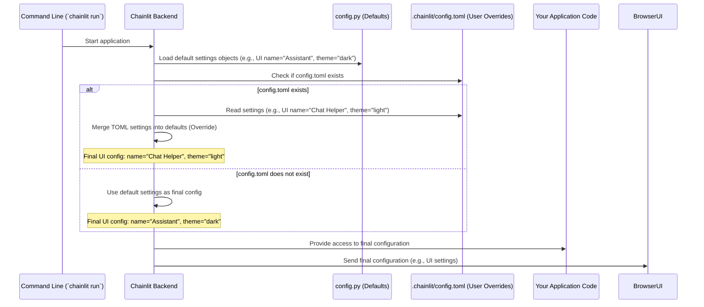

# Chapter 6: Configuration (`config.py` & `config.toml`)

In the [previous chapter](05_context___session.md), we learned how Chainlit uses `Context` and `Session` to manage information specific to each user's chat. Now, let's zoom out a bit. How do we control the *overall* behavior and appearance of our entire Chainlit application? What if we want to change the app's name, its color theme, or enable specific features like file uploads?

This is where **Configuration** comes in. It's like the settings menu for your Chainlit app, allowing you to customize various aspects without touching your core application code (like the Python file with your `@cl.on_chat_start` and `@cl.on_message` functions).

**Motivation: Customizing Your App**

Imagine you've built a cool Chainlit bot. By default, it might be called "Assistant" in the UI and use a standard theme. But you want to make it *your* own!

*   You want to change the displayed name to "My Awesome Bot".
*   You prefer a light theme instead of the default dark one.
*   You want to allow users to upload PDF files but not other types.

How can you make these changes easily? You need a way to tell Chainlit about your preferences. Configuration files provide this exact capability.

**Use Case: Naming and Theming Our Bot**

Let's aim to customize a simple Chainlit app:
1.  Change its displayed name from the default "Assistant" to "Chat Helper".
2.  Change the default theme from "dark" to "light".

We'll achieve this just by editing a configuration file, without changing any Python code.

**Key Concepts: The Two Configuration Files**

Chainlit uses two main places to manage configuration settings:

1.  **`config.toml`: Your Settings File** ⚙️

    This is the primary file *you* will interact with to customize your app. It lives inside a special hidden directory named `.chainlit` within your project's main folder. So, the full path is usually `.chainlit/config.toml`.

    *   **Format:** It uses the TOML format (Tom's Obvious, Minimal Language), which is designed to be easy for humans to read and write. It uses `key = value` pairs, grouped into sections like `[UI]` or `[features]`.
    *   **Purpose:** You put your specific settings here. For example, you'd specify the app name or theme preference in this file.
    *   **Creation:** If the `.chainlit/config.toml` file doesn't exist when you run Chainlit, it will often create a default one for you with helpful comments. You can then edit it.

    ```toml
    # Example snippet from .chainlit/config.toml

    [UI]
    # Name of the assistant.
    name = "My Custom Assistant Name"
    # Default theme ('light' or 'dark')
    default_theme = "light"

    [features]
    # Allow users to upload files?
    [features.spontaneous_file_upload]
        enabled = true
        accept = ["application/pdf"] # Only allow PDF uploads
        max_files = 5
        max_size_mb = 100
    ```
    *   Sections like `[UI]` and `[features]` group related settings.
    *   Keys like `name`, `default_theme`, `enabled`, `accept` hold the specific configuration values.

2.  **`config.py`: The Default Blueprint** 📜

    This is a Python file *inside* the Chainlit library itself (`chainlit/config.py`). You usually don't edit this file directly.

    *   **Purpose:** It defines *all* possible configuration settings and their *default* values. If you don't specify a setting in your `config.toml`, Chainlit uses the default value from `config.py`.
    *   **Internal Use:** Chainlit's internal code reads settings from here and uses them to control its behavior. It defines structures (like `UISettings`, `ProjectSettings`) to hold these configurations.

    Think of `config.py` as the blueprint containing all possible settings and their factory defaults, and `config.toml` as your personal sticky note where you write down any changes you want to make to that blueprint.

3.  **How They Work Together: Overriding Defaults**

    When Chainlit starts:
    1.  It first loads all the default settings defined in `config.py`.
    2.  Then, it looks for your `.chainlit/config.toml` file.
    3.  If `config.toml` exists, Chainlit reads it.
    4.  Any settings found in `config.toml` **override** the default values loaded from `config.py`.
    5.  If a setting is *not* mentioned in `config.toml`, the default value from `config.py` is used.

    This makes customization easy: you only need to specify the things you want to *change* from the defaults in your `config.toml`.

**Solving the Use Case: Naming and Theming**

Let's change our app's name to "Chat Helper" and set the theme to "light".

1.  **Find or Create `config.toml`:** In your project directory (where your main Python file like `app.py` is located), look for a `.chainlit` folder. Inside it, there should be a `config.toml` file. If it doesn't exist, run your Chainlit app once (`chainlit run app.py`), and it should create a default one.

2.  **Edit `config.toml`:** Open `.chainlit/config.toml` in your text editor. Find the `[UI]` section (or add it if it's missing) and modify/add the `name` and `default_theme` settings:

    ```toml
    # .chainlit/config.toml

    # ... other settings might be here ...

    [UI]
    # Name of the assistant.
    name = "Chat Helper" # Changed from the default

    # Default theme ('light' or 'dark')
    default_theme = "light" # Changed from the default (often 'dark')

    # ... other UI settings might follow ...

    # ... other sections like [project] or [features] ...
    ```
    *   We set `name` to `"Chat Helper"`.
    *   We set `default_theme` to `"light"`.

3.  **Run Your App:** Save the `config.toml` file. Now, run your Chainlit app again:
    `chainlit run app.py`

**What You'll See:**

*   The title bar and the default name displayed in the chat interface will now show "Chat Helper".
*   The application's user interface will use a light color scheme.

We successfully customized the app just by editing the `config.toml` file!

**How It Works Internally (Simplified Loading Process)**

What happens behind the scenes when Chainlit starts and needs to figure out its settings?

1.  **Start:** The `chainlit run` command is executed.
2.  **Load Defaults (`config.py`):** Chainlit's internal code first creates configuration objects (like `UISettings`, `ProjectSettings`, `FeaturesSettings`) based on the definitions and default values in `chainlit/config.py`.
3.  **Look for User Config (`config.toml`):** Chainlit checks if a `.chainlit/config.toml` file exists in your project directory.
4.  **Read User Config:** If `config.toml` is found, Chainlit uses a library (like `tomli`) to parse the TOML file into a Python dictionary.
5.  **Merge/Override:** Chainlit intelligently merges the settings read from `config.toml` into the default configuration objects loaded in step 2. Any setting present in `config.toml` replaces the default value for that specific setting.
6.  **Use Final Config:** The rest of the Chainlit application (backend server, UI communication) now uses these final, merged configuration values to determine how to behave and look. For example, the part of the code that sends settings to the browser will now send `name = "Chat Helper"` and `default_theme = "light"`.

Here’s a simplified diagram showing this flow:



**Deeper Dive (Code References)**

Let's peek at simplified versions of the relevant code parts:

*   **`chainlit/config.py`**: Defines the structure and defaults.

    ```python
    # Simplified from chainlit/config.py
    from pydantic.dataclasses import dataclass
    from typing import Literal, Optional

    @dataclass()
    class UISettings:
        # Default name is "Assistant"
        name: str = "Assistant"
        description: str = ""
        # Default theme is "dark"
        default_theme: Optional[Literal["light", "dark"]] = "dark"
        # ... other UI settings with defaults ...

    @dataclass()
    class ProjectSettings:
        enable_telemetry: bool = True
        user_env: Optional[List[str]] = None
        session_timeout: int = 3600
        # ... other project settings with defaults ...

    # Function to load settings from config.toml
    def load_settings():
        # Default file path
        config_file = os.path.join(APP_ROOT, ".chainlit", "config.toml")
        toml_dict = {}
        if os.path.exists(config_file):
            import tomli
            with open(config_file, "rb") as f:
                toml_dict = tomli.load(f) # Parse the TOML file

        # Create settings objects, overriding defaults with values from toml_dict
        ui_config = toml_dict.get("UI", {})
        project_config = toml_dict.get("project", {})

        # Pydantic dataclasses handle the merging smartly:
        # If a key exists in ui_config, it's used; otherwise, the default is kept.
        ui_settings = UISettings(**ui_config)
        project_settings = ProjectSettings(**project_config)

        # ... load other sections similarly ...

        return {
            "ui": ui_settings,
            "project": project_settings,
            # ... other settings objects ...
        }

    # The main config object, loaded on startup
    config = load_config() # Simplified representation of the global config object
    ```
    *   Dataclasses like `UISettings` define the structure and default values.
    *   `load_settings` reads the `.chainlit/config.toml` file using `tomli`.
    *   It creates instances of the settings dataclasses, passing the dictionary loaded from TOML. Pydantic cleverly uses the provided values and falls back to defaults for missing keys.
    *   The globally accessible `config` object holds the final, merged settings.

*   **`chainlit/server.py`**: Uses the loaded configuration.

    ```python
    # Simplified from chainlit/server.py
    from chainlit.config import config # Import the loaded config object
    from fastapi.responses import JSONResponse

    @router.get("/project/settings")
    async def project_settings(current_user: UserParam, language: str):
        # Access the loaded UI and features settings directly from the config object
        ui_settings_dict = config.ui.to_dict()
        features_settings_dict = config.features.to_dict()

        # ... load markdown, chat profiles, etc. ...

        return JSONResponse(
            content={
                "ui": ui_settings_dict, # Send UI settings to the frontend
                "features": features_settings_dict, # Send feature settings
                # ... other settings ...
            }
        )
    ```
    *   Other parts of the Chainlit backend import the `config` object.
    *   They access its attributes (like `config.ui.name`, `config.features.spontaneous_file_upload.enabled`) to make decisions or send settings to the frontend.

**Conclusion**

Configuration in Chainlit allows you to customize your application's appearance (`name`, `theme`, `custom_css`), features (`unsafe_allow_html`, `latex`, `file_upload`), and project settings (`telemetry`, `user_env`, `timeouts`) without modifying your core Python logic.

*   You primarily interact with the user-friendly `.chainlit/config.toml` file.
*   Chainlit defines defaults in `chainlit/config.py`.
*   Settings in `config.toml` **override** the defaults from `config.py`.

By editing `config.toml`, you can easily tailor your Chainlit app to your specific needs and preferences.

Now that we understand how Chainlit is configured and how messages, steps, elements, actions, and session state work, how does the backend actually *send* all this information (messages, element updates, configuration settings) to the user's browser interface? That's the job of the Emitter.

**Next Up:** [Emitter](07_emitter.md)

---

Generated by [AI Codebase Knowledge Builder](https://github.com/The-Pocket/Tutorial-Codebase-Knowledge)