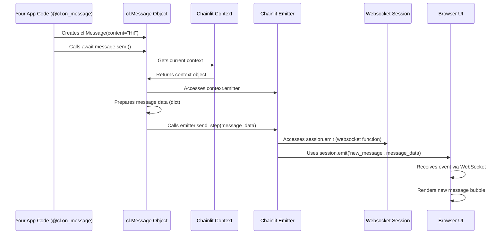

# Chapter 7: Emitter

In the [previous chapter](06_configuration___config_py_____config_toml__.md), we learned how to customize our Chainlit application's appearance and features using `config.toml`. We've set up our app, defined how it reacts with callbacks, created messages and steps, added rich elements and interactive actions, and managed user-specific data with context and sessions.

But how does all the information we create in our Python backend – the messages, the steps showing the bot's thinking, the images, the buttons – actually get sent to the user's browser to be displayed? There must be a messenger involved!

**Motivation: Sending Information to the User Interface**

Think about any Chainlit app we've built so far, like the "Thinking Echo Bot" from [Chapter 2: Message & Step](02_message___step.md).
1.  Your Python code created a `cl.Step` object named "Thinking".
2.  It later created a `cl.Message` object with the final reply.
3.  Somehow, these instructions travelled from your Python code running on the server to the user's web browser, causing the "Thinking" step panel and the chat bubble to appear on the screen.

How does this communication happen? We need a reliable way for the backend to push updates and data to the frontend in real-time. This is the job of the **Emitter**.

**Use Case: The Invisible Mail Carrier**

Imagine our backend Python code is like a busy post office, preparing packages (messages, steps, element data) to be sent to users. Each user connected to our app has their own frontend mailbox (their browser window).

The **Emitter** is like the dedicated mail carrier assigned to each user. When your code says "send this message" (e.g., `await my_message.send()`), it's essentially handing the package (the message data) to the mail carrier (the Emitter) for that specific user. The Emitter then takes this package and delivers it instantly over the network (using the underlying WebSocket connection) to the correct user's mailbox (their browser UI), where it gets displayed.

**Key Concepts: The Role of the Emitter**

1.  **Backend-to-Frontend Communication:** The Emitter's sole purpose is to send data and events *from* the Python backend *to* the connected frontend user interface. It's a one-way street in terms of initiating communication (backend pushes to frontend), although the frontend can send messages back to the backend (like user input or action clicks), which the backend receives through different mechanisms.

2.  **WebSockets:** This communication happens over a persistent connection called a WebSocket. When a user opens your Chainlit app, their browser establishes a WebSocket connection with the backend server. This connection stays open, allowing the backend (via the Emitter) to push updates instantly without the frontend having to constantly ask "Anything new?".

3.  **Tied to Session and Context:** Remember [Chapter 5: Context & Session](05_context___session.md)? Each user has their own `Session`, and the `Context` points to the currently active session. Crucially, each `Session` has its *own dedicated Emitter instance*. When your code runs within a specific user's `Context` (like inside an `@cl.on_message` callback for that user), any calls to send data will automatically use the Emitter associated with *that specific user's session*. This ensures messages and updates go only to the intended recipient and don't get mixed up between different users.

4.  **"Behind the Scenes":** You, as a developer using Chainlit's main features, will almost *never* interact with the Emitter directly. It works silently in the background. When you use high-level objects and methods like:
    *   `cl.Message(...).send()`
    *   `cl.Step(...).update()` or exiting an `async with cl.Step(...)` block
    *   `cl.Element(...).send()`
    *   `cl.Action(...).remove()`
    *   `cl.AskUserMessage(...).send()`

    These methods internally access the current `Context`, find the appropriate `Emitter` for the user's session, package up the necessary data, and call the Emitter's methods (like `send_step`, `update_step`, `send_element`, `remove_action`) to transmit the information.

**Using the Emitter (Indirectly)**

You don't need to write code like `emitter.send_something()`. Instead, you use the familiar Chainlit objects. Let's see how a simple message send involves the Emitter implicitly:

```python
# Inside an @cl.on_message or similar function
import chainlit as cl

# 1. You create a Message object
response_message = cl.Message(content="Hello back to you!")

# 2. You call the send() method
await response_message.send()

# ---- What happens internally (simplified): ----
# a. response_message.send() gets the current context.
# b. It accesses context.emitter.
# c. It prepares the message data into a dictionary (step_dict).
# d. It calls context.emitter.send_step(step_dict).
# e. The emitter sends this data over the websocket to the user's browser.
```

The beauty is that you only need to worry about steps 1 and 2. Chainlit handles the internal steps (a-e) involving the Emitter automatically.

**How It Works Internally (A Simplified Look)**

Let's trace the journey of a message from your code to the UI, highlighting the Emitter's role.

1.  **Code Calls `.send()`:** Your Python code, running in response to a user event (like receiving a message), creates a `cl.Message` object and calls `await my_message.send()`.
2.  **Context Lookup:** The `send()` method uses `chainlit.context` to get the `ChainlitContext` object associated with the current user's ongoing request/task.
3.  **Emitter Access:** The `send()` method accesses the `emitter` property from the context: `context.emitter`. This retrieves the specific `ChainlitEmitter` instance tied to the current user's `WebsocketSession`.
4.  **Data Preparation:** The `Message` object converts its own data (content, author, ID, etc.) into a dictionary format (`StepDict`) suitable for sending over the network.
5.  **Emitter Method Call:** The `send()` method calls the appropriate method on the emitter instance, passing the prepared data. For sending a new message, this is typically `emitter.send_step(message_data_dict)`.
6.  **WebSocket Transmission:** The `emitter.send_step()` method takes the data dictionary. It then uses the underlying websocket communication function (stored in `self.session.emit`) to send an event (e.g., `"new_message"`) along with the data payload over the WebSocket connection to the specific user's browser.
7.  **UI Reception & Rendering:** The Chainlit frontend JavaScript code running in the user's browser receives the `"new_message"` event and its data payload via the WebSocket. It understands this data represents a new chat message and renders a new chat bubble on the screen accordingly.

Here’s a sequence diagram illustrating this flow:



**Deeper Dive (Code References)**

Let's look at simplified snippets showing these connections:

*   **`chainlit/emitter.py`**: Defines the `ChainlitEmitter` class.

    ```python
    # Simplified from chainlit/emitter.py
    from chainlit.session import WebsocketSession
    from chainlit.step import StepDict

    class ChainlitEmitter:
        session: WebsocketSession

        def __init__(self, session: WebsocketSession) -> None:
            self.session = session

        # Method to send a new step/message
        def send_step(self, step_dict: StepDict):
            # Uses the 'emit' function stored in the session,
            # which knows how to send over this specific user's websocket.
            return self.session.emit("new_message", step_dict)

        # Method to update an existing step/message
        def update_step(self, step_dict: StepDict):
            return self.session.emit("update_message", step_dict)

        # ... other methods like send_element, delete_step, etc. ...
    ```
    *   The emitter holds a reference to the specific user's `WebsocketSession`.
    *   Methods like `send_step` package the data and use the `session.emit` function (which points to the underlying Socket.IO emit function for that user's connection) to send the event and data.

*   **`chainlit/message.py` / `chainlit/step.py`**: Show how high-level objects use the emitter.

    ```python
    # Simplified from chainlit/message.py (inside Message class)
    from chainlit.context import context # Access the current context

    async def send(self):
        # ... prepare message data into self_dict ...
        step_dict = self.to_dict() # Convert message to dictionary

        # Access the emitter from the context and send the data
        await context.emitter.send_step(step_dict)

        # Also send any attached elements or actions via the emitter
        for element in self.elements:
            await element.send(for_id=self.id) # Element.send also uses context.emitter
        for action in self.actions:
            await action.send(for_id=self.id)   # Action.send also uses context.emitter

    # Simplified from chainlit/step.py (inside Step class)
    async def update(self):
        # ... prepare updated step data ...
        step_dict = self.to_dict()
        # Use the emitter to send an update event
        await context.emitter.update_step(step_dict)

    async def __aexit__(self, exc_type, exc_val, exc_tb):
        # When an 'async with cl.Step(...)' block ends...
        # ... record end time, handle errors ...
        # Send a final update to mark the step as completed
        await self.update()
    ```
    *   Methods like `send()` and `update()` clearly access `context.emitter` and call its methods (`send_step`, `update_step`).

*   **`chainlit/context.py`**: Shows where the emitter is stored.

    ```python
    # Simplified from chainlit/context.py
    from chainlit.emitter import BaseChainlitEmitter, ChainlitEmitter
    from chainlit.session import WebsocketSession

    class ChainlitContext:
        session: WebsocketSession
        emitter: BaseChainlitEmitter # Holds the emitter instance

        def __init__(self, session: WebsocketSession):
            self.session = session
            # Create the specific emitter for this session
            self.emitter = ChainlitEmitter(session)
            # ... other initializations ...

    # context_var = ContextVar(...) stores the active context
    # context = LazyProxy(get_context) provides easy access: context.emitter
    ```
    *   The `ChainlitContext` object holds a reference to both the `session` and the `emitter` created specifically for that session.

**Conclusion**

The Emitter is the vital communication link sending information from your Chainlit backend to the user's interface. While it operates mostly behind the scenes, understanding its role is key to grasping how Chainlit achieves its real-time interactivity. It acts as the dedicated messenger for each user session, ensuring that messages, steps, elements, and other UI updates created in your Python code are reliably delivered to the correct user's browser via the WebSocket connection, all managed seamlessly through the `Context` and high-level objects like `Message` and `Step`.

So far, we've focused on the interactive parts of a Chainlit app: communication, state management, and configuration. But what if you need to permanently store conversation history, user feedback, or other data beyond a single session? That's where the Data Layer comes in.

**Next Up:** [Data Layer](08_data_layer.md)

---

Generated by [AI Codebase Knowledge Builder](https://github.com/The-Pocket/Tutorial-Codebase-Knowledge)