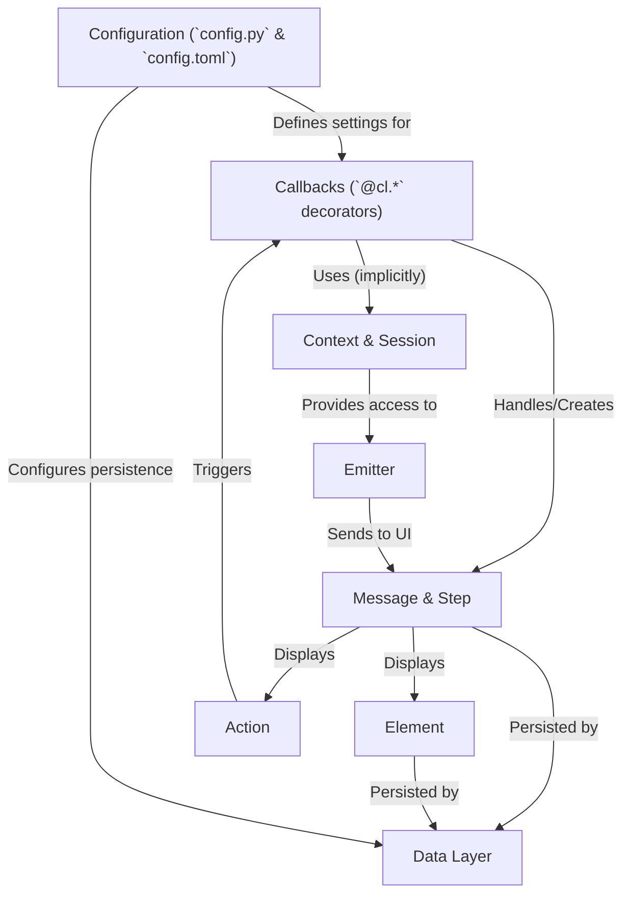

# Tutorial: backend

Chainlit helps you quickly build Python applications with a **conversational interface**.
Think of it like creating a *custom ChatGPT* but with your own logic and UI.
You define how the app reacts to user messages or events using simple **`@cl.*` decorators** (Callbacks), which are the core building blocks of your app's behavior.
The chat UI displays *Messages* and *Steps*, which can include interactive *Elements* like images or buttons (Actions).
Chainlit manages the user's *Session* and provides *Context* for interactions.
It uses an *Emitter* to communicate between the backend and frontend and can automatically save/load conversation history using a configurable *Data Layer*.

**Source Repository:** [None](None)

## Chapters

1. [Callbacks (`@cl.*` decorators)](01_callbacks____cl____decorators_.md)
2. [Message & Step](02_message___step.md)
3. [Element](03_element.md)
4. [Action](04_action.md)
5. [Context & Session](05_context___session.md)
6. [Configuration (`config.py` & `config.toml`)](06_configuration___config_py_____config_toml__.md)
7. [Emitter](07_emitter.md)
8. [Data Layer](08_data_layer.md)

---

Generated by [AI Codebase Knowledge Builder](https://github.com/The-Pocket/Tutorial-Codebase-Knowledge)