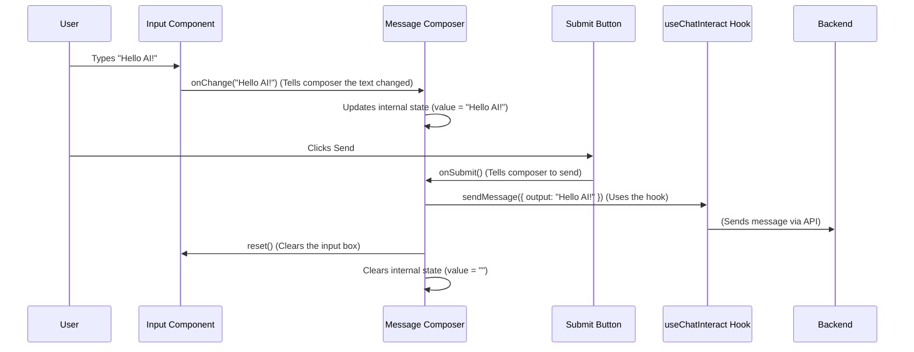

# Chapter 1: Message Composer

Welcome to the Chainlit frontend tutorial! We're excited to guide you through building and understanding the user interface (UI) of a Chainlit application.

In this first chapter, we'll explore the **Message Composer**. Think of it as the **control panel** for the chat – it's where you, the user, type your messages, add files, and tell the AI what to do.

**What's the Goal?**

Imagine you want to chat with an AI assistant. How do you actually *send* your question? You need a place to type, maybe attach a picture for context, and a button to finally send it off. The Message Composer handles all of that!

Our main goal in this chapter is to understand how the user's input (text, files, commands) gets ready to be sent to the AI.

Let's start with the most basic use case: **sending a simple text message like "Hello AI!"**.

## What Makes Up the Message Composer?

The Message Composer isn't just one single piece; it's a collection of smaller parts working together. Here are the main ones:

1.  **Text Input Area:** This is the box where you type your message. It's smart enough to grow as you type more lines.
2.  **Send Button:** The button (usually an arrow icon) you click to send your message.
3.  **Attachment Button:** A button (often a paperclip icon) to upload files (like images, documents) along with your message.
4.  **Command Buttons/Menu:** Special buttons or a menu that let you select specific actions or tools for the AI to use (e.g., `/searchWeb`, `/generateImage`).
5.  **(Other Controls):** You might also see buttons for voice input, accessing chat settings, or connecting to special servers (MCP), but we'll focus on the core parts first.

## How It Looks and Feels (User Perspective)

Using the Message Composer is pretty intuitive:

1.  **Typing:** You click into the input area and type your message, like "Hello AI!".
2.  **Attaching (Optional):** You click the paperclip icon, choose a file from your computer. The file appears above the input area, maybe with a little loading indicator, and then shows it's ready.
3.  **Commanding (Optional):** You might click a command button like `/tool` or type `/` to see a list of available commands and select one.
4.  **Sending:** You click the Send button. Your message (and any attachments or commands) gets sent off to the AI. The input area clears, ready for your next message.

## Under the Hood: How Does it Actually Work?

Now, let's peek behind the curtain. How does typing "Hello AI!" and clicking Send actually make the message go?

**The Core Idea:** The `MessageComposer` component acts like a manager. It keeps track of what you've typed (`value`), what files you've attached (`attachments`), and any special command you've selected (`selectedCommand`). When you hit Send, it gathers all this information and uses a special tool called `useChatInteract` to actually send the message.

**Key Players:**

*   **`MessageComposer` Component (`index.tsx`):** The main boss. It holds the state (the current text, attached files, selected command) and coordinates the other parts.
*   **`Input` Component (`Input.tsx`):** Handles the actual typing. It tells `MessageComposer` whenever the text changes.
*   **`Attachments` Component (`Attachments.tsx`):** Displays the files you've chosen, getting the list of files from `MessageComposer`.
*   **`SubmitButton` Component (`SubmitButton.tsx`):** Just a button, but when clicked, it tells `MessageComposer` to initiate the sending process.
*   **`CommandButtons` / `CommandPopoverButton` (`Command*.tsx`):** Display available commands and tell `MessageComposer` which one (if any) is selected.
*   **`useChatInteract` Hook:** This is a powerful function (provided by `@chainlit/react-client`, which we'll cover in [Chainlit React Client Hooks](04_chainlit_react_client_hooks.md)) that knows how to communicate with the Chainlit backend to send the message.
*   **State Management (`attachmentsState`, `persistentCommandState`):** Special storage areas (using Recoil, see [Recoil State Management](06_recoil_state_management.md)) that help `MessageComposer` keep track of attachments and commands.

**A Simple Walkthrough (Sending "Hello AI!"):**

Let's trace the steps using a diagram:



Essentially, the components notify the main `MessageComposer`, which holds the latest information. Clicking Submit triggers the `MessageComposer` to package everything up and hand it off to `useChatInteract` for sending.

## Diving into the Code (Simplified!)

Let's look at simplified snippets to see how these pieces connect.

**1. Including the Composer (`src/components/chat/Footer.tsx`)**

The `MessageComposer` is typically placed within a larger layout component, like a `ChatFooter`.

```typescript
// src/components/chat/Footer.tsx
import MessageComposer from './MessageComposer';
// ... other imports

// This is a simplified version of the Footer component
export default function ChatFooter({ /* ...props needed by MessageComposer */ }) {
  // ... logic to decide if the footer should show ...

  return (
    <div>
      {/* The MessageComposer component is used here */}
      <MessageComposer /* ...pass necessary props like file handling functions */ />
      {/* WaterMark might be shown below it */}
    </div>
  );
}
```

*   **Explanation:** This shows that `MessageComposer` is just a React component used inside another component (`ChatFooter`). It receives information (props) it needs to function, like how to handle file uploads.

**2. The Manager: `MessageComposer/index.tsx`**

This is the heart of the operation. It manages the state and coordinates actions.

```typescript
// src/components/chat/MessageComposer/index.tsx
import { useState, useCallback } from 'react';
import { useRecoilState } from 'recoil'; // For managing shared state
import { useChatInteract } from '@chainlit/react-client'; // The sending tool

// State storage for attachments and commands (more in Chapter 6)
import { attachmentsState, persistentCommandState } from 'state/chat';

// Child components
import Input from './Input';
import Attachments from './Attachments';
import SubmitButton from './SubmitButton';
// ... other buttons like UploadButton, CommandButtons ...

export default function MessageComposer({ /* ... file handling props ... */ }) {
  // State: Keep track of the typed text
  const [value, setValue] = useState('');
  // State: Keep track of attached files (uses Recoil)
  const [attachments, setAttachments] = useRecoilState(attachmentsState);
  // State: Keep track of the selected command (uses Recoil)
  const [selectedCommand, setSelectedCommand] = useRecoilState(persistentCommandState);

  // Get the function to send messages
  const { sendMessage } = useChatInteract();

  // Function called when Send button is clicked
  const submit = useCallback(() => {
    // Basic check: don't send if empty and no attachments
    if (value === '' && attachments.length === 0) return;

    // Prepare file info (if any) - simplified
    const fileReferences = attachments.map(a => ({ id: a.serverId! }));

    // Call the actual sending function from the hook
    sendMessage(
      { /* ...message details like text (value) */ output: value, command: selectedCommand?.id },
      fileReferences // Pass the file references
    );

    // Reset everything
    setValue(''); // Clear text state
    setAttachments([]); // Clear attachments state
    // inputRef.current?.reset(); // Tell Input component to clear itself (details omitted)
    // Reset command if not persistent (details omitted)

  }, [value, attachments, selectedCommand, sendMessage, setAttachments]);

  return (
    <div id="message-composer">
      {/* Show attachments if any */}
      <Attachments />

      {/* The text input area */}
      <Input
        onChange={setValue} // Tell Input how to update the 'value' state
        onEnter={submit}   // Tell Input to submit on Enter key
        // ... other props like selectedCommand ...
      />

      {/* Buttons area */}
      <div>
        {/* ... UploadButton, CommandButtons, etc. ... */}
        <SubmitButton onSubmit={submit} disabled={!value.trim()} />
      </div>
    </div>
  );
}
```

*   **Explanation:**
    *   Uses `useState` to hold the current typed text (`value`).
    *   Uses `useRecoilState` to manage `attachments` and `selectedCommand` (shared state, covered later).
    *   Gets the `sendMessage` function from the `useChatInteract` hook.
    *   The `submit` function gathers `value`, `attachments`, and `selectedCommand`, calls `sendMessage`, and then clears the state.
    *   It passes the `setValue` function to the `Input` component so the `Input` can update the `MessageComposer`'s state.
    *   It passes the `submit` function to the `SubmitButton`.

**3. The Typing Area: `MessageComposer/Input.tsx`**

This component handles the actual text input using a special `<div>` that acts like a textarea.

```typescript
// src/components/chat/MessageComposer/Input.tsx
import React, { useRef /* ... other imports ... */ } from 'react';
// ... imports for commands ...

interface Props {
  onChange: (value: string) => void; // Function from MessageComposer
  onEnter?: () => void;           // Function from MessageComposer
  // ... other props
}

// Simplified Input component
const Input = React.forwardRef<any, Props>(({ onChange, onEnter, ...props }, ref) => {
  const contentEditableRef = useRef<HTMLDivElement>(null);
  // ... state for command detection, composing state (IME) ...

  // Called whenever the content of the div changes
  const handleInput = (e: React.FormEvent<HTMLDivElement>) => {
    const currentText = e.currentTarget.textContent || '';
    onChange(currentText); // Call the function passed from MessageComposer

    // ... logic to detect if user is typing a '/' command ...
  };

  // Called when a key is pressed
  const handleKeyDown = (e: React.KeyboardEvent<HTMLDivElement>) => {
    // If Enter is pressed (and not Shift+Enter) and onEnter is provided
    if (e.key === 'Enter' && !e.shiftKey && onEnter /* && !isComposing */) {
      e.preventDefault(); // Stop Enter from adding a new line
      onEnter(); // Call the function passed from MessageComposer (usually 'submit')
    }
    // ... logic for handling arrow keys/Enter when command list is shown ...
  };

  return (
    <div
      ref={contentEditableRef}
      contentEditable // Makes the div editable!
      onInput={handleInput}
      onKeyDown={handleKeyDown}
      // ... other attributes like placeholder ...
      className="min-h-10 whitespace-pre-wrap" // Basic styling
    />
    // ... logic to show command suggestions popup ...
  );
});

export default Input;
```

*   **Explanation:**
    *   Uses a `contentEditable` div to allow rich text input (though we mainly use plain text).
    *   The `handleInput` function reads the text inside the div and calls the `onChange` function it received from `MessageComposer`, updating the state there.
    *   The `handleKeyDown` function checks for the Enter key (without Shift) and calls the `onEnter` function (usually `submit`) from `MessageComposer`.

**4. Showing Attachments: `MessageComposer/Attachments.tsx`**

This component simply reads the list of attachments from the shared state and displays them.

```typescript
// src/components/chat/MessageComposer/Attachments.tsx
import { useRecoilValue } from 'recoil';
import { attachmentsState } from '@/state/chat'; // Reads the shared state
import { Attachment } from './Attachment'; // Component to display one attachment
// ... other imports for buttons, tooltips ...

const Attachments = () => {
  // Get the current list of attachments from Recoil state
  const attachments = useRecoilValue(attachmentsState);

  // If there are no attachments, don't render anything
  if (attachments.length === 0) return null;

  return (
    <div id="attachments" className="flex flex-wrap gap-4">
      {/* Loop through each attachment and display it */}
      {attachments.map((attachment) => (
        <Attachment
          key={attachment.id}
          name={attachment.name}
          mime={attachment.type}
        >
          {/* Simplified: Buttons for cancelling upload or removing */}
          {/* <CancelButton ... /> */}
          {/* <RemoveButton ... /> */}
        </Attachment>
      ))}
    </div>
  );
};

export { Attachments };
```

*   **Explanation:** It reads the `attachmentsState` (managed by Recoil, see [Recoil State Management](06_recoil_state_management.md)) and maps over the array to render an `Attachment` component for each file.

**5. The Send Button: `MessageComposer/SubmitButton.tsx`**

A simple button that triggers the submission process.

```typescript
// src/components/chat/MessageComposer/SubmitButton.tsx
import { useChatData, useChatInteract } from '@chainlit/react-client';
import { Send } from '@/components/icons/Send';
import { Stop } from '@/components/icons/Stop';
import { Button } from '@/components/ui/button';
// ... tooltip imports ...

interface SubmitButtonProps {
  disabled?: boolean;
  onSubmit: () => void; // Function passed from MessageComposer
}

export default function SubmitButton({ disabled, onSubmit }: SubmitButtonProps) {
  const { loading } = useChatData(); // Is the AI currently busy?
  const { stopTask } = useChatInteract(); // Function to stop the AI

  // If the AI is busy, show a Stop button instead
  if (loading /* && firstInteraction */) {
    return (
      <Button id="stop-button" onClick={stopTask} size="icon">
        <Stop />
      </Button>
    );
  }

  // Otherwise, show the Send button
  return (
    <Button id="chat-submit" disabled={disabled} onClick={onSubmit} size="icon">
      <Send />
    </Button>
  );
}
```

*   **Explanation:** It receives the `onSubmit` function from `MessageComposer` and calls it when clicked. It also checks if the chat is `loading` and shows a "Stop" button instead if needed, using `stopTask` from `useChatInteract`.

## Conclusion

We've taken our first step into the Chainlit frontend! You now understand that the **Message Composer** is the user's control panel for interacting with the chat.

*   It's built from smaller components like `Input`, `Attachments`, and various buttons.
*   The main `MessageComposer` component manages the state (text, files, commands).
*   It uses the `useChatInteract` hook (specifically `sendMessage`) to send the information to the backend when the user clicks Submit.

You've seen how user actions (typing, clicking) trigger functions that update the application's state and ultimately lead to sending a message.

In the next chapter, we'll look at the other side of the conversation: [Message & Step Rendering](02_message___step_rendering.md). We'll explore how messages *from* the user and *from* the AI are displayed in the chat history.

---

Generated by [AI Codebase Knowledge Builder](https://github.com/The-Pocket/Tutorial-Codebase-Knowledge)