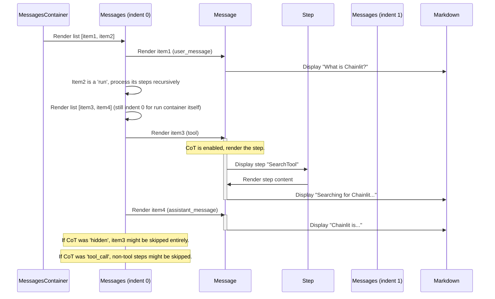

# Chapter 2: Message & Step Rendering

In [Chapter 1: Message Composer](01_message_composer.md), we learned how *you* send messages to the AI using the Message Composer. Now, let's flip the script and see how the chat history – the conversation between you and the AI – actually gets displayed on the screen.

**What's the Goal?**

Imagine you sent "Hello AI!" and the AI replied "Hello User! How can I help?". How does the app show these two messages, clearly indicating who said what? What if the AI did some background work, like searching the web, before answering? How can we show (or hide) those background steps?

This chapter explores **Message & Step Rendering**. It's the system responsible for taking the raw data representing the conversation and turning it into the chat log you see, complete with different styles for user messages, AI messages, and those optional behind-the-scenes steps.

Think of it like an **assembly line**: Raw data (messages, AI thoughts) goes in one end, and a formatted, readable chat history comes out the other.

## What Needs Rendering?

We need to display a few different kinds of things:

1.  **User Messages:** What you typed and sent.
2.  **Assistant Messages:** What the AI responded.
3.  **Steps (Chain of Thought - CoT):** Intermediate actions or thoughts the AI had. This could be:
    *   Calling a tool (e.g., "Using search tool with query 'latest news'").
    *   Internal reasoning steps (if the AI explains its thinking process).
    *   Function calls within the code.

These steps are often **nested**. For example, the main task "Answer user query" might contain a step "Search Web", which itself might have smaller steps.

## Key Components: The Rendering Team

Several components work together like a team to render the chat log:

1.  **`MessagesContainer` (`src/components/chat/MessagesContainer/index.tsx`):** The overall manager. It fetches the chat data (messages, elements, etc.) using hooks like `useChatMessages` (part of [Chainlit React Client Hooks](04_chainlit_react_client_hooks.md)) and sets up the `MessageContext`, which provides settings like whether to show Chain of Thought (`cot`).
2.  **`Messages` (`src/components/chat/Messages/index.tsx`):** The list renderer. It takes a list of messages/steps and loops through them, deciding *which* component should render each item. It's crucial for handling the **recursive** nature of steps (steps within steps).
3.  **`Message` (`src/components/chat/Messages/Message/index.tsx`):** The individual item renderer. It figures out if the item is a user message, an assistant message, or an intermediate step and renders it accordingly. It uses helper components like `UserMessage` or `Step`.
4.  **`Step` (`src/components/chat/Messages/Message/Step.tsx`):** Specifically designed to render an intermediate step. It often shows the step's name (e.g., "Tool Call") and can be expanded or collapsed (like an accordion) to show the step's details or nested steps.
5.  **`UserMessage` (`src/components/chat/Messages/Message/UserMessage.tsx`):** Handles the specific layout and features for messages sent by the user (often right-aligned, different background color, edit button).
6.  **`MessageContent` (`src/components/chat/Messages/Message/Content/index.tsx`):** Takes the raw text content of a message or step (input or output) and prepares it for display.
7.  **`Markdown` (`src/components/Markdown.tsx`):** Takes prepared text and renders it as formatted Markdown (bold, italics, code blocks, lists, tables, etc.). We'll touch on UI components more in [UI Component System & Theming](07_ui_component_system___theming.md).

## How It Looks and Feels (User Perspective)

1.  You send a message. It appears in the chat log, maybe aligned to the right.
2.  The AI starts processing. You might see a loading indicator or nothing.
3.  If Chain of Thought (CoT) is enabled, you might see steps appear, possibly indented:
    *   `> Using Search Tool`
    *   `> Found 3 relevant articles`
4.  Finally, the AI's main response appears, usually aligned to the left with an AI avatar.

The CoT steps might be automatically expanded or collapsed based on settings.

## Under the Hood: The Recursive Rendering Process

How does the app take a list of message data and turn it into the structured chat log? It uses a process called **recursion**.

**The Core Idea:** The `Messages` component is like a manager given a list of tasks (messages or steps). For each task, it either:
a) Hands it off to the `Message` component to draw it on the screen.
b) If the task is a container (like a "run" or a step that has sub-steps), it tells *another* `Messages` manager (itself, recursively!) to handle the sub-tasks inside, often telling it to indent them slightly.

**Simplified Walkthrough:**

Imagine the data looks like this (simplified):

```
[
  { id: 1, type: 'user_message', output: 'What is Chainlit?' },
  { id: 2, type: 'run', name: 'on_message', steps: [
      { id: 3, type: 'tool', name: 'SearchTool', output: 'Searching for Chainlit...' },
      { id: 4, type: 'assistant_message', output: 'Chainlit is an open-source Python framework...' }
    ]
  }
]
```

Here's how it gets rendered:



**Key Points from the Diagram:**

*   `MessagesContainer` starts the process.
*   `Messages` loops through items. It calls `Message` for actual content display.
*   For nested structures (`run`, `steps`), `Messages` calls *itself* (recursion) to handle the inner list.
*   `Message` decides based on `type` how to render (User, AI, Step).
*   `Step` handles the display of intermediate steps, possibly with an accordion.
*   `Markdown` renders the actual text content.
*   The `cot` setting (Chain of Thought visibility) influences whether `Message` renders intermediate steps.

## Diving into the Code (Simplified!)

Let's see how these components interact in the code.

**1. The Manager: `MessagesContainer`**

This component sets up the environment.

```typescript
// src/components/chat/MessagesContainer/index.tsx
import { MessageContext } from '@/contexts/MessageContext';
import { useChatData, useChatMessages, useConfig } from '@chainlit/react-client';
import { Messages } from '@/components/chat/Messages';
// ... other imports

const MessagesContainer = () => {
  const { config } = useConfig(); // Get app configuration
  const { elements, loading, actions } = useChatData(); // Get elements, loading state, actions
  const { messages } = useChatMessages(); // Get the list of messages/steps

  // Create a context value with settings and callbacks
  const memoizedContext = useMemo(() => ({
    loading,
    cot: config?.ui?.cot || 'hidden', // Get CoT setting ('hidden', 'tool_call', 'all')
    allowHtml: config?.features?.unsafe_allow_html,
    latex: config?.features?.latex,
    // ... other context values like callbacks ...
  }), [loading, config]);

  return (
    // Provide the context to all children
    <MessageContext.Provider value={memoizedContext}>
      <Messages
        indent={0} // Start with no indentation
        isRunning={loading}
        messages={messages} // The main list of messages/steps
        elements={elements}
        actions={actions}
      />
    </MessageContext.Provider>
  );
};

export default MessagesContainer;
```

*   **Explanation:** It fetches necessary data (`messages`, `config`, `loading`) using hooks ([Chainlit React Client Hooks](04_chainlit_react_client_hooks.md)). It creates a `memoizedContext` object containing settings (like `cot`) and passes it down using `MessageContext.Provider`. Finally, it renders the main `Messages` component with the initial list.

**2. The List Renderer: `Messages`**

This component iterates and delegates.

```typescript
// src/components/chat/Messages/index.tsx
import React, { memo, useContext } from 'react';
import { MessageContext } from 'contexts/MessageContext';
import { type IStep } from '@chainlit/react-client';
import { Message } from './Message';

interface Props {
  messages: IStep[]; // List of messages or steps
  indent: number; // Current indentation level
  // ... other props
}

// Special names for container steps (like top-level runs)
const CL_RUN_NAMES = ['on_chat_start', 'on_message', 'on_audio_end'];

const Messages = memo(({ messages, indent, ...otherProps }: Props) => {
  const messageContext = useContext(MessageContext);

  return (
    <>
      {messages.map((m) => {
        // If it's a container run (e.g., 'on_message')
        if (CL_RUN_NAMES.includes(m.name)) {
          // Recursively render its children steps, keeping the same indent
          return (
            <React.Fragment key={m.id}>
              {m.steps?.length ? (
                <Messages // <-- RECURSION!
                  messages={m.steps}
                  indent={indent}
                  {...otherProps}
                />
              ) : null}
              {/* Optional: Show a loader based on CoT settings */}
            </React.Fragment>
          );
        } else {
          // It's a regular message or step, render it using the Message component
          return (
            <Message
              message={m}
              key={m.id}
              indent={indent}
              {...otherProps}
            />
          );
        }
      })}
    </>
  );
});

export { Messages };
```

*   **Explanation:** It maps over the `messages` array. If an item is a special container (`CL_RUN_NAMES`), it recursively calls itself (`<Messages ... />`) to render the inner `steps`. Otherwise, it renders the item using the `<Message />` component, passing down the current `indent` level.

**3. The Item Renderer: `Message`**

This component distinguishes between message types and applies CoT logic.

```typescript
// src/components/chat/Messages/Message/index.tsx
import { useContext } from 'react';
import { MessageContext } from 'contexts/MessageContext';
import { type IStep } from '@chainlit/react-client';
import { Messages } from '..'; // To render nested steps
import Step from './Step';
import UserMessage from './UserMessage';
import { MessageContent } from './Content';
// ... other imports

interface Props {
  message: IStep;
  indent: number;
  // ... other props
}

const Message = ({ message, indent, elements, actions, ...otherProps }: Props) => {
  const { cot } = useContext(MessageContext); // Get CoT setting from context
  const isUserMessage = message.type === 'user_message';
  const isStep = !message.type.includes('message'); // Is it an intermediate step?

  // *** CoT Logic ***
  // Decide if this step should be skipped based on CoT setting
  const skip =
    (isStep && cot === 'hidden') ||
    (isStep && cot === 'tool_call' && message.type !== 'tool');

  if (skip) {
    // If skipped, still try to render its children steps recursively
    return message.steps ? (
      <Messages messages={message.steps} indent={indent} {...otherProps} />
    ) : null;
  }

  // *** Rendering Logic ***
  return (
    <div className="message-item"> {/* Simplified wrapper */}
      {isUserMessage ? (
        // Render user message using UserMessage component
        <UserMessage message={message} elements={elements}>
          <MessageContent message={message} elements={elements} />
        </UserMessage>
      ) : isStep ? (
        // Render intermediate step using Step component
        <div className="flex items-start" style={{ marginLeft: `${indent * 20}px` }}> {/* Indentation */}
          <Step step={message}>
            {/* Render step's textual content */}
            <MessageContent message={message} elements={elements} />
            {/* Render nested non-message steps inside the Step component */}
            {message.steps ? (
              <Messages
                messages={message.steps.filter(s => !s.type.includes('message'))}
                indent={indent + 1} // <-- Increase indent for nested steps
                {...otherProps}
              />
            ) : null}
          </Step>
        </div>
      ) : (
        // Render assistant message
        <div className="flex items-start" style={{ marginLeft: `${indent * 20}px` }}> {/* Indentation */}
          {/* Avatar could go here */}
          <div className="flex-grow">
            <MessageContent message={message} elements={elements} />
            {/* Buttons (like feedback) could go here */}
          </div>
        </div>
      )}

      {/* Render any nested *message* steps at the same level (or root) */}
      {message.steps && isStep && (
          <Messages
            messages={message.steps.filter(s => s.type.includes('message'))}
            indent={0} // Assistant messages inside steps usually aren't indented
            {...otherProps}
          />
      )}
    </div>
  );
};

export { Message };
```

*   **Explanation:**
    *   It checks the `message.type` to see if it's a user message, an assistant message, or an intermediate step (`isStep`).
    *   It checks the `cot` setting from the context. If the current step should be skipped (`skip = true`), it tries to render only its children recursively via `Messages`.
    *   If not skipped, it renders the appropriate component (`UserMessage`, `Step`, or a simple layout for assistant messages).
    *   Crucially, when rendering nested steps *inside* a `Step`, it calls `Messages` recursively with `indent + 1`.
    *   It also handles rendering assistant messages (`type.includes('message')`) that might be nested within a step, usually bringing them back to the root indentation level.
    *   It uses `MessageContent` to handle the actual text display.

**4. The Step Renderer: `Step`**

This component often uses an accordion for collapsibility.

```typescript
// src/components/chat/Messages/Message/Step.tsx
import { PropsWithChildren } from 'react';
import type { IStep } from '@chainlit/react-client';
import { Accordion, AccordionContent, AccordionItem, AccordionTrigger } from '@/components/ui/accordion';
// ... other imports

interface Props { step: IStep; }

export default function Step({ step, children }: PropsWithChildren<Props>) {
  // Logic to determine if step is currently running (omitted for brevity)
  const isRunning = false;
  const hasContent = step.output || step.steps?.length; // Does it have details to show?

  // If no content, just show the name simply
  if (!hasContent) {
    return <p className="text-muted-foreground">Used {step.name}</p>;
  }

  // If it has content, use an Accordion
  return (
    <Accordion type="single" collapsible className="w-full">
      <AccordionItem value={step.id} className="border-none">
        <AccordionTrigger className="text-muted-foreground hover:no-underline">
          {isRunning ? `Using ${step.name}` : `Used ${step.name}`}
        </AccordionTrigger>
        <AccordionContent>
          {/* Render the actual content (passed as children) inside */}
          <div className="border-l-2 pl-4 ml-1 mt-2">
            {children}
          </div>
        </AccordionContent>
      </AccordionItem>
    </Accordion>
  );
}
```

*   **Explanation:** It displays the step's name (e.g., "Used SearchTool"). If the step has content (`step.output` or nested `steps`), it wraps the content (`children` passed from the `Message` component) in an `Accordion` component, allowing the user to expand/collapse it.

**5. The Content Renderer: `MessageContent`**

Prepares text and uses the `Markdown` component.

```typescript
// src/components/chat/Messages/Message/Content/index.tsx
import { prepareContent } from '@/lib/message'; // Helper function
import { type IStep } from '@chainlit/react-client';
import { Markdown } from '@/components/Markdown';
// ... other imports like InlinedElements

interface Props {
  message: IStep;
  allowHtml?: boolean;
  latex?: boolean;
  // ... other props
}

const MessageContent = ({ message, allowHtml, latex, elements }: Props) => {
  // Prepare content (handle streaming cursor, find element references)
  const { preparedContent: output, refElements } = prepareContent({
    elements,
    id: message.id,
    content: message.output // Or message.output + CURSOR_PLACEHOLDER if streaming
  });

  // Render the prepared content using the Markdown component
  return (
    <div className="message-text"> {/* Simplified wrapper */}
      <Markdown allowHtml={allowHtml} latex={latex} refElements={refElements}>
        {output || ''}
      </Markdown>
      {/* Display any inline elements like images */}
      {/* <InlinedElements elements={...} /> */}
    </div>
  );
};

export { MessageContent };
```

*   **Explanation:** It takes the raw `message.output` (and potentially `message.input` if `showInput` is true), prepares it using a helper function (`prepareContent`), and then passes the final string to the `Markdown` component for rendering. It also handles linking element references (covered in [Element System](03_element_system.md)).

## Conclusion

You've now seen how Chainlit takes the conversation data and renders it into the familiar chat interface!

*   The process starts with `MessagesContainer` setting up the context.
*   `Messages` recursively iterates through the list of messages and steps.
*   `Message` determines the type of item (user, assistant, step) and renders it, applying Chain of Thought (`cot`) visibility rules.
*   `Step` displays intermediate actions, often using an accordion.
*   `MessageContent` prepares the text, and `Markdown` handles the final formatting.

This recursive system allows Chainlit to display complex, nested sequences of thought and action alongside the main conversation flow.

In the next chapter, we'll dive into a special part of message rendering: the [Element System](03_element_system.md). This system handles displaying rich UI elements like images, videos, files, or custom components directly within the chat messages.

---

Generated by [AI Codebase Knowledge Builder](https://github.com/The-Pocket/Tutorial-Codebase-Knowledge)