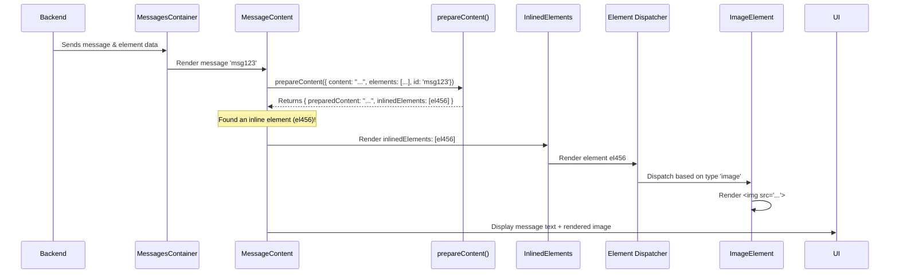

# Chapter 3: Element System

In [Chapter 2: Message & Step Rendering](02_message___step_rendering.md), we saw how text messages and AI thinking steps are displayed in the chat log. But conversations aren't just text! What if the AI needs to show you an image, a data table, a PDF file, or even a custom interactive chart? That's where the **Element System** comes in.

**What's the Goal?**

Imagine you ask the AI, "Show me a picture of a cat." The AI finds one and needs to display it right there in the chat. How does the app handle sending and showing something that *isn't* just plain text?

The Element System is Chainlit's way of managing **rich, non-textual content** within messages. It provides a unified way to:

1.  Define different types of content (images, files, audio, dataframes, custom interactive components).
2.  Link these elements to specific messages.
3.  Render them appropriately within the user interface.

Think of it like embedding different types of media (pictures, videos, documents) within a text document or a webpage. The Element System makes this possible within the Chainlit chat interface.

Our main goal is to understand how an image sent by the AI appears within the chat message.

## Key Concepts: What Makes Up the Element System?

1.  **Elements:** These are the actual pieces of rich content. Each element has properties like:
    *   `id`: A unique identifier.
    *   `type`: What kind of element it is (e.g., `image`, `file`, `audio`, `dataframe`, `custom`).
    *   `name`: A display name (often shown as a reference).
    *   `url` (optional): A link to fetch the element's data (like an image URL or data file).
    *   `forId` (optional): The ID of the message this element is primarily associated with.
    *   `display`: How the element should be shown - `inline`, `side`, or `page`.

2.  **Association with Messages:** When the backend sends a message, it also sends a list of all `elements` relevant to the current chat session. The frontend uses the `forId` property on an element (or finds the element's `name` mentioned in the message text) to know which message a particular element belongs to.

3.  **Display Modes:**
    *   `inline`: The element is shown directly within the message bubble itself (like an image appearing right below the text).
    *   `side`: The element appears as a small clickable link (like `[cat_image.jpg]`) in the message. Clicking it opens the element in a dedicated side panel next to the chat.
    *   `page`: Similar to `side`, but clicking the link navigates the user to a full-page view dedicated to that element.

4.  **The `Element` Dispatcher Component (`src/components/Elements/index.tsx`):** This is a central component that acts like a traffic controller. It receives an element object, looks at its `type` (e.g., `image`, `pdf`, `audio`), and decides *which* specific rendering component (like `ImageElement`, `PDFElement`, `AudioElement`) should be used to actually display it.

## How It Looks and Feels (User Perspective - Showing an Image)

1.  You ask: "Show me a picture of a cat."
2.  The AI responds: "Okay, here is a picture of a cat:"
3.  Right below the AI's text, within the same message bubble, you see the actual image of the cat. This is an `inline` image element.
4.  *Alternatively*, the AI might respond: "Okay, here is the picture: [cat_image.jpg]". You see a small, clickable link. Clicking it might open the image in a panel on the right side of the screen (`side` display) or take you to a new view showing just the image (`page` display).

## Under the Hood: Rendering an Inline Image

Let's trace how an inline image gets displayed.

**The Core Idea:** When a message arrives, the rendering process (specifically `MessageContent` from Chapter 2) checks if any elements are associated with it and meant to be displayed `inline`. If it finds an inline image element, it uses the `Element` dispatcher to select the `ImageElement` component, which then renders the actual `` tag using the image URL provided in the element data.

**Simplified Walkthrough (Inline Image):**

Assume the backend sends message `msg123` with text "Here is the cat:" and an associated element: `{ id: 'el456', type: 'image', name: 'cat_image.jpg', url: '...', forId: 'msg123', display: 'inline' }`.



**Explanation:**

1.  The backend sends the message data, including the `elements` list.
2.  `MessagesContainer` triggers the rendering of the message.
3.  `MessageContent` calls the `prepareContent` helper function.
4.  `prepareContent` finds the `cat_image.jpg` element linked to `msg123` and sees its `display` is `inline`. It returns the element in the `inlinedElements` list.
5.  `MessageContent` renders the `InlinedElements` component, passing it the list containing `el456`.
6.  `InlinedElements` loops through its list and tells the `Element` dispatcher component to render `el456`.
7.  The `Element` dispatcher sees `el456.type` is `image` and calls the `ImageElement` component.
8.  `ImageElement` renders the HTML `` tag using the `url` from the element data.
9.  The final output in the UI is the message text followed by the image.

## Diving into the Code (Simplified!)

Let's look at the key code pieces involved.

**1. Preparing Content & Finding Elements (`src/lib/message.ts`)**

The `prepareContent` function (used by `MessageContent` from Chapter 2) identifies which elements belong to the current message and categorizes them.

```typescript
// src/lib/message.ts

// Helper to check if an element's forId matches the message ID
const isForIdMatch = (id: string, forId: string | undefined) => {
  return forId === id;
};

export const prepareContent = ({
  elements, // List of ALL elements in the session
  content,  // The raw text content of the message
  id        // The ID of the message being rendered
}: {
  elements: IMessageElement[];
  content?: string;
  id: string;
}) => {
  let preparedContent = content ? content.trim() : '';
  const inlinedElements: IMessageElement[] = [];
  const refElements: IMessageElement[] = [];

  // Find elements specifically for this message ID
  const messageElements = elements.filter(e => isForIdMatch(id, e?.forId));

  for (const element of messageElements) {
    if (element.display === 'inline') {
      // Add to inline list if display is 'inline'
      inlinedElements.push(element);
      // We might also want to remove the element name from the text,
      // or handle references differently depending on design.
      // Simple approach: Keep text as is for now.
    } else {
      // If display is 'side' or 'page', treat as reference.
      // Find the element name in the text and turn it into a link.
      // (Simplified logic below)
      const placeholder = `[${element.name}](${element.name.replaceAll(' ', '_')})`;
      if (preparedContent.includes(element.name)) {
         preparedContent = preparedContent.replace(element.name, placeholder);
         refElements.push(element);
      }
    }
  }
  // Also handle elements referenced by name even without forId (more complex logic omitted)


  // Return the modified text and the sorted elements
  return {
    preparedContent,
    inlinedElements,
    refElements // These are handled by the Markdown component via ElementRef
  };
};
```

*   **Explanation:** This function filters all available `elements` to find those matching the current message `id`. It then checks the `display` property. `inline` elements are added to `inlinedElements`. `side`/`page` elements are added to `refElements`, and their names in the `preparedContent` are turned into Markdown links (like `[cat_image.jpg](cat_image.jpg)`).

**2. Rendering Inline Elements (`src/components/chat/Messages/Message/Content/InlinedElements/index.tsx`)**

This component receives the `inlinedElements` list from `MessageContent` and renders them using the appropriate specific component via the `Element` dispatcher.

```typescript
// src/components/chat/Messages/Message/Content/InlinedElements/index.tsx
import { cn } from '@/lib/utils';
import type { ElementType, IMessageElement } from '@chainlit/react-client';
// Import specific list renderers (optional optimization, could directly use Element)
import { InlinedImageList } from './InlinedImageList';
// ... other list types ...

interface Props {
  elements: IMessageElement[]; // Only INLINE elements passed here
  className?: string;
}

const InlinedElements = ({ elements, className }: Props) => {
  if (!elements.length) return null;

  // Group elements by type (e.g., all images together)
  const elementsByType = elements.reduce(
    (acc, el) => {
      // ... logic to group elements by type ...
      (acc[el.type] = acc[el.type] || []).push(el);
      return acc;
    }, {} as { [K in ElementType]?: IMessageElement[] }
  );

  // Render each group using its specific list component (or directly use Element)
  return (
    <div className={cn('flex flex-col gap-4 mt-4', className)}>
      {elementsByType.image?.length ? (
        <InlinedImageList items={elementsByType.image} />
      ) : null}
      {/* ... render other types like text, pdf, audio etc. ... */}
    </div>
  );
};

export { InlinedElements };
```

*   **Explanation:** It takes the list of `inline` elements. It groups them by `type` (e.g., all images, all PDFs). Then, for each type, it calls a dedicated component (like `InlinedImageList`) to render them. This grouping helps organize the display if there are multiple elements of the same type.

**3. Simplified List Renderer (Example: `InlinedImageList`)**

These components loop through elements of a specific type and use the main `Element` dispatcher.

```typescript
// Simplified concept for InlinedImageList.tsx
import { IImageElement } from '@chainlit/react-client';
import { Element } from '@/components/Elements'; // Import the main dispatcher

interface Props {
  items: IImageElement[];
}

const InlinedImageList = ({ items }: Props) => {
  return (
    <div className="image-list flex flex-wrap gap-2">
      {items.map((item) => (
        // Use the main Element component for each image
        <Element key={item.id} element={item} />
      ))}
    </div>
  );
};

export { InlinedImageList };
```

*   **Explanation:** It simply maps over the list of image elements (`items`) and for each one, it renders the main `Element` dispatcher component, passing the specific image element data.

**4. The Dispatcher: `Element` (`src/components/Elements/index.tsx`)**

This is the central component that decides which specific renderer to use based on the element's type.

```typescript
// src/components/Elements/index.tsx
import type { IMessageElement } from '@chainlit/react-client';

// Import all specific element renderers
import { AudioElement } from './Audio';
import { ImageElement } from './Image';
import { PDFElement } from './PDF';
import { TextElement } from './Text';
// ... import others like FileElement, VideoElement, PlotlyElement, LazyDataframe, CustomElement ...

interface ElementProps {
  element?: IMessageElement;
}

const Element = ({ element }: ElementProps): JSX.Element | null => {
  // Switch based on the element's type
  switch (element?.type) {
    case 'image':
      return <ImageElement element={element} />;
    case 'text':
      return <TextElement element={element} />;
    case 'pdf':
      return <PDFElement element={element} />;
    case 'audio':
      return <AudioElement element={element} />;
    // ... cases for file, video, plotly, dataframe, custom ...
    default:
      // If type is unknown or element is missing, render nothing
      return null;
  }
};

export { Element };
```

*   **Explanation:** This component is very straightforward. It takes an `element` object, looks at `element.type`, and uses a `switch` statement to return the correct specific component (e.g., `ImageElement`, `PDFElement`). This acts as a central hub for element rendering.

**5. The Specific Renderer: `ImageElement` (`src/components/Elements/Image.tsx`)**

This component is responsible for actually rendering an image element.

```typescript
// src/components/Elements/Image.tsx
import { cn } from '@/lib/utils';
import { IImageElement } from '@chainlit/react-client';
// ... imports for Dialog (lightbox) ...

const ImageElement = ({ element }: { element: IImageElement }) => {
  // If no URL, cannot display image
  if (!element.url) return null;

  // Basic rendering: an img tag
  return (
    <div className="rounded-sm bg-accent overflow-hidden">
      
      {/* Lightbox Dialog component omitted for simplicity */}
    </div>
  );
};

export { ImageElement };
```

*   **Explanation:** This component receives an `IImageElement`. It checks if a `url` exists and then renders a standard HTML `` tag, using the `element.url` for the `src` attribute and `element.name` for the `alt` text. It also includes styling and potentially features like a lightbox (popup viewer).

**6. Handling References: `ElementRef` (`src/components/Elements/ElementRef.tsx`)**

This component is used by the `Markdown` renderer (see [Chapter 2](02_message___step_rendering.md)) when it encounters the special links created by `prepareContent` for `side` or `page` elements.

```typescript
// src/components/Elements/ElementRef.tsx
import { MessageContext } from '@/contexts/MessageContext';
import { useContext } from 'react';
import type { IMessageElement } from '@chainlit/react-client';

interface ElementRefProps {
  element: IMessageElement; // The element being referenced
}

const ElementRef = ({ element }: ElementRefProps) => {
  // Get the click handler from context (set up in MessagesContainer)
  const { onElementRefClick } = useContext(MessageContext);

  // If the element *was* inline (shouldn't happen via Markdown link, but for safety)
  if (element.display === 'inline') {
    return <span className="font-bold">{element.name}</span>;
  }

  // For 'side' or 'page' elements, render a clickable link
  return (
    <a
      href="#" // Prevent default navigation
      className="cursor-pointer uppercase text-[0.7rem] element-link" // Basic styling
      onClick={(e) => {
        e.preventDefault(); // Stop browser from following '#'
        onElementRefClick?.(element); // Call the handler function
      }}
    >
      {element.name}
    </a>
  );
};

export { ElementRef };
```

*   **Explanation:** It receives the referenced `element`. If the display is `side` or `page`, it renders an `<a>` tag styled like a small badge. When clicked, it prevents the default link behavior and calls the `onElementRefClick` function (provided via `MessageContext`). This function is responsible for triggering the opening of the `ElementSideView` or navigating to the `Element` page, using state management techniques covered in [Recoil State Management](06_recoil_state_management.md).

**7. Side and Page Views (`ElementSideView.tsx`, `ElementView.tsx`)**

These components are responsible for displaying elements when their `ElementRef` link is clicked and their `display` is `side` or `page`.

*   **`ElementSideView`:** Uses Recoil state (`sideViewState`) to know when to show itself as a panel on the right. It receives the element(s) to display and uses the same `Element` dispatcher component internally to render the content.
*   **`ElementView`:** Used by the dedicated element page (`src/pages/Element.tsx`). It receives the element data (fetched based on the URL) and uses the `Element` dispatcher to render it, providing a full-page view.

These rely heavily on routing ([Routing](09_routing.md)) and state management ([Recoil State Management](06_recoil_state_management.md)).

## Conclusion

You've now learned about the **Element System**, Chainlit's mechanism for handling rich content beyond simple text.

*   **Elements** represent non-textual content like images, files, dataframes, and custom components.
*   They are associated with messages via `forId` or name references.
*   They can be displayed `inline` (within the message), `side` (in a side panel), or `page` (on a dedicated page).
*   The `prepareContent` function identifies and sorts elements for a message.
*   The `Element` component acts as a central **dispatcher**, choosing the correct rendering component (e.g., `ImageElement`, `PDFElement`) based on the element's `type`.
*   `ElementRef` handles clicks on links for `side`/`page` elements, triggering side panels or page navigation.

This system allows Chainlit developers to easily send and display complex data and visualizations within the chat interface, making the interaction much richer.

In the next chapter, we'll explore the tools that make fetching messages, elements, and interacting with the chat possible from the frontend: [Chainlit React Client Hooks](04_chainlit_react_client_hooks.md).

---

Generated by [AI Codebase Knowledge Builder](https://github.com/The-Pocket/Tutorial-Codebase-Knowledge)