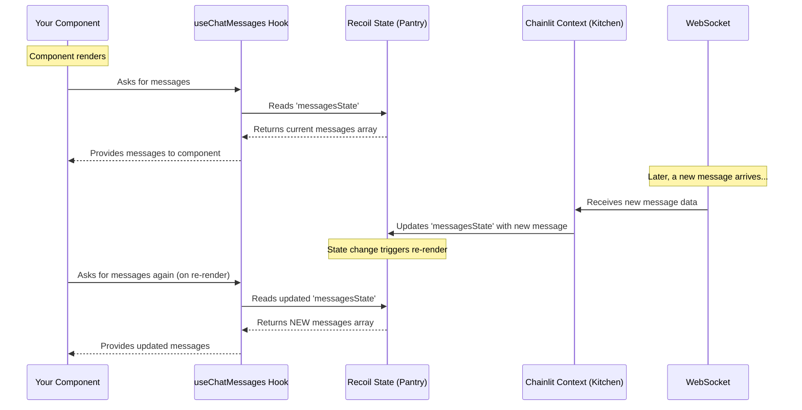
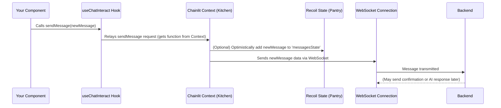

# Chapter 4: Chainlit React Client Hooks

In the last chapter, [Chapter 3: Element System](03_element_system.md), we saw how Chainlit can display rich content like images and files within messages. We've also seen in previous chapters how messages are composed ([Chapter 1](01_message_composer.md)) and rendered ([Chapter 2](02_message___step_rendering.md)).

But how does our frontend code actually *get* the messages to display, or *send* a new message to the backend? How does it know if the user is logged in, or what features are enabled in the app?

**What's the Problem?**

Imagine you're building a chat app. You need to:

1.  Fetch the current chat history when the app loads.
2.  Listen for new messages coming in real-time (usually via a WebSocket connection).
3.  Send a user's new message back to the server.
4.  Keep track of the application's configuration (like theme settings or enabled features).
5.  Manage the user's login status.

Doing all this manually involves setting up API calls, managing WebSocket connections, handling loading states, updating the UI when data changes, and dealing with errors. This can be quite a bit of repetitive and complex code!

**Our Goal:** Understand how Chainlit provides special tools called **React Hooks** to make interacting with the backend and managing chat state much, much simpler. Let's focus on two common tasks: **getting the list of messages** and **sending a new message**.

## What are Chainlit React Client Hooks?

First, what's a "Hook" in React? Think of it as a special JavaScript function (starting with `use`) that lets you "hook into" React features. For example, `useState` lets you add state (memory) to your components.

Chainlit provides its own set of custom hooks, available through the `@chainlit/react-client` library. These are specifically designed for building Chainlit frontends.

**Analogy: The Chat App Toolkit**

Imagine you're building a house. You could craft every tool yourself (hammer, saw, screwdriver) from scratch. Or, you could get a pre-made toolkit designed for house building.

Chainlit React Client Hooks are like that **pre-made toolkit** for building chat interfaces. They give you ready-to-use tools for common chat-related jobs, hiding the complex internal wiring.

**The Main Tools in the Kit:**

Here are some of the most important hooks provided:

*   **`useAuth()`:** Tells you if the user is logged in, who they are, and provides login/logout functions. (See [Authentication Flow](08_authentication_flow.md))
*   **`useConfig()`:** Gives you access to the application's configuration (like UI settings, features enabled by the developer).
*   **`useChatSession()`:** Manages the WebSocket connection to the Chainlit backend, which is crucial for real-time communication.
*   **`useChatMessages()`:** Provides the list of messages (`messages`) and the current `threadId` for the chat session.
*   **`useChatInteract()`:** Gives you functions to interact with the chat, like `sendMessage()`, `replyMessage()`, `stopTask()`, `uploadFile()`, and functions for handling feedback.
*   **`useChatData()`:** A convenient hook that bundles together common data points like `messages`, `elements`, `actions`, `loading` state, and `error` state.

Using these hooks dramatically simplifies component code. Instead of writing fetch requests and managing WebSockets, you just call a hook!

## Solving the Use Case: Getting and Sending Messages

Let's see how we use these hooks for our goal: displaying messages and sending a new one.

**1. Getting Messages with `useChatMessages`**

Imagine you have a component responsible for showing the chat log (like `MessagesContainer` from [Chapter 2](02_message___step_rendering.md)). How does it get the messages?

```typescript
// Simplified example component
import { useChatMessages } from '@chainlit/react-client';
import { Messages } from '@/components/chat/Messages'; // Our rendering component

function ChatDisplay() {
  // Use the hook to get the messages array
  const { messages } = useChatMessages();

  // Now 'messages' is an array of message/step objects
  // ready to be passed to our rendering component.

  if (!messages || messages.length === 0) {
    return <div>No messages yet. Start chatting!</div>;
  }

  return <Messages messages={messages} indent={0} /* ... other props */ />;
}
```

*   **Explanation:** We simply call `useChatMessages()`. It returns an object containing the `messages` array. This array is automatically kept up-to-date by the hook whenever new messages arrive or the history changes. We can then pass this `messages` array directly to our rendering component. Super simple!

**2. Sending Messages with `useChatInteract`**

Now, let's look at the `MessageComposer` from [Chapter 1](01_message_composer.md). How does it send the message when the user clicks "Send"?

```typescript
// Simplified Message Composer component
import { useState, useCallback } from 'react';
import { useChatInteract } from '@chainlit/react-client';
import { Input } from './Input'; // The text input
import { SubmitButton } from './SubmitButton'; // The send button

function SimpleComposer() {
  const [inputValue, setInputValue] = useState('');

  // Use the hook to get the sendMessage function
  const { sendMessage } = useChatInteract();

  // Function called when Send is clicked
  const handleSend = useCallback(() => {
    if (!inputValue.trim()) return; // Don't send empty messages

    // Create a basic message object (details may vary)
    const messageToSend = {
      id: crypto.randomUUID(), // Generate a temporary unique ID
      output: inputValue,
      type: 'user_message',
      name: 'User' // Or get from useAuth()
      // ... other necessary fields
    };

    // Call the function provided by the hook!
    sendMessage(messageToSend);

    // Clear the input
    setInputValue('');

  }, [inputValue, sendMessage]);

  return (
    <div>
      <Input onChange={setInputValue} value={inputValue} onEnter={handleSend} />
      <SubmitButton onSubmit={handleSend} disabled={!inputValue.trim()} />
    </div>
  );
}
```

*   **Explanation:** We call `useChatInteract()` to get an object containing interaction functions. We destructure `sendMessage` from it. In our `handleSend` function, we prepare the message object and then simply call `sendMessage(messageToSend)`. The hook takes care of sending it over the WebSocket connection and potentially updating the local message list optimistically.

## Under the Hood: How Do They Work?

Okay, using them is easy, but how do these hooks perform their magic? They don't *directly* make API calls or manage WebSockets themselves. Instead, they act as interfaces to a central system.

**The Central Manager: Context and State**

Think of a restaurant. The waiters (`Hooks`) take your order and bring you food. They don't cook it themselves. They interact with the kitchen (`Chainlit Context` & `API Client`) and the pantry (`Recoil State`).

*   **Chainlit Context & API Client ([Chapter 5](05_chainlit_context___api_client.md)):** This is the "kitchen." It holds the configured API client, manages the WebSocket connection, and knows how to talk to the backend server.
*   **Recoil State Management ([Chapter 6](06_recoil_state_management.md)):** This is the "pantry." It's a central place where the application's state (like the list of messages, elements, user info, config) is stored. The Context updates this state when new data arrives from the backend.

The hooks connect your components to this central system:

*   Hooks like `useChatMessages` or `useConfig` primarily **read data** from the Recoil state ("pantry").
*   Hooks like `useChatInteract` get **functions** from the Chainlit Context ("kitchen") that trigger actions (like sending a message).

**Diagram: Getting Messages**



**Diagram: Sending a Message**



**Diving Deeper into Code**

Let's revisit some code snippets from the provided context to see these hooks in action.

**1. Setting up the Connection (`src/App.tsx`)**

The main `App` component often uses hooks to establish the connection early on.

```typescript
// src/App.tsx (Simplified)
import { useEffect } from 'react';
import { useAuth, useChatSession, useConfig } from '@chainlit/react-client';
import { useRecoilValue } from 'recoil';
import { userEnvState } from 'state/user'; // State from Recoil

function App() {
  const { config } = useConfig(); // Get config
  const { isAuthenticated, isReady } = useAuth(); // Check auth status
  const userEnv = useRecoilValue(userEnvState); // Get user environment variables
  const { connect, chatProfile } = useChatSession(); // Get connect function

  // Effect to connect when ready
  useEffect(() => {
    // Only connect if authenticated and config/profile is ready
    if (!isAuthenticated || !isReady || !config /* ... || !chatProfileOk */) {
      return;
    }
    // Call the connect function from the hook
    connect({ userEnv });
  }, [userEnv, isAuthenticated, connect, isReady, config, chatProfile]);

  // ... rest of the component ...
  return (/* ... */);
}
```

*   **Explanation:** `App.tsx` uses `useConfig`, `useAuth`, and `useChatSession`. It waits until authentication is ready (`isReady`) and configuration is loaded, then calls the `connect()` function provided by `useChatSession` to establish the WebSocket connection.

**2. Fetching Data in Containers (`src/components/chat/MessagesContainer/index.tsx`)**

Container components often use hooks to fetch the data needed by their children.

```typescript
// src/components/chat/MessagesContainer/index.tsx (Simplified)
import { MessageContext } from '@/contexts/MessageContext';
import { useChatData, useChatMessages, useConfig } from '@chainlit/react-client';
import { Messages } from '@/components/chat/Messages';

function MessagesContainer() {
  const { config } = useConfig(); // Get config
  // useChatData bundles common data points
  const { elements, loading, actions } = useChatData();
  // useChatMessages gets the core message list
  const { messages } = useChatMessages();

  // Create context value using data from hooks
  const contextValue = {
    loading,
    cot: config?.ui?.cot,
    // ... other values ...
  };

  return (
    <MessageContext.Provider value={contextValue}>
      <Messages
        messages={messages} // Pass messages from hook
        elements={elements} // Pass elements from hook
        actions={actions}   // Pass actions from hook
        /* ... other props ... */
      />
    </MessageContext.Provider>
  );
}
```

*   **Explanation:** `MessagesContainer` uses `useConfig`, `useChatData`, and `useChatMessages` to gather all necessary configuration, state (loading), and data (messages, elements, actions). This data is then passed down to the `Messages` component, either directly as props or via React Context.

**3. Interacting in Components (`src/components/chat/MessageComposer/index.tsx`)**

Components that trigger actions use interaction hooks.

```typescript
// src/components/chat/MessageComposer/index.tsx (Simplified)
import { useCallback } from 'react';
import { useChatInteract } from '@chainlit/react-client';
// ... other imports ...

function MessageComposer({ /* ... */ }) {
  const [value, setValue] = useState('');
  // Get interaction functions
  const { sendMessage } = useChatInteract();

  // Function to handle submission
  const submit = useCallback(() => {
    if (!value.trim()) return;

    const messageToSend = {
      id: crypto.randomUUID(),
      output: value,
      type: 'user_message',
      name: 'User' // Ideally from useAuth()
    };

    // Use the function from the hook
    sendMessage(messageToSend, /* fileReferences */);

    setValue(''); // Clear input
    // ... reset other states ...

  }, [value, sendMessage]);

  // ... render Input, Buttons, etc. ...
  // <SubmitButton onSubmit={submit} ... />
  return (/* ... */);
}
```

*   **Explanation:** Just like our earlier simplified example, the actual `MessageComposer` uses `useChatInteract` to get the `sendMessage` function (and potentially others like `replyMessage`). This function is then called within the `submit` callback when the user sends a message.

These examples show how the hooks provide clean, reusable ways to access chat state and trigger actions without needing to know the intricate details of the underlying `Context` or `Recoil` state management.

## Conclusion

You've now learned about the **Chainlit React Client Hooks** – the essential toolkit provided by `@chainlit/react-client` for building Chainlit frontends.

*   They are specialized React Hooks (`useAuth`, `useConfig`, `useChatMessages`, `useChatInteract`, etc.).
*   They act like **pre-built tools** simplifying common tasks like getting messages, sending messages, checking auth, and accessing config.
*   They hide the complexity of direct API calls and WebSocket management.
*   They work by connecting your components to a central **Chainlit Context** ("kitchen") and **Recoil state** ("pantry").

Using these hooks makes your component code cleaner, easier to read, and less prone to errors, allowing you to focus on building the user interface.

In the next chapter, we'll pull back the curtain further and look directly at the "kitchen" itself: the [Chapter 5: Chainlit Context & API Client](05_chainlit_context___api_client.md), which powers these hooks.

---

Generated by [AI Codebase Knowledge Builder](https://github.com/The-Pocket/Tutorial-Codebase-Knowledge)