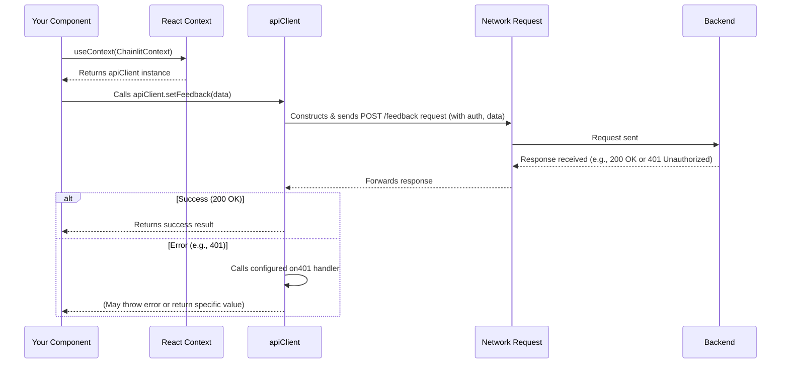

# Chapter 5: Chainlit Context & API Client

In [Chapter 4: Chainlit React Client Hooks](04_chainlit_react_client_hooks.md), we learned about the handy toolkit (`useChatMessages`, `useChatInteract`, etc.) that makes interacting with the Chainlit backend simple within our React components. These hooks magically provide data and functions without us needing to worry about the low-level details.

But how does that magic actually work? How does the `sendMessage` function from `useChatInteract` *really* send the message? How does `useConfig` know the application's settings?

**What's the Problem?**

Imagine every component in our app needed to talk to the backend server. Each one would need to know the server's address, how to format requests correctly, how to handle authentication (like sending a login token), and how to deal with potential errors. This would be incredibly messy and repetitive!

We need a single, consistent way for *any* part of our frontend application to communicate with the Chainlit backend.

**Our Goal:** Understand the **central communication hub** of the Chainlit frontend: the `apiClient` object and how it's made available everywhere using `ChainlitContext`. Let's focus on a simple use case: how a component might fetch information *directly* from the backend, like getting the full URL for an icon file.

## Key Concepts: The Communication Hub

There are two main parts working together:

1.  **`apiClient` (The Dedicated Phone Line):**
    *   This is a special object, an instance of the `ChainlitAPI` class provided by `@chainlit/react-client`.
    *   Think of it as the application's **dedicated phone line to the Chainlit server**. It knows the server's address (`httpEndpoint`).
    *   It has pre-built methods for common tasks: sending messages (`sendMessage`), getting project settings (`getConfig`), setting user feedback (`setFeedback`), handling logins (`passwordAuth`, `headerAuth`), fetching element data, etc.
    *   It automatically handles some tricky parts, like adding authentication details to requests if the user is logged in, and calling specific functions if errors occur (like redirecting to login on a 401 error).

2.  **`ChainlitContext` and its `Provider` (The Phone Jack System):**
    *   `ChainlitContext` is a standard feature of React called "Context". Think of it as defining a type of "phone jack" that can provide access to our `apiClient`.
    *   `ChainlitContext.Provider` is a special React component that acts like the **installer of the phone system**. It wraps around a large part of our application (usually the entire app) and holds the actual `apiClient` instance (our phone line).
    *   By wrapping the app in the `Provider`, any component *inside* that wrapper can "plug into the jack" and get access to the same `apiClient` instance.

## Solving the Use Case: Getting an Icon URL

Let's see how these pieces work together to allow a component (like `ButtonLink.tsx`) to get the full URL for an icon hosted by the backend.

**Step 1: Creating the `apiClient` (The Phone Line)**

Somewhere central, usually when the app starts, we create the `apiClient` instance.

```typescript
// src/api/index.ts (Simplified)
import { ChainlitAPI, ClientError } from '@chainlit/react-client';
import { toast } from 'sonner'; // For showing errors

// Define the server address
const serverUrl = 'http://localhost:8000/chainlit'; // Example address

// Function to handle unauthorized errors (e.g., redirect to login)
const on401 = () => {
  window.location.href = '/login';
};

// Function to handle other errors (e.g., show a notification)
const onError = (error: ClientError) => {
  toast.error(error.toString());
};

// Create the single apiClient instance
export const apiClient = new ChainlitAPI(
  serverUrl, // Where the backend lives
  'webapp',  // Type of client
  on401,     // What to do on 401 error
  onError    // What to do on other errors
);
```

*   **Explanation:** We import the `ChainlitAPI` class. We define the backend URL and functions to handle specific errors. Then, we create *one* instance of `ChainlitAPI`, passing these details. This `apiClient` object is now ready to communicate.

**Step 2: Providing the `apiClient` (Installing the Phone Jack)**

In the main entry point of our application, we use the `ChainlitContext.Provider` to make this `apiClient` available to all components.

```typescript
// src/main.tsx (Simplified)
import React from 'react';
import ReactDOM from 'react-dom/client';
import { RecoilRoot } from 'recoil'; // For state management (Chapter 6)
import { ChainlitContext } from '@chainlit/react-client';

import AppWrapper from 'AppWrapper'; // Main application component
import { apiClient } from 'api'; // Import the apiClient we just created

ReactDOM.createRoot(document.getElementById('root')!).render(
  <React.StrictMode>
    {/* Provide the apiClient instance to the whole app */}
    <ChainlitContext.Provider value={apiClient}>
      <RecoilRoot>
        <AppWrapper />
      </RecoilRoot>
    </ChainlitContext.Provider>
  </React.StrictMode>
);
```

*   **Explanation:** We import `ChainlitContext` and our `apiClient`. We wrap our main `AppWrapper` component with `<ChainlitContext.Provider value={apiClient}>`. This crucial step makes the `apiClient` object accessible via the context to `AppWrapper` and all components rendered within it.

**Step 3: Using the `apiClient` (Picking up the Phone)**

Now, any component deep inside the application tree can access and use the `apiClient`. Let's look at a simplified `ButtonLink` component that needs to build the full URL for an icon.

```typescript
// src/components/ButtonLink.tsx (Simplified)
import { useContext } from 'react';
import { ChainlitContext } from '@chainlit/react-client';
import { Button } from '@/components/ui/button';

interface ButtonLinkProps {
  name?: string;
  iconUrl?: string; // e.g., "/public/images/icon.png"
  url: string;
}

export default function ButtonLink({ name, iconUrl, url }: ButtonLinkProps) {
  // 1. Get the apiClient from the context
  const apiClient = useContext(ChainlitContext);

  // 2. Build the full URL if needed
  const fullIconUrl =
    iconUrl?.startsWith('/public')
      ? apiClient.buildEndpoint(iconUrl) // Use apiClient method
      : iconUrl;

  return (
    <Button variant="ghost" size="icon">
      <a href={url} target="_blank">
        
      </a>
    </Button>
    // ... Tooltip omitted ...
  );
}
```

*   **Explanation:**
    1.  We use the standard React `useContext` hook with `ChainlitContext` to get the `apiClient` instance that was provided higher up in the tree.
    2.  We check if the `iconUrl` is a relative path (starts with `/public`). If it is, we use the `apiClient.buildEndpoint(iconUrl)` method. This method knows the base server URL (from Step 1) and correctly constructs the full URL (e.g., `http://localhost:8000/chainlit/public/images/icon.png`).
    3.  We use the resulting `fullIconUrl` in the `` tag.

This component didn't need to know the server address itself; it just asked the provided `apiClient` to handle it.

## Under the Hood: How `apiClient` Works

When a component calls a method on the `apiClient` (like `setFeedback`, `get`, `post`, `buildEndpoint`), what happens?

**Walkthrough (Calling `apiClient.setFeedback`):**

1.  **Component Call:** Your component (e.g., `MessagesContainer` or `ReadOnlyThread`) gets the `apiClient` using `useContext(ChainlitContext)`.
2.  **Method Invocation:** The component calls `apiClient.setFeedback(feedbackData)`.
3.  **Request Building:** The `apiClient`'s `setFeedback` method knows the specific backend endpoint for feedback (e.g., `/feedback`). It constructs the full URL by combining the base `httpEndpoint` with `/feedback`. It prepares the HTTP request (e.g., a POST request), setting the correct headers (like `Content-Type: application/json`) and adding the `feedbackData` as the request body. If the user is logged in, it also adds the necessary authentication token to the headers.
4.  **Sending Request:** The `apiClient` uses the browser's built-in `fetch` API (or a similar library) to send the constructed HTTP request over the network to the Chainlit backend server.
5.  **Handling Response:** The backend processes the request and sends back an HTTP response. The `apiClient` receives this response.
6.  **Processing & Error Handling:** It checks the response status. If it's successful (e.g., status 200 OK), it might parse the response data (if any) and return it to the calling component. If it's an error (e.g., 401 Unauthorized, 500 Server Error), it triggers the appropriate error handler (`on401` or `onError` that we configured in Step 1).
7.  **Returning Result:** Finally, it returns the result (or throws an error) back to the component that originally called the method.

**Sequence Diagram:**



This diagram shows how the component interacts with the `apiClient` via context, and how the `apiClient` handles the details of network communication and error handling.

## Diving into the Code

Let's revisit the key files:

**1. `src/api/index.ts` - The Factory**

```typescript
// src/api/index.ts (Focus on instantiation)
import { ChainlitAPI } from '@chainlit/react-client';
// ... other imports (getRouterBasename, toast, error handlers) ...

const httpEndpoint = /* ... Calculated server URL ... */;
const on401 = /* ... Function to handle 401 ... */;
const onError = /* ... Function to handle other errors ... */;

// This line creates the single, shared API client instance
export const apiClient = new ChainlitAPI(
  httpEndpoint, // The server address
  'webapp',     // Client identifier
  on401,        // Unauthorized handler
  onError       // Generic error handler
);
```

*   **Explanation:** This is where the one-and-only `apiClient` is created using the `ChainlitAPI` constructor, configured with the server address and error handlers.

**2. `src/main.tsx` - The Distributor**

```typescript
// src/main.tsx (Focus on Provider)
import { ChainlitContext } from '@chainlit/react-client';
import { apiClient } from 'api'; // Import the instance
import AppWrapper from 'AppWrapper';
// ... other imports ...

ReactDOM.createRoot(document.getElementById('root')!).render(
  <React.StrictMode>
    {/* This makes 'apiClient' available via ChainlitContext */}
    <ChainlitContext.Provider value={apiClient}>
      {/* ... Rest of the app ... */}
      <AppWrapper />
    </ChainlitContext.Provider>
  </React.StrictMode>
);
```

*   **Explanation:** The `<ChainlitContext.Provider value={apiClient}>` wrapper is the key mechanism that injects the `apiClient` instance into the React component tree, making it accessible via `useContext`.

**3. `src/components/ReadOnlyThread.tsx` - The Consumer**

```typescript
// src/components/ReadOnlyThread.tsx (Focus on using apiClient)
import { useCallback, useContext } from 'react';
import { toast } from 'sonner';
import {
  ChainlitContext, // Import the Context object
  IFeedback,
  IStep
} from '@chainlit/react-client';
// ... other imports ...

const ReadOnlyThread = ({ id }: Props) => {
  // Get the apiClient instance using useContext
  const apiClient = useContext(ChainlitContext);
  const [steps, setSteps] = useState<IStep[]>([]);

  // Example: Function to handle feedback submission
  const onFeedbackUpdated = useCallback(
    async (message: IStep, onSuccess: () => void, feedback: IFeedback) => {
      // Use the apiClient to send the feedback to the backend
      toast.promise(apiClient.setFeedback(feedback), {
        loading: 'Updating...',
        success: (res) => {
          // ... update local state on success ...
          onSuccess();
          return 'Feedback updated!';
        },
        error: (err) => {
          return <span>{err.message}</span>; // Error handled by apiClient's onError
        }
      });
    },
    [apiClient, setSteps] // Include apiClient in dependency array
  );

  // ... rest of the component ...
};
```

*   **Explanation:** This component needs to send feedback. It gets the `apiClient` using `useContext(ChainlitContext)`. Then, inside the `onFeedbackUpdated` callback, it directly calls `apiClient.setFeedback(feedback)`. It doesn't need to know the URL, headers, or how to handle errors – the `apiClient` takes care of it.

## Conclusion

You now understand the core communication mechanism of the Chainlit frontend:

*   The **`apiClient`** is a central object (`ChainlitAPI` instance) responsible for all communication with the backend server. It handles request formatting, authentication, and basic error handling.
*   **`ChainlitContext`** and its **`Provider`** are standard React tools used to make this single `apiClient` instance available throughout the entire component tree.
*   Components can access the `apiClient` using the `useContext(ChainlitContext)` hook and call its methods directly (like `apiClient.setFeedback`, `apiClient.buildEndpoint`).

While components *can* use the `apiClient` directly via context (as seen in `ReadOnlyThread` or `ButtonLink`), the hooks we saw in [Chapter 4: Chainlit React Client Hooks](04_chainlit_react_client_hooks.md) often provide a more convenient layer, especially for managing the state related to chat interactions (messages, loading status, etc.). These hooks use the `apiClient` internally.

Speaking of state, how does the application keep track of all the messages, elements, user settings, and loading indicators? In the next chapter, we'll explore [Chapter 6: Recoil State Management](06_recoil_state_management.md), the system Chainlit uses for managing application-wide state.

---

Generated by [AI Codebase Knowledge Builder](https://github.com/The-Pocket/Tutorial-Codebase-Knowledge)