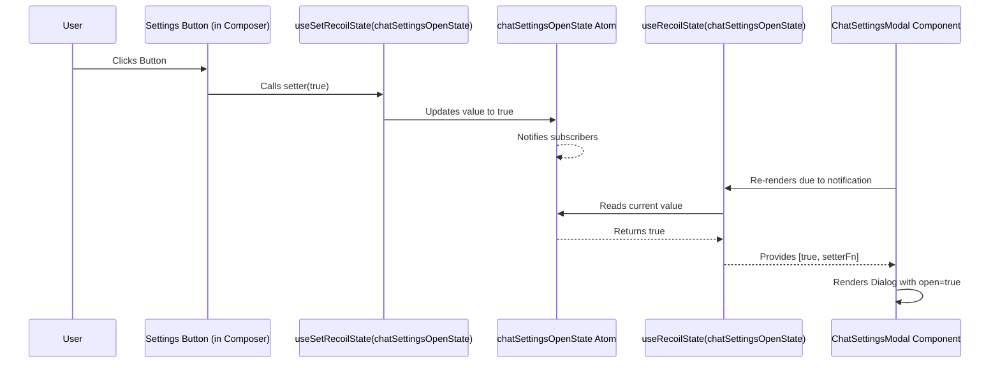

# Chapter 6: Recoil State Management

In [Chapter 5: Chainlit Context & API Client](05_chainlit_context___api_client.md), we saw how the `apiClient` provides a central way to talk to the backend, and how `ChainlitContext` makes it available everywhere. We also saw a component called `<RecoilRoot>` wrapping our app in `src/main.tsx`.

But what is Recoil, and why do we need it?

**What's the Problem?**

Imagine you have different parts of your application that need to share the same piece of information, or react when that information changes. For example:

*   A button in the `MessageComposer` needs to open a Chat Settings modal.
*   The main `App` component needs to know whether to *show* that modal.
*   The `ElementSideView` panel needs to know *which* element details to display when you click an element reference link.

How do these separate components communicate and stay in sync? Passing data up and down through many layers of components (called "prop drilling") can become very messy and complicated, especially in a larger app.

**Our Goal:** Understand how Chainlit uses **Recoil** to manage this shared information (the application's "state") in a clean and efficient way. Let's focus on a simple use case: **how clicking the Settings button in the Message Composer makes the Chat Settings modal appear.**

## What is Recoil? The Central Bulletin Board

Recoil is a state management library specifically for React applications.

**Analogy: The Office Bulletin Board**

Imagine your application is like an office building with different departments (components) on various floors. You need a way to share important announcements that everyone (or specific departments) can see and react to.

Recoil acts like a **central bulletin board** placed in the lobby.

*   Any department (component) can post a new announcement (update a piece of state) on the board.
*   Any other department (component) can look at the board (read the state).
*   Departments can also "subscribe" to specific types of announcements, so they are automatically notified (re-render) whenever that specific piece of information changes.

This avoids having to run messages up and down the stairs (prop drilling) between departments.

## Key Concepts: Atoms and Hooks

1.  **`atom` (A Single Note on the Board):**
    *   An `atom` represents a single, independent piece of state. Think of it as one specific note pinned to the bulletin board.
    *   Each atom has a unique key (like a title for the note) and a default value.
    *   Examples in Chainlit:
        *   `chatSettingsOpenState`: Is the chat settings modal currently open? (true/false)
        *   `attachmentsState`: What files has the user attached to the message composer? (an array of attachment objects)
        *   `sideViewState`: What element should be shown in the side panel? (an object or undefined)

2.  **Recoil Hooks (Interacting with the Board):**
    *   Components use special React Hooks (functions starting with `use`) provided by Recoil to interact with atoms.
    *   **`useRecoilState(atomName)`:** Like reading a note *and* having a pen to change it. Returns the current value and a function to update it. Use this when a component needs both to read and write the state.
    *   **`useRecoilValue(atomName)`:** Like just reading a note. Returns only the current value. Use this when a component only needs to read the state.
    *   **`useSetRecoilState(atomName)`:** Like having a pen to write or update a specific note, without needing to read its current value first. Returns only the function to update the atom. Use this when a component only needs to write the state.

3.  **`<RecoilRoot>` (Setting up the Board):**
    *   This is a component provided by Recoil that needs to wrap your entire application (or the part of it that uses Recoil).
    *   It sets up the context, essentially "installing the bulletin board" so all components inside can access it. We saw this in `src/main.tsx` in the previous chapter.

## Solving the Use Case: Opening the Chat Settings Modal

Let's trace how clicking the Settings button opens the modal using Recoil.

**Step 1: Defining the Atom (The Note Template)**

Somewhere in our state definition files, we define an atom to hold the open/closed state of the modal.

```typescript
// src/state/project.ts
import { atom } from 'recoil';

// Define an atom to track if the chat settings modal is open
export const chatSettingsOpenState = atom<boolean>({
  key: 'chatSettingsOpen', // Unique ID for this atom
  default: false // Initially, the modal is closed
});
```

*   **Explanation:** We use the `atom` function from Recoil. We give it a unique `key` ('chatSettingsOpen') and set its `default` value to `false` (modal closed). This creates the "note template" on our bulletin board.

**Step 2: Setting the State (Posting an Update)**

The `MessageComposer` component contains the Settings button. When clicked, it needs to change the `chatSettingsOpenState` to `true`.

```typescript
// src/components/chat/MessageComposer/index.tsx (Simplified)
import { useSetRecoilState } from 'recoil';
import { chatSettingsOpenState } from '@/state/project'; // Import the atom
import { Settings } from '@/components/icons/Settings';
import { Button } from '@/components/ui/button';
// ... other imports

export default function MessageComposer({ /* ...props... */ }) {
  // Get the function to SET the chatSettingsOpenState atom
  const setChatSettingsOpen = useSetRecoilState(chatSettingsOpenState);

  // ... other logic ...

  return (
    <div>
      {/* ... other buttons ... */}
      {/* Check if there are any chat settings inputs to show the button */}
      {/* {chatSettingsInputs.length > 0 && ( */}
        <Button
          id="chat-settings-open-modal"
          // When clicked, call the function from the hook
          onClick={() => setChatSettingsOpen(true)}
          variant="ghost"
          size="icon"
        >
          <Settings className="!size-6" />
        </Button>
      {/* )} */}
      {/* ... submit button ... */}
    </div>
  );
}
```

*   **Explanation:**
    *   We import the `chatSettingsOpenState` atom we defined earlier.
    *   We use the `useSetRecoilState` hook with this atom. This hook gives us *only* the function to change the atom's value (`setChatSettingsOpen`).
    *   In the button's `onClick` handler, we call `setChatSettingsOpen(true)`. This updates the value of the `chatSettingsOpenState` atom on the "bulletin board" to `true`.

**Step 3: Reading the State (Checking the Note)**

A separate component, `ChatSettingsModal`, needs to know whether it should be visible or not. It reads the same atom.

```typescript
// src/components/ChatSettings.tsx (Simplified)
import { useRecoilState } from 'recoil';
import { chatSettingsOpenState } from '@/state/project'; // Import the same atom
import {
  Dialog,
  DialogContent,
  DialogHeader,
  DialogTitle
} from '@/components/ui/dialog';
// ... other imports

export default function ChatSettingsModal() {
  // Get the current value AND the setter function for the atom
  const [isOpen, setIsOpen] = useRecoilState(chatSettingsOpenState);

  // ... logic to handle saving settings ...

  // Use the 'isOpen' value to control the Dialog component's visibility
  return (
    <Dialog open={isOpen} onOpenChange={setIsOpen}>
      <DialogContent>
        <DialogHeader>
          <DialogTitle>Chat Settings</DialogTitle>
        </DialogHeader>
        {/* ... form inputs for settings ... */}
      </DialogContent>
    </Dialog>
  );
}
```

*   **Explanation:**
    *   This component also imports the `chatSettingsOpenState` atom.
    *   It uses the `useRecoilState` hook. This gives it both the current value (`isOpen`) and the function to change it (`setIsOpen`). (It needs the setter function because the `Dialog` component can call `onOpenChange` to close itself, e.g., by clicking outside).
    *   The `isOpen` variable (which reflects the current state of the atom) is passed to the `Dialog` component's `open` prop, controlling whether the modal is rendered.

**Summary:** The `MessageComposer` *writes* to the atom, and the `ChatSettingsModal` *reads* from the same atom. Recoil ensures that when the atom's value changes (from `false` to `true`), the `ChatSettingsModal` automatically re-renders with the new value, making the modal appear.

## Under the Hood: How State Changes Propagate

When `setChatSettingsOpen(true)` is called in the `MessageComposer`:

1.  **Update Request:** The `useSetRecoilState` hook tells Recoil, "Update the atom with the key 'chatSettingsOpen' to the value `true`."
2.  **Atom Update:** Recoil finds the `chatSettingsOpenState` atom and changes its internal value from `false` to `true`.
3.  **Subscription Notification:** Recoil checks which components are currently "subscribed" to this atom (i.e., components using `useRecoilState` or `useRecoilValue` with `chatSettingsOpenState`). In our case, `ChatSettingsModal` is subscribed.
4.  **Component Re-render:** Recoil triggers a re-render of all subscribed components (`ChatSettingsModal`).
5.  **Reading New Value:** During its re-render, `ChatSettingsModal` calls `useRecoilState(chatSettingsOpenState)` again. This time, Recoil provides the *new* value (`true`).
6.  **UI Update:** The `ChatSettingsModal` component uses the new value (`isOpen = true`) and renders the visible `Dialog`.

**Sequence Diagram:**



This shows how an action in one component (`SettingsBtn`) updates the central `Atom`, which then causes another component (`Modal`) to re-render with the updated information, all managed by Recoil.

## Diving into the Code (Recap)

Let's quickly revisit the key files involved:

**1. `src/main.tsx` - Installing the Bulletin Board**

```typescript
// src/main.tsx (Simplified)
import { RecoilRoot } from 'recoil'; // Import RecoilRoot
import { ChainlitContext } from '@chainlit/react-client';
import { apiClient } from 'api';
import AppWrapper from 'AppWrapper';
// ... other imports

ReactDOM.createRoot(document.getElementById('root')!).render(
  <React.StrictMode>
    <ChainlitContext.Provider value={apiClient}>
      {/* RecoilRoot wraps the part of the app using Recoil */}
      <RecoilRoot>
        <AppWrapper />
      </RecoilRoot>
    </ChainlitContext.Provider>
  </React.StrictMode>
);
```

*   **Explanation:** `<RecoilRoot>` is essential. It enables Recoil for all components within `AppWrapper`.

**2. `src/state/project.ts` - Defining the Note**

```typescript
// src/state/project.ts (Simplified)
import { atom } from 'recoil';

export const chatSettingsOpenState = atom<boolean>({
  key: 'chatSettingsOpen', // Must be unique across the app
  default: false
});
```

*   **Explanation:** Defines a single piece of state using `atom`.

**3. `src/components/chat/MessageComposer/index.tsx` - Writing the Note**

```typescript
// src/components/chat/MessageComposer/index.tsx (Relevant part)
import { useSetRecoilState } from 'recoil';
import { chatSettingsOpenState } from '@/state/project';
// ...

const setChatSettingsOpen = useSetRecoilState(chatSettingsOpenState);
// ...
<Button onClick={() => setChatSettingsOpen(true)}>...</Button>
// ...
```

*   **Explanation:** Uses `useSetRecoilState` to get a function that updates the atom's value.

**4. `src/components/ChatSettings.tsx` - Reading the Note**

```typescript
// src/components/ChatSettings.tsx (Relevant part)
import { useRecoilState } from 'recoil';
import { chatSettingsOpenState } from '@/state/project';
import { Dialog } from '@/components/ui/dialog';
// ...

const [isOpen, setIsOpen] = useRecoilState(chatSettingsOpenState);
// ...
return <Dialog open={isOpen} onOpenChange={setIsOpen}>...</Dialog>;
// ...
```

*   **Explanation:** Uses `useRecoilState` to get the current value and the update function, connecting the component's rendering to the atom's state.

You'll see Recoil used throughout the Chainlit frontend for managing various pieces of shared state like attachments (`attachmentsState`), the content of the side view panel (`sideViewState`), user environment variables (`userEnvState`), and more, often in conjunction with the hooks from [Chapter 4: Chainlit React Client Hooks](04_chainlit_react_client_hooks.md).

## Conclusion

You've now learned about **Recoil**, Chainlit's chosen library for managing global application state.

*   It solves the problem of sharing data between distant components without complex "prop drilling".
*   It uses the concept of a **central bulletin board** (`RecoilRoot`).
*   Individual pieces of state are defined as **`atoms`** (notes on the board).
*   Components interact with atoms using **hooks** like `useRecoilState`, `useRecoilValue`, and `useSetRecoilState`.
*   Updating an atom automatically triggers re-renders in components subscribed to it, keeping the UI in sync.

Recoil provides a clean and scalable way to handle shared state in React applications like Chainlit.

Now that we understand how state is managed, let's look at how the visual building blocks of the application are created and styled in the next chapter: [Chapter 7: UI Component System & Theming](07_ui_component_system___theming.md).

---

Generated by [AI Codebase Knowledge Builder](https://github.com/The-Pocket/Tutorial-Codebase-Knowledge)