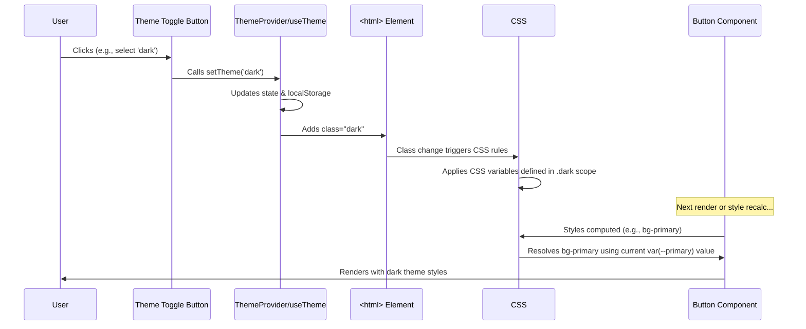

# Chapter 7: UI Component System & Theming

Welcome to Chapter 7! In [Chapter 6: Recoil State Management](06_recoil_state_management.md), we learned how Chainlit uses Recoil to manage shared information across different parts of the application, like whether a modal is open or closed.

Now, let's shift our focus from the application's *data* state to its *visual appearance*. How do we make sure all the buttons, input fields, and cards look consistent throughout the app? How do we easily switch between light mode and dark mode?

**What's the Problem?**

Imagine building a website from scratch. You add a button on one page, style it blue. Then you add another button on a different page, maybe style it blue again, but slightly differently. Soon, you have dozens of buttons, all looking slightly inconsistent. Making a simple change, like changing the brand color, would require hunting down and editing every single button! This is slow, error-prone, and leads to a messy user interface.

We need a way to:
1.  Define common UI elements (like buttons, inputs, dialogs) once and reuse them everywhere.
2.  Apply a consistent style (colors, shapes, sizes) to these elements.
3.  Easily change the overall look and feel (like switching themes) without rewriting every element.

**Our Goal:** Understand how Chainlit uses a **UI Component System** (specifically Shadcn/UI with Tailwind CSS) and a **Theming System** to create a consistent, reusable, and customizable user interface. We'll focus on a simple use case: **How does a `Button` component get its style and adapt to light/dark mode?**

## What are UI Components? (The Building Blocks)

Think of building something with **Lego bricks**. You don't create each tiny plastic stud yourself; you use pre-made bricks of standard shapes and sizes (2x4 brick, 1x2 brick, window piece, etc.).

UI Components are the Lego bricks of our user interface. They are pre-built, reusable pieces of code that represent common UI elements:

*   `Button`: Clickable buttons for actions.
*   `Input`: Fields for users to type text.
*   `Card`: Containers to display content blocks.
*   `Dialog`: Pop-up windows for modals or alerts.
*   `Sidebar`: A navigation panel.
*   And many more...

Using these components ensures that:
*   **Consistency:** All buttons look and behave the same way.
*   **Efficiency:** We don't have to rebuild the same element over and over.
*   **Maintainability:** If we need to change how all buttons look, we only need to modify the central `Button` component definition.

**Shadcn/UI: Our Box of Bricks**

Chainlit primarily uses components from **Shadcn/UI**. Shadcn/UI is a bit different from typical UI libraries. Instead of installing a big package, you copy and paste the code for the components you need directly into your project (usually into `src/components/ui/`).

*   **Why?** This gives you full control over the code. You own the components and can modify them as much as you need.
*   **Built On:** Shadcn/UI components are built using:
    *   **Radix UI:** A library providing unstyled, accessible "primitive" components (like the core logic for a dropdown or dialog). This ensures our components work well for everyone, including users with disabilities.
    *   **Tailwind CSS:** A utility-first CSS framework used for styling the components. We'll look at this next.

You can find the code for these base components in the `src/components/ui/` directory, like `button.tsx`, `card.tsx`, `dialog.tsx`, etc.

```typescript
// src/components/ui/button.tsx (Highly Simplified)
import * as React from 'react';
import { cn } from '@/lib/utils'; // Helper for combining class names
import { cva } from 'class-variance-authority'; // Helper for style variants

// Define different styles for buttons (variants and sizes)
const buttonVariants = cva(
  'inline-flex items-center justify-center rounded-md text-sm font-medium', // Base styles
  {
    variants: {
      variant: {
        default: 'bg-primary text-primary-foreground hover:bg-primary/90', // Style for default button
        outline: 'border border-input hover:bg-accent', // Style for outline button
        // ... other variants (destructive, secondary, ghost, link)
      },
      size: {
        default: 'h-10 px-4 py-2', // Style for default size
        sm: 'h-9 px-3', // Style for small size
        // ... other sizes (lg, icon)
      }
    },
    defaultVariants: { variant: 'default', size: 'default' }
  }
);

// The actual Button component
const Button = React.forwardRef<HTMLButtonElement, /* ...props... */>(
  ({ className, variant, size, ...props }, ref) => {
    return (
      <button
        // Apply the correct Tailwind classes based on variant and size props
        className={cn(buttonVariants({ variant, size, className }))}
        ref={ref}
        {...props}
      />
    );
  }
);

export { Button, buttonVariants };
```

*   **Explanation:** This file defines the `Button` component.
    *   It uses `cva` (Class Variance Authority) to define different *variants* (`default`, `outline`) and *sizes* (`default`, `sm`). Each combination maps to specific Tailwind CSS class names (like `bg-primary`, `border`, `h-10`).
    *   The `Button` component itself is a simple React component that takes `variant` and `size` props and uses the `buttonVariants` function to generate the correct Tailwind CSS classes to apply.
    *   `cn` is a utility function to merge class names intelligently.

## How Components are Styled (The Paint: Tailwind CSS)

How do those class names like `bg-primary` or `rounded-md` actually style the button? That's **Tailwind CSS**.

Instead of writing traditional CSS files with selectors and rules:

```css
/* Traditional CSS */
.my-button {
  background-color: blue;
  color: white;
  padding: 10px 20px;
  border-radius: 6px;
  /* ... and many more lines ... */
}
```

Tailwind lets you apply styles directly in your HTML/JSX using **utility classes**:

```jsx
// JSX with Tailwind CSS
<button className="bg-blue-500 text-white px-5 py-2.5 rounded-md ...">
  Click Me
</button>
```

*   `bg-blue-500`: Sets the background color to a specific shade of blue defined by Tailwind.
*   `text-white`: Sets the text color to white.
*   `px-5`, `py-2.5`: Sets horizontal and vertical padding.
*   `rounded-md`: Applies a medium border radius.

This makes styling faster and keeps styles co-located with the component structure. Shadcn/UI components heavily rely on Tailwind utility classes, often using abstract names like `bg-primary` or `text-foreground`. Where do these abstract names get their actual color values? That brings us to theming.

## What is Theming? (The Color Palette)

Theming is about managing the overall visual style of the application, making it easy to customize and switch looks. The most common example is switching between **light mode** and **dark mode**.

**Analogy: The Paint Kit**

Imagine you have a paint-by-numbers kit. The instructions might say "Color section 1 with 'Sky Blue'". Theming is like having multiple paint kits:
*   **Light Mode Kit:** 'Sky Blue' is a light blue color. 'Text Color' is dark gray. 'Background Color' is white.
*   **Dark Mode Kit:** 'Sky Blue' is a darker blue. 'Text Color' is light gray. 'Background Color' is dark gray.

Our components (like the Button) are built using the abstract names (`bg-primary`, `text-foreground`). The theming system is responsible for providing the *actual* color values based on whether the light or dark "paint kit" is currently active.

**How? CSS Variables!**

Chainlit uses **CSS Variables** (also called Custom Properties) for theming. These are variables defined in CSS that can hold values like colors, fonts, or spacing units.

Example:
```css
/* Define variables */
:root { /* Variables for light mode */
  --background: 0 0% 100%; /* White in HSL */
  --foreground: 0 0% 10%;  /* Dark Gray */
  --primary: 240 5.9% 10%; /* Dark Blue */
  --radius: 0.5rem;
}

.dark { /* Override variables for dark mode */
  --background: 0 0% 10%;  /* Dark Gray */
  --foreground: 0 0% 98%; /* Almost White */
  --primary: 210 40% 98%; /* Lighter Blue */
  /* --radius might stay the same */
}

/* Use variables in styles */
body {
  background-color: hsl(var(--background));
  color: hsl(var(--foreground));
}

button {
  background-color: hsl(var(--primary));
  border-radius: var(--radius);
}
```
Here, `hsl(var(--background))` will resolve to white in light mode and dark gray when the `.dark` class is applied to a parent element.

## Defining the Theme (`tailwind.config.js`)

Tailwind CSS allows us to define our theme colors, fonts, spacing, border radius, etc., in its configuration file: `tailwind.config.js`. Chainlit configures Tailwind to use CSS variables for these theme values.

```javascript
// tailwind.config.js (Simplified Colors section)
export default {
  darkMode: ['class'], // Use class-based dark mode (.dark class)
  theme: {
    extend: {
      colors: {
        // Define colors using HSL format referencing CSS variables
        background: 'hsl(var(--background))',
        foreground: 'hsl(var(--foreground))',
        primary: {
          DEFAULT: 'hsl(var(--primary))', // Used for 'bg-primary', 'text-primary'
          foreground: 'hsl(var(--primary-foreground))' // Text on primary background
        },
        secondary: {
          DEFAULT: 'hsl(var(--secondary))',
          foreground: 'hsl(var(--secondary-foreground))'
        },
        muted: {
          DEFAULT: 'hsl(var(--muted))',
          foreground: 'hsl(var(--muted-foreground))'
        },
        accent: {
          DEFAULT: 'hsl(var(--accent))',
          foreground: 'hsl(var(--accent-foreground))'
        },
        border: 'hsl(var(--border))',
        // ... other colors ...
      },
      borderRadius: {
        lg: 'var(--radius)',
        md: 'calc(var(--radius) - 2px)',
        sm: 'calc(var(--radius) - 4px)'
      },
      // ... other theme extensions (keyframes, animation) ...
    }
  },
  // ... plugins ...
};
```

*   **Explanation:**
    *   `darkMode: ['class']` tells Tailwind to activate dark mode styles when an element has the `dark` class.
    *   Inside `theme.extend.colors`, we define color names like `background`, `primary`, etc.
    *   Crucially, their values are set to `hsl(var(--variable-name))`. This tells Tailwind: "When you see `bg-primary`, use the color defined by the CSS variable `--primary`".
    *   Similarly, `borderRadius` uses `var(--radius)`.
    *   The actual HSL values for these CSS variables (`--background`, `--primary`, `--radius`) are defined elsewhere, typically in a global CSS file or applied dynamically by our `ThemeProvider`.

## Applying the Theme (`ThemeProvider`)

How does the application know whether to use the light or dark set of CSS variable values? This is managed by the `ThemeProvider` component.

```typescript
// src/components/ThemeProvider.tsx (Simplified)
import { createContext, useContext, useEffect, useState } from 'react';

type Theme = 'dark' | 'light' | 'system'; // Possible theme settings

// Context to hold the current theme and setter function
const ThemeProviderContext = createContext(/* ...initial state... */);

export function ThemeProvider({ children, defaultTheme = 'system', storageKey = 'vite-ui-theme' }) {
  // State to hold the chosen theme ('light', 'dark', or 'system')
  const [theme, setTheme] = useState<Theme>(
    // Read saved theme from localStorage or use default
    () => (localStorage.getItem(storageKey) as Theme) || defaultTheme
  );

  useEffect(() => {
    const root = window.document.documentElement; // Get the <html> element

    // Remove previous theme classes
    root.classList.remove('light', 'dark');

    let currentTheme: 'light' | 'dark';
    if (theme === 'system') {
      // If 'system', check OS preference
      currentTheme = window.matchMedia('(prefers-color-scheme: dark)').matches
        ? 'dark'
        : 'light';
    } else {
      // Otherwise, use the explicitly chosen theme
      currentTheme = theme;
    }

    // Add the determined class ('light' or 'dark') to the <html> element
    root.classList.add(currentTheme);

    // Apply custom CSS variables from window.theme if available (from backend config)
    // applyThemeVariables(currentTheme); // Simplified concept

  }, [theme]); // Re-run this effect when the theme state changes

  // Function to update the theme state and save to localStorage
  const value = {
    theme,
    setTheme: (newTheme: Theme) => {
      localStorage.setItem(storageKey, newTheme);
      setTheme(newTheme);
    }
  };

  // Provide the theme state and setter to children components
  return (
    <ThemeProviderContext.Provider value={value}>
      {children}
    </ThemeProviderContext.Provider>
  );
}

// Hook for components to easily access the current theme and setter
export const useTheme = () => {
  // ... (provides context value and calculated 'variant') ...
};
```

*   **Explanation:**
    *   It uses `useState` to keep track of the selected theme (`light`, `dark`, or `system`). It reads the initial value from `localStorage` to remember the user's preference.
    *   The `useEffect` hook runs whenever the `theme` state changes.
    *   Inside the effect:
        *   It determines the actual theme to apply (`light` or `dark`), resolving `system` based on the user's OS settings.
        *   It adds the corresponding class (`light` or `dark`) to the root `<html>` element. This is the key step that triggers CSS rules to apply the correct set of CSS variable values.
        *   It might also directly apply specific CSS variable values fetched from the backend configuration (using `applyThemeVariables` or similar logic).
    *   It provides the current `theme` and the `setTheme` function via React Context, so other components (like a theme toggle button) can use the `useTheme` hook to read or change the theme.

We wrap our entire application with this provider in `src/App.tsx`:

```typescript
// src/App.tsx (Simplified)
import { ThemeProvider } from './components/ThemeProvider';
// ... other imports

function App() {
  // ... other logic ...

  return (
    // Wrap the app, providing theme functionality
    <ThemeProvider storageKey="vite-ui-theme" /* ...defaultTheme */ >
      {/* ... Toaster, Modals, Router ... */}
      <RouterProvider router={router} />
      {/* ... Loader ... */}
    </ThemeProvider>
  );
}

export default App;
```

## Putting it Together: Button in Light/Dark Mode

Now let's revisit our Button use case:

1.  **Component Definition (`button.tsx`):** Defines a `Button` component using Tailwind classes like `bg-primary`, `text-primary-foreground`, `rounded-md`.
2.  **Tailwind Config (`tailwind.config.js`):** Maps these classes to CSS variables: `bg-primary` uses `hsl(var(--primary))`, `rounded-md` uses `var(--radius)`.
3.  **CSS Variables:** Somewhere (e.g., a global CSS file or injected styles), the actual values for `--primary`, `--radius`, etc., are defined, potentially with overrides inside a `.dark` selector.
    ```css
    :root { --primary: /* dark blue HSL */; --radius: 0.5rem; }
    .dark { --primary: /* light blue HSL */; }
    ```
4.  **Theme Provider (`ThemeProvider.tsx`):** Determines if the theme should be `light` or `dark` based on user preference/system settings.
5.  **Applying the Class:** The `ThemeProvider` adds either the `light` or (more importantly) the `dark` class to the `<html>` element.
6.  **CSS Resolution:** The browser sees the structure. If the `dark` class is present, the CSS variables defined within the `.dark` scope (like the lighter blue for `--primary`) take precedence. If not, the default `:root` variables are used.
7.  **Button Rendering:** The `Button` component renders with the `bg-primary` class. The browser calculates the style for `bg-primary` based on the *current value* of the `--primary` CSS variable, applying either the light mode dark blue or the dark mode light blue.

**Sequence Diagram (Theme Change):**



## Conclusion

We've explored how Chainlit builds its user interface using a robust system:

*   **UI Components (Shadcn/UI):** Reusable building blocks (`Button`, `Card`, etc.) based on Radix UI primitives for accessibility and owned directly by the project.
*   **Styling (Tailwind CSS):** Utility classes provide a quick and consistent way to style components directly in the JSX.
*   **Theming (CSS Variables):** Abstract style values (like `primary` color or `radius`) are defined using CSS variables.
*   **Theme Management (`ThemeProvider`):** A React component manages switching between themes (like light/dark) by applying a class to the root element, which causes CSS to use the appropriate set of variable values.

This combination allows Chainlit to have a visually consistent, maintainable, and customizable frontend. Buttons, cards, inputs, and other elements look coherent and adapt automatically to the selected theme.

In the next chapter, we'll delve into how users log in and how the application manages their sessions: [Authentication Flow](08_authentication_flow.md).

---

Generated by [AI Codebase Knowledge Builder](https://github.com/The-Pocket/Tutorial-Codebase-Knowledge)