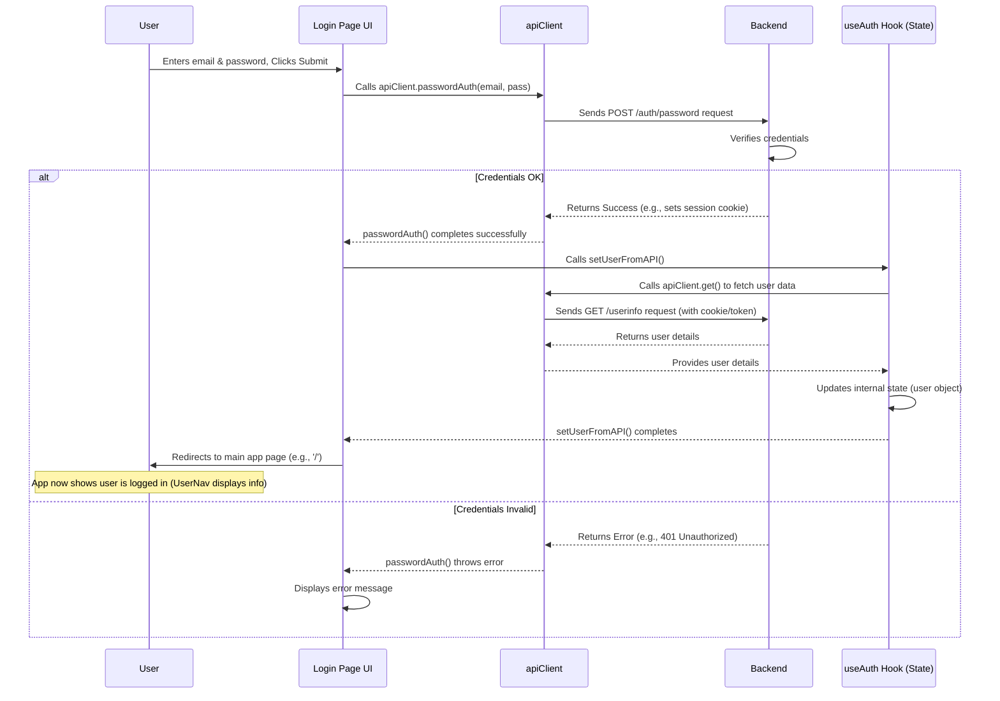

# Chapter 8: Authentication Flow

Welcome back! In [Chapter 7: UI Component System & Theming](07_ui_component_system___theming.md), we saw how Chainlit uses UI components and theming to create a consistent and visually appealing interface, adapting even to light and dark modes.

Now, let's talk about security and identity. How does the application know who *you* are? How does it let you log in securely and keep track of your session?

**What's the Problem?**

Imagine a private chat application or one where you have personalized settings. We can't just let anyone access it! We need a system to:

1.  Verify a user's identity (are they really who they say they are?).
2.  Grant them access only if they are verified.
3.  Remember that they are logged in as they navigate the app.
4.  Provide a way to log out.

This process of verifying users and managing their access is called **Authentication**.

**Our Goal:** Understand how Chainlit handles user login and session management. We'll focus on the common use case: **Logging in with an email and password.**

**Analogy: The Application's Security Guard**

Think of the Authentication Flow as the **security guard** standing at the entrance of your application building.

*   When you arrive (`Login` page), the guard asks for your credentials (email/password or maybe a badge from another trusted company like Google/GitHub - OAuth).
*   The guard checks these credentials with the main office (backend via `apiClient`).
*   If verified, the guard lets you in and gives you a temporary access pass (your session).
*   The guard remembers you have access (`useAuth` hook) as you move around the building.
*   When you leave, you return the pass (`logout` function).

## Key Concepts: The Guard's Tools

Several parts work together to manage authentication:

1.  **Login Methods:** Chainlit supports different ways for the guard to check credentials:
    *   **Password:** You provide your email and password directly.
    *   **OAuth (Open Authorization):** You log in using a third-party service like Google, GitHub, Okta, etc. The app trusts that service to verify you. You get redirected to their login page and then back to the app.
2.  **`Login` Page (`src/pages/Login.tsx`):** The "front desk" where you interact with the guard. It displays the forms for email/password entry and buttons for OAuth providers. It uses components like `LoginForm` ([Chapter 7: UI Component System & Theming](07_ui_component_system___theming.md)).
3.  **`apiClient` ([Chapter 5: Chainlit Context & API Client](05_chainlit_context___api_client.md)):** The "phone line" the guard uses to call the main office (backend) to verify your password or handle the final steps of an OAuth login. It has methods like `passwordAuth` and `getOAuthEndpoint`.
4.  **`useAuth` Hook ([Chapter 4: Chainlit React Client Hooks](04_chainlit_react_client_hooks.md)):** This hook is like the guard's internal memory and toolkit. It tells any part of the app:
    *   *If* someone is logged in (`user` object exists).
    *   *Who* is logged in (`user` object details).
    *   How to log out (`logout` function).
    *   How to check credentials again or initialize the session (`setUserFromAPI`).
5.  **`AuthCallback` Page (`src/pages/AuthCallback.tsx`):** A special, temporary page you land on after successfully logging in via an OAuth provider (like Google). Its job is to tell the `apiClient` and `useAuth` hook that the OAuth login was successful and to fetch your user details.

## Solving the Use Case: Password Login

Let's walk through how you log in using your email and password.

**Step 1: Filling the Form (Login Page)**

You navigate to the application, and since you're not logged in, you're redirected to the `Login` page (`src/pages/Login.tsx`). This page uses the `LoginForm` component (`src/components/LoginForm.tsx`) to display the input fields.

```typescript
// src/components/LoginForm.tsx (Simplified)
import { useForm } from 'react-hook-form';
import { Input } from '@/components/ui/input';
import { Button } from '@/components/ui/button';
// ... other imports

interface Props {
  onPasswordSignIn?: (email: string, password: string) => Promise<any>;
  // ... other props (providers, error, callbackUrl)
}

export function LoginForm({ onPasswordSignIn, ...props }: Props) {
  const { register, handleSubmit } = useForm(); // React Hook Form for handling forms

  // This function is called when the form is submitted
  const onSubmit = (data: { email: string, password: string }) => {
    // Call the function passed down from the Login page
    onPasswordSignIn?.(data.email, data.password);
  };

  return (
    <form onSubmit={handleSubmit(onSubmit)}>
      {/* Input for Email */}
      <Input id="email" placeholder="me@example.com" {...register('email')} />

      {/* Input for Password */}
      <Input id="password" type="password" {...register('password')} />

      {/* Submit Button */}
      <Button type="submit">Sign In</Button>

      {/* ... OAuth buttons might be here too ... */}
    </form>
  );
}
```

*   **Explanation:** The `LoginForm` renders standard input fields and a submit button. When you click "Sign In", it calls the `onSubmit` function, which in turn calls the `onPasswordSignIn` function that was passed down as a prop from the main `Login` page.

**Step 2: Sending Credentials (Login Page & API Client)**

The `Login` page (`src/pages/Login.tsx`) provides the `handlePasswordLogin` function to the `LoginForm`. This function uses the `apiClient` to send your credentials to the backend.

```typescript
// src/pages/Login.tsx (Simplified)
import { useContext, useState } from 'react';
import { useNavigate } from 'react-router-dom';
import { ChainlitContext, useAuth } from '@chainlit/react-client'; // Use types from client
import { LoginForm } from '@/components/LoginForm';

export default function Login() {
  const apiClient = useContext(ChainlitContext); // Get the API client (Chapter 5)
  const { setUserFromAPI } = useAuth(); // Get function to update auth state
  const [error, setError] = useState('');
  const navigate = useNavigate();

  // Function passed to LoginForm's onPasswordSignIn prop
  const handlePasswordLogin = async (email: string, password: string) => {
    setError(''); // Clear previous errors
    try {
      // Use the apiClient to call the backend password auth endpoint
      await apiClient.passwordAuth(email, password); // <-- Backend check happens here

      // If passwordAuth doesn't throw an error, login was successful.
      // Tell useAuth to fetch the user details from the backend.
      await setUserFromAPI();

      // Redirect to the main application page
      navigate('/');

    } catch (err: any) {
      // If login fails, show an error
      setError(err.message || 'Login failed');
    }
  };

  // ... other logic (checking config, handling OAuth) ...

  return (
    <div>
      {/* ... Logo, background image ... */}
      <LoginForm
        onPasswordSignIn={handlePasswordLogin}
        error={error}
        // ... other props (providers) ...
      />
    </div>
  );
}
```

*   **Explanation:**
    *   It gets the `apiClient` using `useContext` ([Chapter 5](05_chainlit_context___api_client.md)).
    *   It gets the `setUserFromAPI` function from the `useAuth` hook.
    *   The `handlePasswordLogin` function takes the email and password.
    *   It calls `apiClient.passwordAuth(email, password)`. This method sends the credentials to the backend securely. The backend checks them against its database.
    *   If the backend confirms the credentials are correct, `passwordAuth` completes successfully.
    *   It then calls `setUserFromAPI()`. This function (from `useAuth`) tells the application to fetch the logged-in user's information from the backend and store it.
    *   Finally, it navigates the user to the main page (`/`).
    *   If `passwordAuth` fails (wrong password), it throws an error, which is caught, and an error message is displayed.

**Step 3: Storing the Session & User Info (`useAuth`)**

The `useAuth` hook is the central piece managing the *state* of authentication. After `setUserFromAPI` successfully fetches the user data, the hook updates its internal state.

```typescript
// Usage of useAuth hook (conceptual)
import { useAuth } from '@chainlit/react-client';

function UserDisplay() {
  // Get authentication status and user data from the hook
  const { user, logout } = useAuth();

  if (!user) {
    // If 'user' is null or undefined, the user is not logged in
    return <div>Not logged in</div>;
  }

  // If 'user' exists, we can display their information
  return (
    <div>
      Welcome, {user.identifier}! {/* Display username/email */}
      {/* 'user' might contain other details like image, etc. */}
      <button onClick={() => logout()}>Logout</button> {/* Provide logout button */}
    </div>
  );
}
```

*   **Explanation:** Components anywhere in the app can call `useAuth()`.
    *   It returns an object, most importantly containing `user`. If `user` has data, the user is logged in. If `user` is `null`, they are not.
    *   It also returns the `logout` function. Calling this function tells the backend to invalidate the session and clears the user data in the frontend state.

**Step 4: Displaying User Info & Logout (e.g., `UserNav`)**

Components like the user navigation menu in the header use the `useAuth` hook to display user information and provide a logout button.

```typescript
// src/components/header/UserNav.tsx (Simplified)
import { useAuth } from '@chainlit/react-client';
import { Avatar, AvatarFallback } from '@/components/ui/avatar';
import { Button } from '@/components/ui/button';
import { LogOut } from 'lucide-react';
// ... imports for DropdownMenu ...

export default function UserNav() {
  // Get user data and logout function from the hook
  const { user, logout } = useAuth();

  // If no user is logged in, don't render anything
  if (!user) return null;

  const displayName = user.identifier; // Get user identifier

  return (
    <DropdownMenu>
      <DropdownMenuTrigger asChild>
        <Button variant="ghost">
          <Avatar>
            {/* Optionally display user image or initials */}
            <AvatarFallback>{displayName[0].toUpperCase()}</AvatarFallback>
          </Avatar>
        </Button>
      </DropdownMenuTrigger>
      <DropdownMenuContent>
        <DropdownMenuLabel>{displayName}</DropdownMenuLabel>
        <DropdownMenuSeparator />
        {/* Call the logout function from the hook when clicked */}
        <DropdownMenuItem onClick={() => logout()}>
          Logout <LogOut />
        </DropdownMenuItem>
      </DropdownMenuContent>
    </DropdownMenu>
  );
}
```

*   **Explanation:** This component checks if `user` exists using `useAuth()`. If yes, it displays the user's initial/avatar and name. The "Logout" menu item is wired to call the `logout()` function provided by the `useAuth` hook.

## Under the Hood: Password Login Flow

Let's visualize the password login process:



**Explanation:**

1.  The user submits the form on the `Login` page.
2.  The page calls `apiClient.passwordAuth`.
3.  `apiClient` sends the credentials to the backend.
4.  The backend checks them.
5.  If **successful**, the backend often sets a secure cookie in the browser to remember the session. `passwordAuth` returns successfully.
6.  The `Login` page then calls `setUserFromAPI` from the `useAuth` hook.
7.  `useAuth` (likely via `apiClient` again) fetches the detailed user profile from a backend endpoint (e.g., `/userinfo`). This request automatically includes the session cookie, proving the user is logged in.
8.  The backend returns the user data.
9.  `useAuth` updates its state, making the `user` object available.
10. The user is redirected to the main app, where components like `UserNav` can now access the `user` data via `useAuth`.
11. If **unsuccessful**, `passwordAuth` throws an error, and the `Login` page shows the error.

**What about OAuth?**

OAuth (like "Login with Google") is slightly different.

1.  You click the "Login with Google" button on the `Login` page.
2.  The page calls `apiClient.getOAuthEndpoint('google')` which provides the correct Google login URL.
3.  Your browser is redirected to Google's login page.
4.  You log in with Google.
5.  Google redirects you back to a specific page in our app: `AuthCallback` (`src/pages/AuthCallback.tsx`).
6.  The `AuthCallback` page runs `setUserFromAPI()` from the `useAuth` hook. This fetches the user data from our backend (which has now verified the Google login) and updates the auth state, similar to the end of the password flow.
7.  `AuthCallback` then redirects you to the main app page (`/`).

```typescript
// src/pages/AuthCallback.tsx (Simplified)
import { useEffect } from 'react';
import { useNavigate } from 'react-router-dom';
import { useAuth } from '@chainlit/react-client';

export default function AuthCallback() {
  const { user, setUserFromAPI } = useAuth();
  const navigate = useNavigate();

  // When this page loads after OAuth redirect...
  useEffect(() => {
    // If we don't have user data yet, fetch it.
    // This verifies the OAuth login with the backend.
    if (!user) setUserFromAPI();
  }, [user, setUserFromAPI]); // Run once or if user state changes

  // Once we have the user data...
  useEffect(() => {
    if (user) {
      // Redirect to the main application page
      navigate('/');
    }
  }, [user, navigate]); // Run when user state changes

  return null; // This page doesn't render anything visible
}
```

## Conclusion

You've now learned about the **Authentication Flow** in Chainlit, the system that acts like the application's security guard.

*   It verifies users through methods like **Password Login** or **OAuth**.
*   The **`Login` Page** presents the interface for users to provide credentials or choose an OAuth provider.
*   The **`apiClient`** handles the secure communication with the backend to check credentials.
*   The **`useAuth` Hook** is the central place to check if a user is logged in (`user`), get their details, and access the `logout` function. It manages the authentication state.
*   **`AuthCallback`** handles the redirect step specific to OAuth logins.

This system ensures that only verified users can access protected parts of the application and maintains their session state as they navigate.

In the final chapter, we'll look at how the application handles different URLs and navigates between different views or pages: [Chapter 9: Routing](09_routing.md).

---

Generated by [AI Codebase Knowledge Builder](https://github.com/The-Pocket/Tutorial-Codebase-Knowledge)