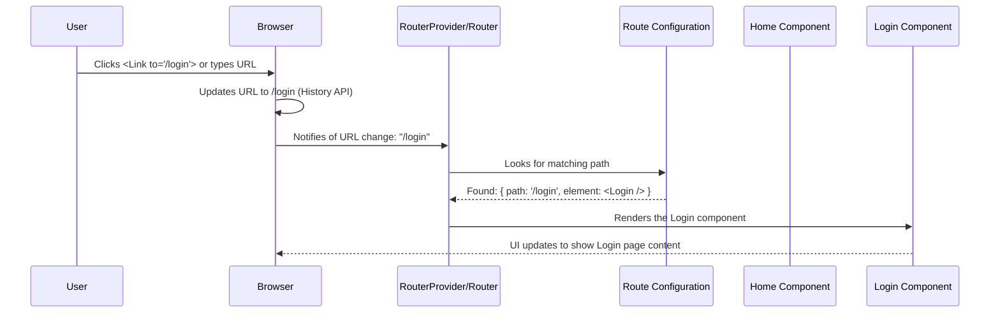

# Chapter 9: Routing

Welcome to the final chapter of our Chainlit frontend tutorial! In [Chapter 8: Authentication Flow](08_authentication_flow.md), we learned how Chainlit handles user logins and keeps track of who is using the application.

Now, let's tackle one last fundamental concept: how does the app know what to display when you visit different web addresses (URLs) like `/login` or `/thread/abc-123`? How can you navigate between different "pages" within the app without the entire browser window reloading each time? This magic is handled by **Routing**.

**What's the Problem?**

Imagine a traditional website. Clicking a link usually takes you to a completely new HTML page, causing a full browser refresh. This can feel slow. Modern web applications, like Chainlit, often operate as **Single-Page Applications (SPAs)**. This means you load the main application shell once, and then different parts of the content are dynamically loaded and swapped out as you navigate, making the experience feel faster and smoother, like a desktop application.

But if it's all technically *one page*, how does the browser's address bar change, and how does the app know whether to show the login form, the main chat interface, or a specific past conversation based on that address?

**Our Goal:** Understand how Chainlit uses a routing system (specifically **React Router**) to map URL paths to different page components, enabling seamless navigation within the single-page application. Let's focus on the basic use case: **How does visiting `/login` show the `Login` page, and `/` show the main `Home` (chat) page?**

**Analogy: The App's Internal GPS**

Think of the **Router** as the application's **internal GPS system**.

*   You type a destination (URL path like `/login`) into the GPS.
*   The GPS looks at its map (the route configuration).
*   It finds the route matching your destination.
*   It directs you (renders the component) to the correct location (the `Login` page) on the screen.

All this happens without needing to "restart the car" (reload the entire webpage).

## Key Concepts: Building the Map

1.  **Single-Page Application (SPA):** Our Chainlit frontend is mostly loaded once. Routing lets us change the *view* within this single page without full reloads.
2.  **URL Path:** The part of the web address after the domain name (e.g., in `https://chat.example.com/thread/123`, the path is `/thread/123`).
3.  **Routes:** These are the rules defined in our application that connect specific URL paths to specific React components (our "pages").
4.  **React Router:** The library Chainlit uses to handle routing in React. It provides the tools to define routes and manage navigation.
5.  **`createBrowserRouter`:** A function from React Router used to define all the application's routes in a structured way. It uses the browser's built-in History API to change the URL without page reloads.
6.  **`Route` Definition:** Within `createBrowserRouter`, we define individual routes, specifying:
    *   `path`: The URL path to match (e.g., `/`, `/login`, `/thread/:id`).
    *   `element`: The React component to render when the path matches (e.g., `<Home />`, `<Login />`).
7.  **`RouterProvider`:** A component from React Router that takes the router configuration (created by `createBrowserRouter`) and makes it available to the rest of the application.
8.  **Navigation:**
    *   **`Link` Component:** A component provided by React Router to create clickable links that change the URL and trigger routing *without* a full page reload.
    *   **`useNavigate` Hook:** Allows you to trigger navigation programmatically (e.g., after a successful login).
    *   **`Navigate` Component:** Can be used within route definitions to automatically redirect from one path to another.
9.  **Dynamic Routes (`/thread/:id`):** Routes can contain parameters (like `:id`). React Router allows us to extract these parameters (e.g., the specific thread ID) from the URL.

## Solving the Use Case: Navigating to Login and Home

Let's see how visiting different URLs shows the correct page.

**1. Defining the Routes (`src/router.tsx`)**

First, we need to tell React Router which component corresponds to which path. This is done using `createBrowserRouter`.

```typescript
// src/router.tsx (Simplified)
import { Navigate, createBrowserRouter } from 'react-router-dom';

// Import the page components we want to route to
import Home from 'pages/Home';
import Login from 'pages/Login';
import Thread from 'pages/Thread';
// ... other page imports (Element, AuthCallback, Env)

// Create the router configuration
export const router = createBrowserRouter(
  [
    // Route 1: When the path is exactly '/'
    {
      path: '/',
      element: <Home /> // Render the Home component
    },
    // Route 2: When the path is '/login'
    {
      path: '/login',
      element: <Login /> // Render the Login component
    },
    // Route 3: A dynamic route for specific threads
    {
      path: '/thread/:id?', // ':id' is a URL parameter, '?' makes it optional
      element: <Thread />   // Render the Thread component
    },
    // ... routes for /element/:id, /login/callback, /env ...

    // Catch-all Route: If no other path matches
    {
      path: '*',
      // Redirect the user back to the home page
      element: <Navigate replace to="/" />
    }
  ],
  // Optional: Handle base path if deployed in a subdirectory
  // { basename: getRouterBasename() }
);
```

*   **Explanation:**
    *   We import `createBrowserRouter` and the page components (`Home`, `Login`, `Thread`).
    *   We create an array of route objects. Each object defines a `path` and the `element` (component) to render for that path.
    *   `/` maps to `<Home />`.
    *   `/login` maps to `<Login />`.
    *   `/thread/:id?` maps to `<Thread />`. The `:id` part means it can match `/thread/123`, `/thread/abc`, etc. The `?` makes the ID optional, so it could also match `/thread`.
    *   `*` acts as a wildcard. If the URL doesn't match any other defined path, the user is redirected (`Navigate`) to the home page (`/`).

**2. Providing the Router (`src/main.tsx`)**

We need to make this router configuration available to our application. This is done using `RouterProvider` in the main entry point.

```typescript
// src/main.tsx (Simplified)
import React from 'react';
import ReactDOM from 'react-dom/client';
import { RouterProvider } from 'react-router-dom'; // Import RouterProvider
import { RecoilRoot } from 'recoil';
import { ChainlitContext } from '@chainlit/react-client';
import { apiClient } from 'api';
import AppWrapper from 'AppWrapper'; // Contains ThemeProvider, etc.
import { router } from './router'; // Import the router configuration

ReactDOM.createRoot(document.getElementById('root')!).render(
  <React.StrictMode>
    <ChainlitContext.Provider value={apiClient}>
      <RecoilRoot>
        {/* Pass the created router to the RouterProvider */}
        <RouterProvider router={router} />
      </RecoilRoot>
    </ChainlitContext.Provider>
  </React.StrictMode>
);
```

*   **Explanation:** We import `RouterProvider` and our `router` configuration. We wrap our application with `<RouterProvider router={router} />`. This activates React Router and connects our defined routes to the browser's URL. (Note: In the actual `frontend` code, `AppWrapper` contains the `ThemeProvider` and other global elements, and `AppWrapper` itself is rendered inside `RouterProvider` in `App.tsx`, but the principle is the same - `RouterProvider` wraps the part of the app that needs routing).

**3. What Happens Now?**

*   When you type `http://localhost:PORT/` in your browser and press Enter, React Router sees the path `/`. It looks up its configuration, finds the matching route, and renders the `<Home />` component inside the `RouterProvider`.
*   When you type `http://localhost:PORT/login` or click a link pointing to `/login`, React Router sees the path `/login`. It finds the corresponding route and renders the `<Login />` component, replacing the previous view *without* a full page reload.

## Under the Hood: The GPS in Action

How does clicking a link or typing a URL trigger this component swapping?

1.  **URL Change:** The user clicks a `<Link to="/login">` component or types `/login` in the address bar and hits Enter. The browser updates the URL shown in the address bar using the History API (this doesn't trigger a server request for SPAs).
2.  **Router Notification:** The `BrowserRouter` (managed internally by the `RouterProvider` using our `createBrowserRouter` config) is listening for changes to the browser's history (URL). It detects the new path: `/login`.
3.  **Route Matching:** The router iterates through the list of routes we defined in `src/router.tsx`.
    *   Does `/login` match `/`? No.
    *   Does `/login` match `/login`? Yes!
4.  **Component Rendering:** The router finds the matching route object: `{ path: '/login', element: <Login /> }`. It then renders the specified `element`, the `<Login />` component.
5.  **UI Update:** React updates the DOM, replacing the previously rendered component (e.g., `<Home />`) with the new `<Login />` component. The user sees the Login page appear.

**Sequence Diagram:**



This flow happens seamlessly within the single loaded webpage.

## Diving Deeper into Code

Let's revisit the key files involved in routing:

**1. `src/router.tsx` - The Route Map**

```typescript
// src/router.tsx (Focus on structure)
import { Navigate, createBrowserRouter } from 'react-router-dom';
import Home from 'pages/Home';
import Login from 'pages/Login';
import Thread from 'pages/Thread';
// ... other imports ...
import getRouterBasename from '@/lib/router'; // Helper for base path

export const router = createBrowserRouter(
  [
    { path: '/', element: <Home /> },
    { path: '/login', element: <Login /> },
    { path: '/thread/:id?', element: <Thread /> },
    { path: '/element/:id', element: <Element /> }, // For viewing specific elements
    { path: '/login/callback', element: <AuthCallback /> }, // Handles OAuth returns
    { path: '/env', element: <Env /> }, // For setting API keys
    { path: '*', element: <Navigate replace to="/" /> } // Fallback redirect
  ],
  // Tells router if the app lives in a subdirectory (e.g., mydomain.com/chat/)
  { basename: getRouterBasename() }
);
```

*   **Explanation:** This defines all possible "pages" or views in the application and the URL paths that trigger them. `getRouterBasename` reads a configuration value to handle cases where the Chainlit app isn't running at the root of the domain.

**2. `src/App.tsx` - Providing the Router**

```typescript
// src/App.tsx (Focus on RouterProvider placement)
import { RouterProvider } from 'react-router-dom';
import { router } from 'router'; // Import the configured router
import { ThemeProvider } from './components/ThemeProvider';
// ... other imports (Toaster, ChatSettingsModal, Loader) ...

function App() {
  // ... hooks for config, auth, session (see previous chapters) ...

  return (
    // ThemeProvider wraps everything
    <ThemeProvider /* ...props... */ >
      {/* ... Toaster, Modals ... */}
      {/* RouterProvider makes the 'router' config active */}
      <RouterProvider router={router} />
      {/* ... Loader for initial loading state ... */}
    </ThemeProvider>
  );
}

export default App;
```

*   **Explanation:** `RouterProvider` takes the `router` configuration object and enables routing functionality for all components rendered by it.

**3. `src/pages/Thread.tsx` - Using Dynamic Parameters**

How does the `Thread` page know *which* thread to display when the URL is `/thread/abc-123`? It uses the `useParams` hook from React Router.

```typescript
// src/pages/Thread.tsx (Simplified)
import { useEffect } from 'react';
import { useParams } from 'react-router-dom'; // Import useParams
import { useConfig } from '@chainlit/react-client';
// ... other imports (Page, Chat, ReadOnlyThread, Loader) ...

export default function ThreadPage() {
  // useParams extracts parameters defined in the route path (':id')
  const { id } = useParams<{ id: string }>(); // Get the 'id' from the URL
  const { config } = useConfig();

  // Now 'id' contains the value from the URL (e.g., "abc-123")
  // We can use this 'id' to fetch the specific thread data
  // or check if it's the currently active thread.

  useEffect(() => {
    // Logic using the 'id' parameter...
    console.log('Current thread ID from URL:', id);
    // ... update thread history state ...
  }, [id]);

  // ... logic to decide whether to show Chat, ReadOnlyThread, or Loader based on 'id' ...

  return (
    <Page>
      {/* ... Render Chat or ReadOnlyThread based on the 'id' ... */}
    </Page>
  );
}
```

*   **Explanation:** The `useParams()` hook reads the current URL and extracts the value corresponding to the `:id` parameter defined in the route (`/thread/:id`). This allows the `ThreadPage` component to load and display the data for the specific thread requested in the URL.

**4. Navigation Example (Conceptual)**

While not explicitly shown in the provided `UserNav` snippet, navigation is often triggered like this:

```typescript
import { Link } from 'react-router-dom'; // For declarative links
import { useNavigate } from 'react-router-dom'; // For programmatic navigation

function SomeComponent() {
  const navigate = useNavigate();

  const handleLogout = () => {
    // ... perform logout logic ...
    // Programmatically navigate to the login page after logout
    navigate('/login');
  };

  return (
    <div>
      {/* Declarative link: Navigates to home on click */}
      <Link to="/">Go Home</Link>

      {/* Button triggering programmatic navigation */}
      <button onClick={handleLogout}>Logout</button>
    </div>
  );
}
```

*   **Explanation:**
    *   `<Link to="/">` creates a clickable link. When clicked, React Router intercepts it, updates the URL to `/`, and renders the `<Home />` component without a page reload.
    *   `useNavigate()` gives you a `navigate` function. Calling `navigate('/login')` changes the URL to `/login` and renders the `<Login />` component, useful for triggering navigation after an action like logging out.

## Conclusion

Congratulations on completing the Chainlit frontend tutorial! You've now learned about **Routing**, the system that manages navigation within the single-page application.

*   Routing allows different "pages" (components) to be displayed based on the **URL path**.
*   Chainlit uses **React Router** to define routes (`createBrowserRouter`) and connect them to the application (`RouterProvider`).
*   Routes map paths (like `/`, `/login`, `/thread/:id`) to specific page components (`Home`, `Login`, `Thread`).
*   Navigation between routes using tools like `Link` or `useNavigate` happens **without full page reloads**, creating a smoother user experience typical of SPAs.
*   Dynamic routes allow components like `ThreadPage` to access parameters (like the thread `id`) directly from the URL using `useParams`.

Understanding routing is crucial for building multi-view applications where users need to navigate between different sections like login, chat, settings, or specific conversation histories. This concludes our journey through the core concepts of the Chainlit frontend!

---

Generated by [AI Codebase Knowledge Builder](https://github.com/The-Pocket/Tutorial-Codebase-Knowledge)