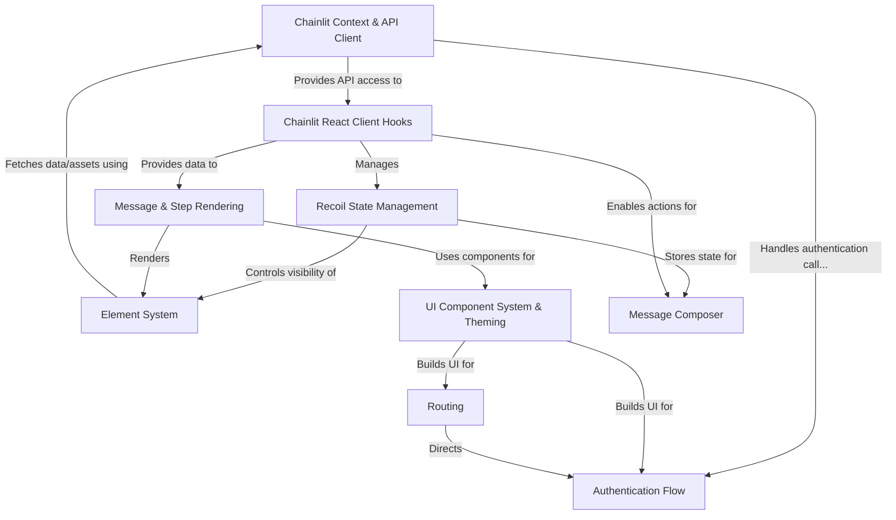

# Tutorial: frontend

This project is the **frontend** for the Chainlit framework, providing the *user interface* for interacting with Chainlit chat applications.
It allows users to send messages, view responses (including complex elements like images or data tables), manage chat history, and authenticate.
The interface is built using **React** and styled with **Tailwind CSS** and **Shadcn/UI** components, communicating with a backend via an API client.

**Source Repository:** [None](None)

## Chapters

1. [Message Composer](01_message_composer.md)
2. [Message & Step Rendering](02_message___step_rendering.md)
3. [Element System](03_element_system.md)
4. [Chainlit React Client Hooks](04_chainlit_react_client_hooks.md)
5. [Chainlit Context & API Client](05_chainlit_context___api_client.md)
6. [Recoil State Management](06_recoil_state_management.md)
7. [UI Component System & Theming](07_ui_component_system___theming.md)
8. [Authentication Flow](08_authentication_flow.md)
9. [Routing](09_routing.md)

---

Generated by [AI Codebase Knowledge Builder](https://github.com/The-Pocket/Tutorial-Codebase-Knowledge)