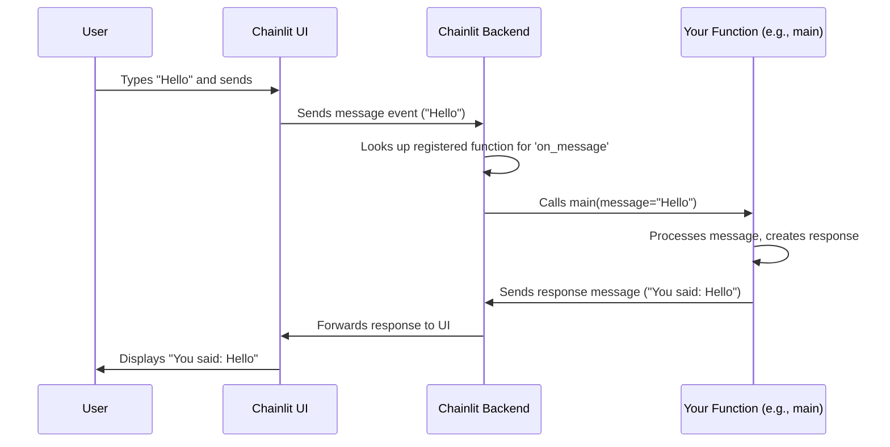

# Chapter 1: Callbacks & Hooks

Welcome to the Chainlit tutorial! We're excited to help you build your first chat applications. Let's start with one of the most fundamental concepts in Chainlit: **Callbacks and Hooks**.

## What are Callbacks & Hooks? Why Do I Need Them?

Imagine you're building a chatbot. How does it know *when* to do something? How does it know *what* to do when a user sends a message, or when the chat first starts?

This is where **Callbacks & Hooks** come in. Think of them as instructions for your chatbot receptionist. They tell your Chainlit application: "When *this specific event* happens, run *this specific piece of Python code*."

The **main use case** is defining your application's logic. For example:
*   *When a user sends a message*, you want your code to process that message and send a reply.
*   *When the chat first starts*, you might want to send a welcome message or load some data.

Callbacks & Hooks are the way you connect specific events in the chat interface to your Python functions.

## How Do They Work? Decorators!

In Chainlit, you define these "when this happens, do that" rules using Python **decorators**. Decorators are special keywords starting with `@` that you place right above your function definition.

Chainlit provides several built-in decorators for common events:

*   `@cl.on_chat_start`: Runs the decorated function when a new chat session begins.
*   `@cl.on_message`: Runs the decorated function whenever the user sends a message.
*   `@cl.on_chat_end`: Runs the decorated function when the chat session ends.
*   And several others for more advanced scenarios (like handling audio, authentication, etc.)

Let's focus on the most common one: `@cl.on_message`.

## Example: Responding to a User Message

Let's build the simplest possible chatbot: one that just echoes back whatever the user says.

Here's the Python code using a Chainlit callback:

```python
# app.py
import chainlit as cl

@cl.on_message  # This decorator marks the function to run on every message
async def main(message: cl.Message):
    # Get the message content from the user
    user_message = message.content

    # Create the response
    response = f"You said: {user_message}"

    # Send the response back to the user
    await cl.Message(content=response).send()

```

**Explanation:**

1.  `import chainlit as cl`: We import the Chainlit library.
2.  `@cl.on_message`: This is the Chainlit decorator. It tells Chainlit: "Hey, whenever a user sends a message, please run the `main` function right below this line."
3.  `async def main(message: cl.Message):`: This is our Python function. Chainlit will automatically pass information about the user's message into this function via the `message` argument. We'll learn more about the `Message` object in [Message](02_message.md).
4.  `user_message = message.content`: We extract the text the user actually typed.
5.  `response = f"You said: {user_message}"`: We prepare our reply.
6.  `await cl.Message(content=response).send()`: We create a new Chainlit `Message` with our response and send it back to the UI.

**What happens when you run this?**

If you run this Chainlit app and type "Hello there!" into the chat input and press Enter, the application will almost instantly reply with: "You said: Hello there!". The `@cl.on_message` decorator made the `main` function run automatically when your message arrived.

## Under the Hood: How Decorators Register Functions

So, how does `@cl.on_message` actually work? It's not magic, just clever programming!

**High-Level Flow:**

1.  **Startup:** When you run your Chainlit app (`chainlit run app.py`), Chainlit first reads your Python file (`app.py`).
2.  **Registration:** As it reads the file, it sees the `@cl.on_message` decorator above your `main` function. It "registers" your `main` function, essentially making a note: "If a message event occurs, I need to call this `main` function."
3.  **Waiting:** The Chainlit server starts and waits for events (like users connecting or sending messages).
4.  **Event Occurs:** A user connects to the chat UI in their browser and sends a message ("Hello there!").
5.  **Lookup:** The Chainlit backend receives this message event. It checks its internal registry: "Do I have any function registered for the `on_message` event?"
6.  **Execution:** It finds your `main` function in the registry! It then calls your `main` function, passing in the details of the message the user sent.
7.  **Response:** Your `main` function runs, prepares a reply, and uses `cl.Message(...).send()` to send it back through the Chainlit backend to the user's UI.

Here's a simplified diagram of the message flow:



**Code Dive (Simplified):**

The magic starts in `backend/chainlit/callbacks.py`. Let's look at a *simplified* version of how `@cl.on_message` is defined:

```python
# Simplified from backend/chainlit/callbacks.py

# A place to store references to user functions for each event
from chainlit.config import config
from chainlit.utils import wrap_user_function

# ... other imports ...

def on_message(func: Callable) -> Callable:
    """
    Decorator to react to messages coming from the UI.
    """
    # This is the core part:
    # It takes the user's function (`func`, e.g., your `main` function)
    # and registers it in Chainlit's configuration.
    # `wrap_user_function` helps handle async/sync and arguments smoothly.
    config.code.on_message = wrap_user_function(func)

    # It returns the original function, as decorators should
    return func

```

And `wrap_user_function` (simplified from `backend/chainlit/utils.py`) looks something like this:

```python
# Simplified from backend/chainlit/utils.py
import inspect

async def wrapper(*args):
    # ... (gets function parameters) ...
    params_values = # ... (matches args to function parameters) ...

    # ... (optional task start/end handling) ...

    try:
        # Call the actual user function (like your 'main')
        if inspect.iscoroutinefunction(user_function):
            return await user_function(**params_values)
        else:
            return user_function(**params_values)
    except Exception as e:
        # ... (error handling) ...
    finally:
        # ... (optional task start/end handling) ...

# The actual `wrap_user_function` returns this `wrapper`
# return wrapper
```

Essentially, the decorator (`@cl.on_message`) uses Python's features to store a reference to your function (`main`) in a central configuration (`config.code.on_message`). Later, when the Chainlit backend gets a message event, it looks up `config.code.on_message`, finds your function, and executes it using the `wrapper` to handle details like `async`.

## Conclusion

Callbacks and Hooks, implemented via decorators like `@cl.on_message` and `@cl.on_chat_start`, are the core mechanism for defining *how* and *when* your Chainlit application logic runs in response to events. By decorating your Python functions, you tell Chainlit exactly what code to execute for user interactions and other chat lifecycle moments.

Now that you understand how to trigger code when a message arrives, let's dive deeper into the `message` object itself to see what information it contains and how you can use it more effectively.

Ready to learn more about messages? Let's move on to [Message](02_message.md).

---

Generated by [AI Codebase Knowledge Builder](https://github.com/The-Pocket/Tutorial-Codebase-Knowledge)