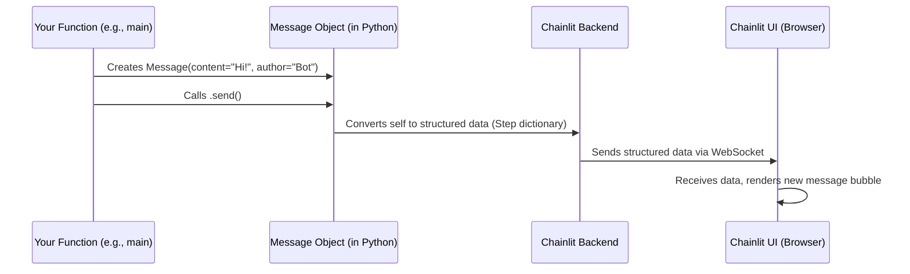

# Chapter 2: Message

Hi there! In [Chapter 1: Callbacks & Hooks](01_callbacks___hooks.md), we saw how to make our Python code run when a user sends a message using `@cl.on_message`. We even used `cl.Message(...)` to send a reply back. Now, let's zoom in and understand exactly what a `Message` is in Chainlit.

## What is a Message? Why Do I Need It?

Imagine you're chatting with someone. Every time you or they say something, it appears in a little speech bubble. In Chainlit, each of these bubbles is represented by a **`Message`**.

The **main use case** for `Message` is simple: **showing things to the user in the chat window.** This could be:

*   A text reply from your AI assistant.
*   A confirmation message.
*   An error notification.
*   Even a question asking the user for more information.

Think of Messages as the fundamental way your Chainlit application communicates *back* to the user visually. Without them, the chat would be pretty quiet!

## How Do They Work? Creating Message Objects

In your Python code, you create `Message` objects to send information to the user interface. The most basic way is using `cl.Message()`.

Let's look at the core parts:

*   **`content`**: This is the main text you want to display in the message bubble. It's what the message *says*.
*   **`author`**: This specifies *who* sent the message. It defaults to your app's name (defined in your configuration), but you can change it (e.g., to "System", "User", or a specific character name).
*   **`.send()`**: This is a crucial method. Just creating a `Message` object in Python doesn't show it to the user yet. You need to call `.send()` on the message object to actually transmit it to the chat interface. Because sending things over the network takes time, you'll almost always use `await` before `.send()`.

## Example: Sending a Simple Message

Let's revisit our echo bot from Chapter 1, but focus on the message sending part:

```python
# app.py
import chainlit as cl

@cl.on_message
async def main(message: cl.Message): # The user's input message
    # Prepare the content for our reply
    response_content = f"You said: {message.content}"

    # Create a new Message object for the reply
    reply_message = cl.Message(
        content=response_content,
        author="Echo Bot" # Let's give our bot a name!
    )

    # Send the reply message to the UI
    await reply_message.send()
```

**Explanation:**

1.  `response_content = ...`: We prepare the text string we want to send.
2.  `reply_message = cl.Message(...)`: We create an instance of the `Message` class.
    *   `content=response_content`: We tell it *what* to say.
    *   `author="Echo Bot"`: We specify *who* is saying it. If we omitted this, it would use the default app name.
3.  `await reply_message.send()`: This is the magic step! It takes the `reply_message` object and sends its details (content, author) to the user's browser so it appears as a new chat bubble.

**What happens?**

If the user types "Hello", the bot will reply with a message bubble that says "You said: Hello" and shows "Echo Bot" as the sender.

## More Than Just Text: Actions and Elements

Messages aren't limited to just text! They can also carry:

*   **Actions:** Buttons the user can click. We'll learn more about these later, but imagine a button saying "Run again?" next to a message.
*   **Elements:** Richer content like images, plots, or files. We'll cover these in detail in [Element](04_element.md). Think of showing a picture alongside your text.

Here's a sneak peek (don't worry about `Action` or `Image` details yet, just see how they attach to a `Message`):

```python
import chainlit as cl
# Assume we have an Action and an Image defined elsewhere
# from some_module import my_action, my_image

@cl.on_chat_start
async def start():
    # Imagine my_action is a button and my_image is a picture
    await cl.Message(
        content="Welcome! Look at this picture and choose an action:",
        # actions=[my_action],  # Attaching a button (requires Action definition)
        # elements=[my_image], # Attaching an image (requires Image definition)
    ).send()

    # For now, let's send a simpler message without actual actions/elements
    await cl.Message(
        content="Welcome! Imagine a button and image here.",
        author="Welcome Bot"
    ).send()
```

**Explanation:**

We create a `Message` and pass optional lists of `actions` or `elements` when creating it. When `.send()` is called, these associated items are sent along with the text and displayed appropriately in the UI.

## Special Messages: Asking for Input

Sometimes, you need to pause the conversation and wait for the user to provide something. Chainlit has special message types for this:

*   **`cl.AskUserMessage`**: Sends a message and *waits* for the user to type a text response. Your Python code execution pauses until they reply.
*   **`cl.AskFileMessage`**: Sends a message asking the user to *upload a file*. It waits until they upload one (or cancel).
*   **`cl.ErrorMessage`**: A convenient way to send a message formatted as an error.

Let's see `AskUserMessage` in action:

```python
import chainlit as cl

@cl.on_chat_start
async def start():
    # Ask the user for their name and wait for a reply
    res = await cl.AskUserMessage(
        content="Hello! What's your name?",
        timeout=30 # Wait for 30 seconds
    ).send()

    # res will be None if the user doesn't answer in time
    # Otherwise, it's a dictionary containing their response
    if res:
        user_name = res['output']
        await cl.Message(
            content=f"Nice to meet you, {user_name}!"
        ).send()
```

**Explanation:**

1.  `res = await cl.AskUserMessage(...).send()`: We create and send a special message. The `await` here *pauses* the `start` function.
2.  Chainlit shows "Hello! What's your name?" in the chat and enables the input box.
3.  The user types their name (e.g., "Alex") and presses Enter.
4.  The `await` finishes, and the user's response is put into the `res` variable (as a dictionary like `{'output': 'Alex'}`).
5.  The code then continues, sending a greeting using the collected name.

## Under the Hood: How Messages Get Sent

When you call `await cl.Message(...).send()`, what actually happens?

1.  **Object Creation:** Your Python code creates a `Message` object in the server's memory, storing things like `content` and `author`.
2.  **Serialization:** The `.send()` method takes this Python object and converts its important information into a structured format (like JSON) that can be sent over the internet. This structured format is called a "Step" internally (more on that in [Step](03_step.md)).
3.  **Transmission:** The Chainlit backend uses its communication channel (WebSockets, managed by the [Emitter](08_emitter.md)) to send this structured data to the user's web browser.
4.  **Rendering:** The Chainlit frontend code running in the browser receives this data. It understands the structure and knows how to draw a new chat bubble on the screen with the correct text, author, and any associated actions or elements.

Here's a simplified diagram:



**Code Dive (Simplified):**

The `Message` class is defined in `backend/chainlit/message.py`.

*   **Initialization (`__init__`)**: Sets up the basic properties.

    ```python
    # Simplified from backend/chainlit/message.py
    class Message(MessageBase):
        def __init__(
            self,
            content: Union[str, Dict],
            author: Optional[str] = None,
            # ... other parameters like language, actions, elements ...
        ):
            self.content = str(content) # Ensure content is a string
            self.author = author or config.ui.name # Use provided author or default
            self.actions = actions if actions is not None else []
            self.elements = elements if elements is not None else []
            # ... sets defaults for language, type, etc. ...

            super().__post_init__() # Handles ID, thread_id, parent_id
    ```

*   **Sending (`send`)**: Converts to a dictionary (`to_dict()`) and uses the context emitter.

    ```python
    # Simplified from backend/chainlit/message.py
    class Message(MessageBase):
        # ... __init__ ...

        async def send(self):
            # ... (sets created_at timestamp if needed) ...
            # ... (renames author if author_rename hook is configured) ...

            # Convert the Message object to a dictionary suitable for the UI
            step_dict = await self._create() # Also handles persistence

            # Add message to the current chat context
            chat_context.add(self)

            # Use the emitter to send the dictionary to the UI
            await context.emitter.send_step(step_dict)

            # Send any associated actions or elements
            # await asyncio.gather(...) for actions and elements

            return self # Return the message object itself
    ```

The `context.emitter.send_step(step_dict)` part is where the backend sends the message data off to the frontend. The frontend code (primarily in `frontend/src/components/chat/Messages/Message/index.tsx`) catches this data and uses React components to display it visually.

## Conclusion

You've learned that `Message` objects are the core way your Chainlit app communicates back to the user. You create them in Python, providing `content` and optionally `author`, `actions`, or `elements`, and then use `await message.send()` to display them in the chat interface. Special types like `AskUserMessage` allow you to pause and get input from the user.

Messages form the visible conversation flow. But often, a single assistant reply might involve multiple internal "steps" or thoughts (like calling a tool, processing its output, then generating the final text). How can we represent and visualize these internal steps? That's where our next topic comes in.

Ready to see how Chainlit handles more complex thought processes? Let's explore [Step](03_step.md).

---

Generated by [AI Codebase Knowledge Builder](https://github.com/The-Pocket/Tutorial-Codebase-Knowledge)