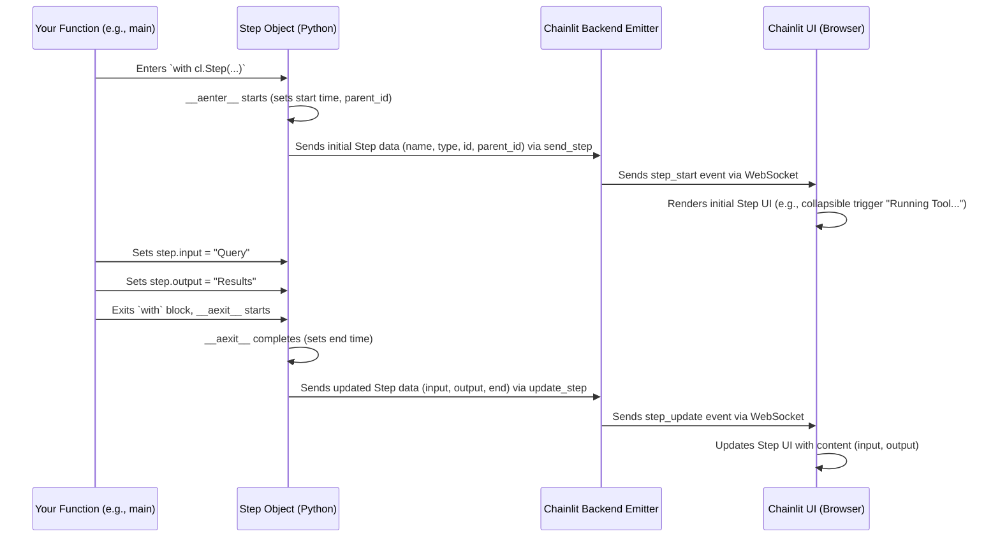

# Chapter 3: Step

Welcome back! In [Chapter 2: Message](02_message.md), we learned how to send messages back and forth between the user and our Chainlit application. Messages are great for showing the final results of a conversation. But what if you want to see *how* the assistant arrived at its answer? What if it used a tool, or thought through several stages? That's where **Steps** come in!

## What is a Step? Why Do I Need It?

Imagine you ask an AI assistant a complex question, like "Summarize the latest news about AI regulations." The assistant might perform several actions behind the scenes:

1.  **Search the web** for "AI regulations news".
2.  **Read** a few relevant articles.
3.  **Extract** key points.
4.  **Generate** a summary.

A simple `Message` would just show you the final summary. But wouldn't it be helpful, especially when developing or debugging, to see *each* of those intermediate actions?

**Steps** are Chainlit's way of representing these internal thought processes or tool usages. Think of them like the assistant showing its work on a whiteboard.

The **main use case** for Steps is **transparency and debugging**:

*   **For Developers:** Understand exactly what your agent is doing, which tools it called, what data it processed, and where things might have gone wrong.
*   **For Users (Optional):** Allow curious users to peek "under the hood" and see the reasoning behind an answer.

In the Chainlit UI, Steps typically appear as collapsible sections nested within a message, allowing you to expand them and see the details.

## How Do Steps Work? Showing Your Work

Steps are created in your Python code, usually within the function handling a user message (`@cl.on_message`). The most common way to create a Step is using a `with` statement (like opening a file in Python), which automatically handles starting and ending the step.

Key parts of a Step:

*   **`name`**: A human-readable label for the step (e.g., "Web Search", "LLM Call", "Data Analysis").
*   **`type`**: A category describing the kind of step. Common types include:
    *   `llm`: For calls to a language model.
    *   `tool`: For using an external tool (like a search engine, calculator, or database).
    *   `run`: For a general block of code or logical section.
    *   `embedding`, `retrieval`, `rerank`: For specific RAG (Retrieval-Augmented Generation) stages.
*   **`input`**: What went *into* this step (e.g., the search query, the prompt sent to the LLM).
*   **`output`**: What came *out* of this step (e.g., the search results, the raw text from the LLM).
*   **Nesting:** Steps can be inside other steps! This creates a "chain of thought" hierarchy, showing sub-tasks.
*   **`elements`**: Steps can also contain [Elements](04_element.md), like text files or data visualizations, relevant to that specific step. (We'll cover Elements next!)

## Example: Simulating a Tool Call

Let's modify our echo bot to *pretend* it's using a tool to generate the response.

```python
# app.py
import chainlit as cl
import time # To simulate the tool taking some time

@cl.on_message
async def main(message: cl.Message):
    # The user's message content
    user_input = message.content

    # Use 'with cl.Step(...)' to create a step
    with cl.Step(name="Echo Tool", type="tool") as step:
        # Set the input for this step
        step.input = f"Input to tool: {user_input}"

        # Simulate the tool doing some work
        time.sleep(1.5) # Pretend it takes 1.5 seconds
        tool_output = f"Output from tool: You said '{user_input}'"

        # Set the output for this step
        step.output = tool_output

    # Now, send the final message to the user
    # We could use the step.output directly or process it further
    await cl.Message(content=f"The tool responded: {step.output}").send()

```

**Explanation:**

1.  `with cl.Step(name="Echo Tool", type="tool") as step:`: This line starts a new step. Chainlit automatically records the start time and prepares to show it in the UI. We give it a `name` and `type`. The `step` variable inside the `with` block lets us interact with this specific step.
2.  `step.input = ...`: We record what data is going *into* our simulated tool.
3.  `time.sleep(1.5)`: We pause briefly to make it seem like work is being done.
4.  `step.output = ...`: We record what the tool produced.
5.  When the `with` block ends, Chainlit automatically records the end time and updates the step in the UI with the final input and output.
6.  `await cl.Message(...).send()`: We send the final result to the user as a regular message.

**What happens in the UI?**

If the user types "Hello Chainlit!", they will see:

1.  A final message bubble saying: "The tool responded: Output from tool: You said 'Hello Chainlit!'"
2.  *Above* or *within* that message bubble (depending on UI configuration), there will be a collapsible section labeled something like:
    ```
    > Used Echo Tool
    ```
3.  If the user clicks to expand it, they'll see the details:
    ```
    v Used Echo Tool
        Input: Input to tool: Hello Chainlit!
        Output: Output from tool: You said 'Hello Chainlit!'
    ```

This shows the user (or developer) the intermediate "tool" step that led to the final answer.

## Nested Steps: Building a Chain of Thought

Sometimes, one step might involve several sub-steps. You can easily represent this by nesting `with cl.Step(...)` blocks.

```python
# app.py
import chainlit as cl
import time

@cl.on_message
async def main(message: cl.Message):
    # Parent step for the whole process
    with cl.Step(name="Analyze Request", type="run") as parent_step:
        parent_step.input = message.content

        # First nested step: Identify topic
        with cl.Step(name="Identify Topic", type="llm") as topic_step:
            topic_step.input = f"What is the topic of '{message.content}'?"
            time.sleep(0.5) # Simulate LLM call
            topic = "greeting" # Pretend LLM identified it
            topic_step.output = f"Identified topic: {topic}"

        # Second nested step: Generate response based on topic
        with cl.Step(name="Generate Response", type="llm") as response_step:
            response_step.input = f"Generate a {topic} response."
            time.sleep(1) # Simulate LLM call
            response = "Hello there! How can I help?"
            response_step.output = response

        # Set the final output for the parent step
        parent_step.output = response

    # Send the final message
    await cl.Message(content=parent_step.output).send()
```

**Explanation:**

*   We have an outer `Analyze Request` step.
*   *Inside* its `with` block, we have two more `with cl.Step(...)` blocks: `Identify Topic` and `Generate Response`.
*   Chainlit automatically understands this nesting because the inner `with` blocks are executed while the outer one is still active. It sets the `parent_id` of the inner steps to the `id` of the outer step.

**What happens in the UI?**

If the user types "Hi", they will see the final message "Hello there! How can I help?". They will also see a collapsible structure like this:

```
> Used Analyze Request
```

Expanding it reveals:

```
v Used Analyze Request
    Input: Hi
    > Used Identify Topic
    > Used Generate Response
    Output: Hello there! How can I help?
```

And expanding the nested steps shows their respective inputs and outputs:

```
v Used Analyze Request
    Input: Hi
    v Used Identify Topic
        Input: What is the topic of 'Hi'?
        Output: Identified topic: greeting
    v Used Generate Response
        Input: Generate a greeting response.
        Output: Hello there! How can I help?
    Output: Hello there! How can I help?
```

This clearly shows the sequence and hierarchy of operations.

## Under the Hood: How Steps Get to the UI

How does Chainlit manage to show these steps, even nested ones, in the UI as they happen?

1.  **Context Manager Enters (`__aenter__`)**: When your code hits `with cl.Step(...) as step:`, Python calls the step object's asynchronous "enter" method (`__aenter__`).
2.  **Initial Send**: Inside `__aenter__`, the `Step` object gets a unique ID. It checks if it's inside another step (using a thread-local context) and sets its `parent_id` accordingly. It then immediately sends a message via the [Emitter](08_emitter.md) to the frontend saying "Hey, a new step with this ID, name, type, and parent ID has started!".
3.  **UI Renders Placeholder**: The frontend receives this message and renders a placeholder for the step in the correct nested position (e.g., showing "Running Identify Topic...").
4.  **Your Code Runs**: The code inside your `with` block executes. You set `step.input` and `step.output`.
5.  **Context Manager Exits (`__aexit__`)**: When the `with` block finishes (normally or due to an error), Python calls the step object's asynchronous "exit" method (`__aexit__`).
6.  **Final Update**: Inside `__aexit__`, the `Step` object records its end time. If there was an error, it marks itself as an error. It then sends another message via the [Emitter](08_emitter.md) to the frontend: "Hey, update the step with this ID. Here are its final input, output, end time, and error status."
7.  **UI Updates**: The frontend receives this update message and fills in the details for the corresponding step in the UI.

Here’s a diagram showing the flow for a single step:



**Code Dive (Simplified):**

*   **`backend/chainlit/step.py`**: This file defines the `Step` class.
    *   The `__init__` method sets up basic properties like `name`, `type`, `id`.
    *   The `__aenter__` method (for `async with`) determines the `parent_id` by looking at a special context variable (`local_steps`) that tracks the currently active steps in the current execution flow. It then calls `self.send()` which uses the `context.emitter` to send the initial step data.
    *   The `__aexit__` method records the end time, checks for errors (`exc_type`), and calls `self.update()` which uses the `context.emitter` to send the final data.

    ```python
    # Simplified from backend/chainlit/step.py
    import contextvars # Used for local_steps
    local_steps = contextvars.ContextVar("local_steps", default=None)

    class Step:
        # ... __init__ ...

        async def __aenter__(self):
            self.start = utc_now()
            previous_steps = local_steps.get() or []
            parent_step = previous_steps[-1] if previous_steps else None

            if not self.parent_id and parent_step:
                self.parent_id = parent_step.id # Automatic nesting!

            # Add self to the list of active steps for this context
            local_steps.set(previous_steps + [self])
            await self.send() # Send initial step info to UI
            return self

        async def __aexit__(self, exc_type, exc_val, exc_tb):
            self.end = utc_now()
            if exc_type: # If an error happened inside the 'with' block
                self.output = str(exc_val)
                self.is_error = True

            # Remove self from the list of active steps
            current_steps = local_steps.get()
            if current_steps and self in current_steps:
                current_steps.remove(self)
                local_steps.set(current_steps)

            await self.update() # Send final step info to UI
    ```

*   **`frontend/src/components/chat/Messages/Message/Step.tsx`**: This React component in the frontend receives the step data from the backend (via the Emitter and WebSockets) and renders the collapsible accordion UI you see in the chat. It uses the `parentId` to correctly nest steps visually.

## Conclusion

You've learned that **Steps** are Chainlit's powerful feature for visualizing the intermediate thoughts, tool calls, and actions your assistant takes to generate a response. They are essential for debugging and provide transparency into the agent's reasoning process. You create them easily using `with cl.Step(...)`, setting their `name`, `type`, `input`, and `output`, and they can be nested to show complex chains of thought.

Steps and [Messages](02_message.md) primarily deal with text-based information (inputs, outputs, content). But what if you want to display an image, a data plot, or let the user download a file associated with a message or a step? For that, we need our next abstraction.

Ready to add richer content to your chat? Let's move on to [Element](04_element.md).

---

Generated by [AI Codebase Knowledge Builder](https://github.com/The-Pocket/Tutorial-Codebase-Knowledge)