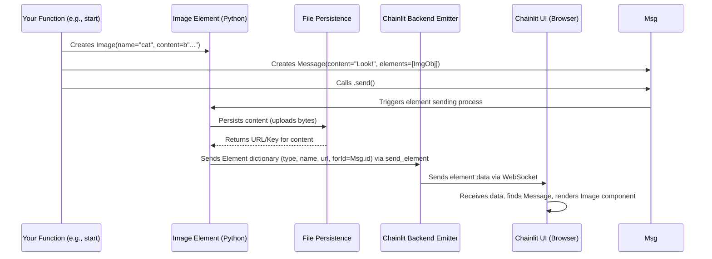

# Chapter 4: Element

Hello again! In [Chapter 3: Step](03_step.md), we saw how to show the internal "thinking" process of our application using Steps. Both [Messages](02_message.md) and Steps are great for displaying text, but what if we want to show something more visual, like a picture, a chart, or let the user download a file? That's where **Elements** come in handy!

## What is an Element? Why Do I Need It?

Think about sending an email. You can write text, but you can also *attach* things like photos, documents, or spreadsheets. In Chainlit, **Elements** are very similar – they are like attachments or embeds for your chat messages or steps.

They allow you to display rich, non-text content directly within the chat interface.

The **main use case** for Elements is to **show or share non-textual information** alongside your text messages. For example:

*   Display an **image** generated by an AI.
*   Show a **data table** (like a spreadsheet) with results.
*   Embed a **playable audio file**.
*   Let the user download a generated **PDF report**.
*   Visualize data with a **Plotly chart**.

Elements make your chat application much more interactive and informative than just plain text bubbles.

## How Do Elements Work? Attaching Rich Content

Elements are Python objects that you create in your code. Chainlit provides several built-in Element types:

*   `cl.Image`: For pictures.
*   `cl.Audio`: For sound files.
*   `cl.Video`: For video files.
*   `cl.Text`: For formatted text blocks (like code snippets or long documents).
*   `cl.Pdf`: For displaying PDF files.
*   `cl.File`: For generic file downloads.
*   `cl.Pyplot`: For Matplotlib charts.
*   `cl.Plotly`: For Plotly charts.
*   `cl.Dataframe`: For Pandas DataFrames (shown as tables).
*   `cl.CustomElement`: For creating your own unique UI components (more advanced).

**Creating and Sending Elements:**

1.  **Instantiate:** You create an instance of an Element class, usually providing the `content` (raw bytes), `path` (to a local file), or `url` (to an online resource). You also give it a `name` for display.
2.  **Associate:** You attach the Element to a `Message` or a `Step` by passing it in a list to the `elements` parameter when creating the message/step.
3.  **Send:** When the `Message` (using `.send()`) or `Step` (implicitly via the `with` block) is sent to the UI, the associated Element(s) are sent along with it.

**Where Do Elements Appear? (`display` parameter)**

You can control where the element appears in the UI using the `display` parameter when creating the element:

*   `'inline'` (default): The element appears directly within the chat message or step it's attached to. Good for things tightly coupled with the text, like a small image illustrating a point.
*   `'side'`: The element appears in a separate side panel next to the chat. Useful for things the user might want to refer to throughout the conversation, like a document or a larger image.
*   `'page'`: The element takes over the main content area, replacing the chat view. Useful for large, interactive elements like complex plots or custom applications.

## Example: Sending an Image with a Message

Let's imagine our app generates a simple welcome image (we'll just use a placeholder URL for this example) and sends it with a welcome message.

```python
# app.py
import chainlit as cl

# A placeholder image URL (replace with a real one!)
# You could also use 'path' for a local file or 'content' for raw bytes
IMAGE_URL = "https://chainlit-prod.s3.eu-west-3.amazonaws.com/logo/chainlit_logo_light.png"

@cl.on_chat_start
async def start():
    # 1. Create the Image Element
    image_element = cl.Image(
        name="logo",        # Name displayed in the UI
        display="inline",   # Show it inside the message
        url=IMAGE_URL       # Source of the image
    )

    # 2. Create a Message and attach the element
    await cl.Message(
        content="Welcome! Here's our logo:",
        elements=[image_element] # Pass the element in a list
    ).send() # 3. Send the message (and the element)
```

**Explanation:**

1.  `image_element = cl.Image(...)`: We create an `Image` object. We give it a `name` ("logo"), tell it to display `'inline'`, and provide the `url` of the image.
2.  `elements=[image_element]`: When creating the `cl.Message`, we pass our `image_element` inside a list to the `elements` argument.
3.  `await cl.Message(...).send()`: Sending the message automatically sends the associated image element too.

**What happens in the UI?**

When the chat starts, the user will see:

1.  A message bubble saying "Welcome! Here's our logo:".
2.  Right below or next to the text within that same bubble, the Chainlit logo image will be displayed.

If we had used `display="side"`, the image would appear in a panel to the right of the chat messages.

## Example: Attaching a File to a Step

Elements aren't just for messages! You can attach them to [Steps](03_step.md) to provide context for that specific part of the process. Imagine a step that processes a text file; you could attach the file itself.

```python
# app.py
import chainlit as cl

# Content of a dummy text file
DUMMY_FILE_CONTENT = b"This is the content of the input file."

@cl.on_message
async def main(message: cl.Message):

    with cl.Step(name="Process File", type="tool") as step:
        step.input = "Processing user request..."

        # 1. Create the File Element
        file_element = cl.File(
            name="input.txt",
            content=DUMMY_FILE_CONTENT, # Provide raw bytes content
            mime="text/plain",         # Specify the file type
            display="inline"           # Show inside the step
        )

        # 2. Attach the element to the step (within the 'with' block)
        step.elements = [file_element]

        # Simulate processing...
        processed_content = f"Processed: {DUMMY_FILE_CONTENT.decode()}"
        step.output = processed_content

    # Send final message
    await cl.Message(content="File processed! See step details.").send()

```

**Explanation:**

1.  `file_element = cl.File(...)`: We create a `File` element. We give it a `name`, provide the raw `content` as bytes, specify the `mime` type, and set `display` to `'inline'`.
2.  `step.elements = [file_element]`: *Inside* the `with cl.Step(...)` block, we assign a list containing our `file_element` to the `step.elements` attribute. This links the file to this specific step.
3.  When the `with` block ends, the step (along with its input, output, and associated element) is automatically sent/updated in the UI.

**What happens in the UI?**

The user sees the final message "File processed! See step details." Above or within it, they see the collapsible "Process File" step. Expanding the step shows:

```
v Used Process File
    Input: Processing user request...
    [An icon representing 'input.txt', possibly clickable to download]
    Output: Processed: This is the content of the input file.
```

The file element appears *inside* the expanded step view.

## Under the Hood: How Elements Get Sent and Displayed

Sending an Element involves a few stages:

1.  **Element Creation (Python):** Your code creates an `Element` object (e.g., `cl.Image(...)`) in the backend's memory.
2.  **Persistence (Optional but common):** If the element has `content` (bytes) or a local `path`, Chainlit needs to make it accessible to the user's browser.
    *   The `.send()` method (or Step's exit) triggers `_create()`.
    *   `_create()` calls `context.session.persist_file()`.
    *   This uploads the content/file to Chainlit's configured storage (like a cloud bucket or local storage accessible by the server).
    *   It gets back a unique identifier (`chainlit_key`) or a URL pointing to the persisted file.
3.  **Serialization:** The Element object (now with a `url` or `chainlit_key`) is converted into a dictionary format (JSON) that the frontend can understand. This includes its `id`, `type`, `name`, `display`, `url`/`chainlit_key`, and the `for_id` (the ID of the message or step it belongs to).
4.  **Transmission:** The Chainlit backend uses the [Emitter](08_emitter.md) to send this dictionary over the WebSocket connection to the user's browser.
5.  **Rendering (Frontend):** The Chainlit frontend JavaScript code receives this data. It finds the corresponding message/step using `for_id` and uses React components (like `ImageElement`, `FileElement`, etc.) to display the element visually in the correct location (`inline`, `side`, `page`).

Here's a simplified diagram for sending an image with `content`:



**Code Dive (Simplified):**

*   **`backend/chainlit/element.py`**: Defines the base `Element` class and specific subclasses like `Image`, `File`, `Plotly`, etc.
    *   `__init__`: Sets up basic properties (`name`, `display`, `content`/`path`/`url`).
    *   `send(self, for_id)`: This method is called when associating the element with a message/step ID.
        *   It calls `self._create()` to handle persistence if needed (uploading content/path).
        *   It then calls `context.emitter.send_element(self.to_dict())` to send the element's data to the UI.
    *   `_create()`: Handles the persistence logic using `context.session.persist_file()`.

    ```python
    # Simplified from backend/chainlit/element.py
    @dataclass
    class Element:
        # ... fields like name, content, path, url, display ...
        for_id: Optional[str] = None
        chainlit_key: Optional[str] = None # Key after persistence

        async def _create(self, persist=True):
            # ... (Checks if already persisted) ...
            if (data_layer := get_data_layer()) and persist:
                # Optionally store metadata in database
                # asyncio.create_task(data_layer.create_element(self))
                pass

            # If we have content/path and no URL/key, persist it
            if not self.url and not self.chainlit_key:
                file_dict = await context.session.persist_file(
                    name=self.name, path=self.path, content=self.content, mime=self.mime
                )
                self.chainlit_key = file_dict["id"] # Store the key

            self.persisted = True
            return True

        async def send(self, for_id: str, persist=True):
            self.for_id = for_id # Link to the message/step ID

            # ... (Infer mime type if not set) ...

            await self._create(persist=persist) # Ensure content is accessible

            # ... (Check if URL or key exists) ...

            # Send the element data to the UI
            await context.emitter.send_element(self.to_dict())

    @dataclass
    class Image(Element):
        type: ClassVar[ElementType] = "image"
        size: ElementSize = "medium"
        # Inherits send, _create etc. from Element
    ```

*   **`frontend/src/components/Elements/index.tsx`**: This file acts as a router in the frontend. Based on the `type` field received from the backend, it decides which specific React component to render (e.g., `ImageElement`, `AudioElement`, `FileElement`).
*   **`frontend/src/components/Elements/Image.tsx` (and others):** These are the React components that actually render the HTML for each element type, using the `url` or other properties received from the backend. For example, `ImageElement` renders an `` tag.

## Conclusion

You've learned that **Elements** are Chainlit's way of incorporating rich, non-text content into your chat applications. They act like attachments, allowing you to display images, audio, video, files, data tables, plots, and more. You create them in Python using classes like `cl.Image` or `cl.File`, associate them with `Messages` or `Steps` using the `elements` parameter, and control their placement with the `display` setting (`inline`, `side`, or `page`). Elements make your applications far more engaging and capable.

Now that we know how to build the core parts of a chat application (handling messages, showing steps, displaying elements), how do we customize the overall look and behavior of our app, like setting the app name or enabling dark mode?

Ready to fine-tune your application's settings? Let's dive into [Configuration](05_configuration.md).

---

Generated by [AI Codebase Knowledge Builder](https://github.com/The-Pocket/Tutorial-Codebase-Knowledge)