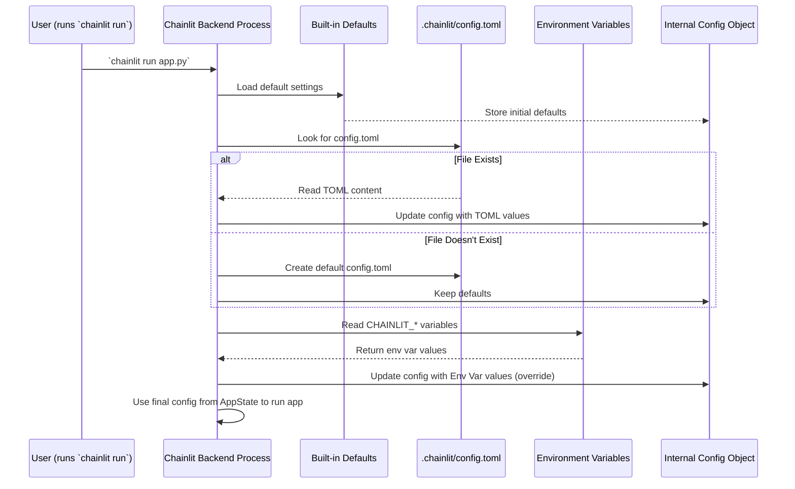

# Chapter 5: Configuration

In the previous chapters, we learned how to build the core parts of our Chainlit app: handling user interactions with [Callbacks & Hooks](01_callbacks___hooks.md), sending chat bubbles with [Message](02_message.md), showing internal work with [Step](03_step.md), and displaying rich content like images with [Element](04_element.md).

Now, you might be wondering: how do I change the name of my app? Or switch to a dark theme? Or maybe allow users to upload files? For all these kinds of settings, Chainlit uses **Configuration**.

## What is Configuration? Why Do I Need It?

Think of **Configuration** as the **settings panel** for your Chainlit application. Just like you use the settings menu on your phone to change the wallpaper or adjust brightness, you use Chainlit's configuration to tweak how your app looks and behaves *without* changing your main Python code (like the functions decorated with `@cl.on_message`).

The **main use case** is customizing your app's appearance and enabling/disabling built-in features. For example:

*   You want your chatbot to be named "Finance Bot" instead of the default "Assistant".
*   You prefer a dark user interface.
*   You need users to be able to upload PDFs for your app to process.
*   You want to add a link to your company's website in the app header.

Configuration lets you control all these things easily from one central place.

## How Does It Work? The `.chainlit/config.toml` File

Chainlit primarily manages configuration through a special file: `config.toml`, located inside a hidden folder named `.chainlit` in your project's main directory.

*   **.chainlit/**: A folder where Chainlit keeps project-specific settings.
*   **config.toml**: The file containing the actual configuration settings.

**What's TOML?**
TOML stands for "Tom's Obvious, Minimal Language". It's a simple file format designed to be easy for humans to read. It uses sections (`[SectionName]`) and key-value pairs (`key = value`).

**Example Structure:**

```toml
# This is a comment in TOML

[UI] # Section for User Interface settings
name = "My Chat App" # Key 'name' with value 'My Chat App'
default_theme = "light" # Key 'default_theme' with value 'light'

[features] # Section for enabling/disabling features
unsafe_allow_html = false # Key 'unsafe_allow_html' with value false
```

**Creating the File:**
If you don't have this file, Chainlit usually creates a default one when you first run a command like `chainlit run` or explicitly with `chainlit init` in your project directory.

## What Can I Configure?

The `config.toml` file is organized into sections, each controlling different aspects of your application:

1.  **`[UI]` - User Interface:** Controls the visual appearance.
    *   `name`: The name displayed in the chat header (Default: "Assistant").
    *   `description`: A description used for HTML meta tags.
    *   `default_theme`: Set the theme to `"light"` or `"dark"` (Default: "dark").
    *   `layout`: Set the layout to `"default"` or `"wide"`.
    *   `custom_css`: Path to a custom CSS file for advanced styling.
    *   `custom_js`: Path to a custom JavaScript file.
    *   `header_links`: Add custom links to the header.
    *   `login_page_image`: Customize the login page background.
    *   `cot`: Configure how Chain of Thought ([Step](03_step.md)) details are displayed (`"hidden"`, `"tool_call"`, `"full"`).

2.  **`[features]` - Feature Flags:** Turns built-in features on or off.
    *   `unsafe_allow_html`: Allows rendering raw HTML in messages (Use with caution!).
    *   `latex`: Enables rendering of math expressions using LaTeX syntax.
    *   `spontaneous_file_upload`: Configures user file uploads (enabled by default, can restrict types/size).
    *   `audio`: Configures audio input settings.
    *   `auto_tag_thread`: Automatically tags conversations with the used Chat Profile.
    *   `edit_message`: Allows users to edit sent messages.

3.  **`[project]` - Project Settings:** General operational settings.
    *   `enable_telemetry`: Allows Chainlit to collect anonymous usage data (Default: true).
    *   `user_env`: A list of environment variable names the user must provide (e.g., `["OPENAI_API_KEY"]`).
    *   `session_timeout`: How long a session is kept in memory if the user disconnects (seconds).
    *   `cache`: Enable/disable third-party caching (like LangChain's).
    *   `allow_origins`: List of allowed domains for connecting to the app (useful for security).

4.  **Authentication:** While not a specific section, settings related to authentication (like OAuth providers) are often configured via environment variables mentioned in the documentation, tying into the overall configuration system.

## Examples: Customizing Your App

Let's see how to change some common settings. Open your `.chainlit/config.toml` file (or create it if it doesn't exist) and modify it.

**1. Change App Name and Theme:**

```toml
# .chainlit/config.toml

[UI]
name = "My Research Buddy"
default_theme = "light"
# ... other UI settings ...

# ... other sections ...
```

**Explanation:**
*   We set the `name` under the `[UI]` section to "My Research Buddy".
*   We set `default_theme` to `"light"`.
*   Save the file and restart your Chainlit app (`chainlit run app.py`). The chat interface will now show the new name in the header and use a light color scheme.

**2. Allow HTML Rendering (Use Carefully!):**

```toml
# .chainlit/config.toml

# ... other sections ...

[features]
unsafe_allow_html = true # Changed from false to true
# ... other feature settings ...

# ... other sections ...
```

**Explanation:**
*   Setting `unsafe_allow_html` to `true` allows `cl.Message(content="<b>Bold Text</b>")` to render as **Bold Text**.
*   **Warning:** Only enable this if you trust the source of the message content, as it can be a security risk if users can inject malicious HTML or scripts.

**3. Require an API Key from the User:**

```toml
# .chainlit/config.toml

[project]
# Ask the user to provide their OpenAI API Key
user_env = ["OPENAI_API_KEY"]
enable_telemetry = true
# ... other project settings ...

# ... other sections ...
```

**Explanation:**
*   Adding `"OPENAI_API_KEY"` to the `user_env` list under `[project]` tells Chainlit to prompt the user for this specific environment variable when they first connect to the app.
*   Your Python code can then access this value using `os.environ.get("OPENAI_API_KEY")`.

**Environment Variables:**
Some settings, especially sensitive ones or those likely to change between environments (development, production), can also be set using environment variables. These usually override the values in `config.toml`. For example, setting the environment variable `CHAINLIT_DEFAULT_THEME=dark` would force the dark theme, even if the TOML file says `light`. Check the Chainlit documentation for available environment variables.

## Under the Hood: How Configuration is Loaded

How does Chainlit actually *use* the `config.toml` file?

1.  **Startup:** When you run `chainlit run your_app.py`, the Chainlit backend starts up.
2.  **Check for Config:** It looks for the `.chainlit/config.toml` file in your current project directory.
3.  **Create Default (if needed):** If the file doesn't exist, Chainlit often creates one with default values (`init_config` function in `config.py`).
4.  **Read File:** It reads the content of `config.toml` using a TOML parser (`tomli` library).
5.  **Load Defaults:** Chainlit has built-in default values for all settings.
6.  **Read Environment Variables:** It checks for relevant environment variables (e.g., `CHAINLIT_DEFAULT_THEME`, `CHAINLIT_PROJECT_USER_ENV`).
7.  **Merge Settings:** It merges these sources together:
    *   Starts with the built-in defaults.
    *   Overrides defaults with values found in `config.toml`.
    *   Overrides TOML values with any matching environment variables found.
8.  **Store Configuration:** The final, merged settings are stored in an internal configuration object (`config` instance of `ChainlitConfig` in `config.py`).
9.  **Apply Settings:** Different parts of the Chainlit backend and frontend read from this configuration object during startup and runtime to determine how to behave (e.g., the UI reads the theme setting, the message processing checks the `unsafe_allow_html` flag).

Here's a simplified diagram of the process:



**Code Dive (Simplified):**

The core logic lives in `backend/chainlit/config.py`.

*   **`DEFAULT_CONFIG_STR`**: A multi-line string holding the default TOML content.
*   **`init_config()`**: Checks if `config.toml` exists and creates it from `DEFAULT_CONFIG_STR` if not.
*   **Dataclasses (`UISettings`, `FeaturesSettings`, `ProjectSettings`)**: Python classes that define the structure and types for each section of the config.
*   **`load_settings()`**: Reads the `config.toml` file using `tomli.load()` and populates the dataclasses.
*   **`load_config()`**: The main function called at startup. It calls `init_config()`, `load_settings()`, reads environment variables (e.g., `os.environ.get(...)`), and merges everything into the global `config` object (an instance of `ChainlitConfig`).

```python
# Simplified concept from backend/chainlit/config.py

import os
import tomli
from pydantic.dataclasses import dataclass

# Define structure for settings (simplified)
@dataclass
class UISettings:
    name: str = "Assistant" # Default value
    default_theme: str = "dark"

# ... other dataclasses for Features, Project ...

@dataclass
class ChainlitConfig:
    ui: UISettings
    # ... other settings sections ...

def load_config():
    # 1. Start with defaults (defined in dataclasses)
    final_ui_settings = UISettings()
    # ... initialize other sections ...

    # 2. Load from config.toml if exists
    try:
        with open(".chainlit/config.toml", "rb") as f:
            toml_dict = tomli.load(f)
            ui_from_toml = toml_dict.get("UI", {})
            # Override defaults with TOML values if present
            final_ui_settings = UISettings(**ui_from_toml)
            # ... load other sections ...
    except FileNotFoundError:
        pass # Use defaults if file not found

    # 3. Override with Environment Variables
    env_theme = os.environ.get("CHAINLIT_DEFAULT_THEME")
    if env_theme:
        final_ui_settings.default_theme = env_theme
    # ... check other env vars ...

    # Create the final config object
    config = ChainlitConfig(ui=final_ui_settings, ...)
    return config

# Chainlit loads this config object on startup
config = load_config()
```

This `config` object is then accessible throughout the Chainlit backend to guide its behavior.

## Conclusion

Configuration is your control panel for customizing the look, feel, and features of your Chainlit application. By editing the simple `.chainlit/config.toml` file, you can change the app name, theme, enable file uploads, require API keys, and much more, all without modifying your core Python logic. Understanding configuration is key to tailoring your Chainlit app to your specific needs.

Now that we know how to configure our app, let's think about the users interacting with it. How does Chainlit handle different users talking to the app at the same time? How does it remember the conversation history for each user? That brings us to the concept of sessions.

Ready to learn how Chainlit manages individual user conversations? Let's explore [Session Management](06_session_management.md).

---

Generated by [AI Codebase Knowledge Builder](https://github.com/The-Pocket/Tutorial-Codebase-Knowledge)