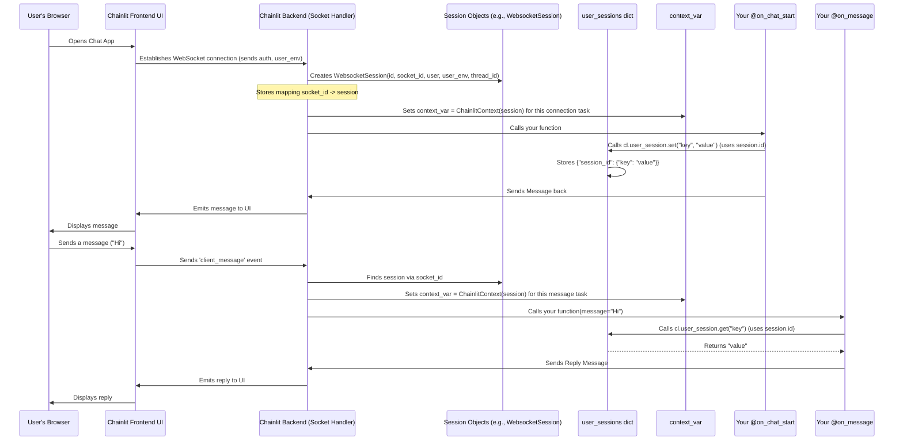

# Chapter 6: Session Management

In [Chapter 5: Configuration](05_configuration.md), we learned how to customize the overall look and behavior of our Chainlit application using the `config.toml` file. Now, let's shift our focus to the individual users interacting with our app.

Imagine you build a chatbot assistant. How does it handle multiple people talking to it simultaneously without mixing up their conversations? How does it remember what *you* specifically asked it a few messages ago? This is where **Session Management** comes in.

## What is Session Management? Why Do I Need It?

Think of your Chainlit application like a hotel. When a new guest arrives (a user connects), the receptionist (Chainlit) needs to give them a unique room key and keep track of their stay. **Session Management** is Chainlit's system for handling each "guest" (user connection) separately.

A **session** is like a dedicated, private workspace for each user interacting with your app. It holds all the information related to that specific user's current connection, including:

1.  **The Connection:** The actual communication channel (like a WebSocket connection).
2.  **User Identity:** Who the user is, especially if they logged in.
3.  **Conversation Context:** Which specific chat thread (`thread_id`) they are currently in.
4.  **User Environment:** Any specific settings or keys the user provided (like an API key asked for via `user_env` in the config).
5.  **Temporary Data (`cl.user_session`):** A place to store temporary notes or data related *only* to this user's current interaction, separate from other users.

The **main use case** is to maintain **state** for each user. This means:
*   Keeping conversations isolated between different users.
*   Remembering information within a single user's conversation (e.g., user preferences set at the start).
*   Storing temporary data that is specific to one user's current visit (like a counter or intermediate calculation results).

Without session management, every user would be talking in the same global "room", and the application wouldn't be able to distinguish between them or remember anything specific to their ongoing interaction.

## How Do Sessions Work? Using `cl.user_session`

For developers, the most common way to interact with the session is through `cl.user_session`. This is a special object that acts like a temporary Python dictionary tied to the current user's session. You can use it to store and retrieve data that should only exist for the duration of that user's visit.

**Key Methods:**

*   `cl.user_session.set(key, value)`: Stores a piece of data (`value`) under a specific name (`key`).
*   `cl.user_session.get(key, default_value)`: Retrieves the data stored under `key`. If nothing is stored for that key, it returns the `default_value`.

Think of it as putting sticky notes in the user's dedicated workspace.

## Example: Remembering a User's Name

Let's create a simple app that asks for the user's name when they start the chat and then uses it in subsequent messages.

```python
# app.py
import chainlit as cl

@cl.on_chat_start
async def on_chat_start():
    # Ask the user for their name
    res = await cl.AskUserMessage(content="Hello! What's your name?").send()
    if res:
        name = res['output']
        # Store the name in the user's session
        cl.user_session.set("user_name", name)
        await cl.Message(content=f"Nice to meet you, {name}!").send()

@cl.on_message
async def on_message(message: cl.Message):
    # Retrieve the name from the session
    name = cl.user_session.get("user_name", "User") # Default to "User" if not set

    # Use the stored name in the response
    await cl.Message(content=f"{name}, you said: {message.content}").send()
```

**Explanation:**

1.  **`@cl.on_chat_start`:**
    *   We use `cl.AskUserMessage` to ask for the name.
    *   `cl.user_session.set("user_name", name)`: We take the user's response (`name`) and store it in their session under the key `"user_name"`. This "sticky note" is now attached to *this specific user's session*.
2.  **`@cl.on_message`:**
    *   `name = cl.user_session.get("user_name", "User")`: Before replying, we try to retrieve the value associated with `"user_name"` from the session. If the user provided a name earlier (and the session is still active), it will return that name. If not (maybe they skipped the question or the session expired), it will return the default value `"User"`.
    *   The response message then uses the retrieved `name`.

**What happens?**

*   User A connects. The app asks for their name. They type "Alice". The app replies "Nice to meet you, Alice!". `cl.user_session` now holds `{"user_name": "Alice"}` for User A's session.
*   User B connects in a different browser window. The app asks for *their* name. They type "Bob". The app replies "Nice to meet you, Bob!". `cl.user_session` now holds `{"user_name": "Bob"}` for User B's session.
*   User A sends another message: "How are you?". The app retrieves "Alice" from User A's session and replies: "Alice, you said: How are you?".
*   User B sends a message: "Hello again". The app retrieves "Bob" from User B's session and replies: "Bob, you said: Hello again".

Each user's `user_name` is kept separate because it's stored in their distinct session via `cl.user_session`. This data is temporary; if the user disconnects for too long (based on the `session_timeout` in [Configuration](05_configuration.md)), their session might expire, and the stored data will be lost.

## Accessing Deeper Session Info: `cl.context`

While `cl.user_session` is great for temporary data, sometimes you need more fundamental information about the session, like the user's unique identifier (if logged in) or the current `thread_id`. This information lives inside the session object itself.

Chainlit provides access to the current session's context through `cl.context`. This object holds references to the underlying session (`cl.context.session`) and the emitter (`cl.context.emitter`, more in [Emitter](08_emitter.md)).

```python
# app.py
import chainlit as cl

@cl.on_message
async def on_message(message: cl.Message):
    # Access the current session object
    current_session = cl.context.session

    # Get the thread ID for this conversation
    thread_id = current_session.thread_id

    # Get user information (might be None if not logged in)
    user = current_session.user
    user_id = user.identifier if user else "Anonymous"

    await cl.Message(
        content=f"Message received from user {user_id} in thread {thread_id}."
    ).send()

    # You can also access user_env variables provided by the user
    api_key = current_session.user_env.get("OPENAI_API_KEY")
    if api_key:
         await cl.Message(content="Found your API key!").send()
```

**Explanation:**

1.  `current_session = cl.context.session`: We get the actual session object (could be `WebsocketSession` or `HTTPSession`).
2.  `thread_id = current_session.thread_id`: We access the unique ID for the current chat conversation.
3.  `user = current_session.user`: We get the user object associated with the session (if authentication is enabled).
4.  `user_id = user.identifier if user else "Anonymous"`: We extract a unique identifier for the user.
5.  `api_key = current_session.user_env.get("OPENAI_API_KEY")`: We access environment variables that the user might have provided, as configured in the `[project]` section's `user_env` list (see [Configuration](05_configuration.md)).

Using `cl.context` gives you read-only access to the core state managed by Chainlit for that user's session.

## Under the Hood: Creating Sessions and Context

How does Chainlit create and manage these sessions behind the scenes?

1.  **Connection:** A user connects to your Chainlit app, typically via a WebSocket connection established by the frontend.
2.  **Authentication (Optional):** If authentication is configured, Chainlit verifies the user's identity.
3.  **Session Creation:** Chainlit creates a session object (`WebsocketSession` for WebSocket connections, `HTTPSession` for direct API calls). This object gets a unique session ID. It stores information like the `socket_id` (for WebSockets), user details, any provided `user_env` variables, and generates a new `thread_id` if one isn't being resumed.
4.  **Context Initialization:** For every incoming request or event (like `connect`, `on_message`), Chainlit initializes the **context** for that specific execution path. It uses a mechanism called `ContextVar` (`context_var` in `context.py`) to store a reference to the `ChainlitContext` object (which holds the `session` and `emitter`) specifically for that task.
5.  **Access via `cl.context` and `cl.user_session`:** When your code (`@cl.on_message`, etc.) runs, it can access the context established in step 4.
    *   `cl.context` directly reads from the `context_var`.
    *   `cl.user_session` uses `cl.context.session.id` to look up the correct dictionary in the global `user_sessions` store (`user_session.py`).
6.  **Disconnection/Timeout:** When the user disconnects, the WebSocket connection closes. After a timeout period (`session_timeout`), Chainlit cleans up the session object and removes its entry from the `user_sessions` dictionary (unless persistence is configured differently via the Data Layer).

Here's a simplified flow for a WebSocket connection:



## Code Dive (Simplified)

*   **Session Creation (`socket.py`):** When a WebSocket connects (`@sio.on("connect")`), a `WebsocketSession` instance is created.

    ```python
    # Simplified from backend/chainlit/socket.py

    @sio.on("connect")
    async def connect(sid, environ, auth):
        # ... authentication logic ...
        user_env = load_user_env(auth.get("userEnv"))
        session_id = auth.get("sessionId") # Unique ID from browser session
        # ... other details like client_type, chat_profile ...

        # Create the session object for this connection
        WebsocketSession(
            id=session_id,
            socket_id=sid, # ID for this specific WebSocket connection
            emit=emit_fn,
            emit_call=emit_call_fn,
            user_env=user_env,
            user=user, # Authenticated user object
            token=token,
            # ... other params ...
        )
        # ...
    ```

*   **Context Initialization (`context.py`):** Helper functions set the context variable for the current task.

    ```python
    # Simplified from backend/chainlit/context.py
    from contextvars import ContextVar

    context_var: ContextVar[ChainlitContext] = ContextVar("chainlit")

    def init_ws_context(session_or_sid: Union[WebsocketSession, str]) -> ChainlitContext:
        # ... find the WebsocketSession object ...
        session = # ... get session ...
        context = ChainlitContext(session) # Create context wrapper
        context_var.set(context) # *** Set the context for the current task ***
        return context

    # This allows cl.context to work later in the call stack
    context: ChainlitContext = LazyProxy(get_context, enable_cache=False)
    ```

*   **`cl.user_session` Implementation (`user_session.py`):** The `get` and `set` methods use the session ID from the current context.

    ```python
    # Simplified from backend/chainlit/user_session.py
    from chainlit.context import context # Accesses the current context

    user_sessions: Dict[str, Dict] = {} # Global dictionary holding session data

    class UserSession:
        def get(self, key, default=None):
            if not context.session: # Check if context is available
                return default

            session_id = context.session.id # Get ID from current context's session

            if session_id not in user_sessions:
                user_sessions[session_id] = {}

            user_session_data = user_sessions[session_id]
            # ... (copies some core session fields into user_session_data) ...
            return user_session_data.get(key, default)

        def set(self, key, value):
            if not context.session:
                return None

            session_id = context.session.id

            if session_id not in user_sessions:
                user_sessions[session_id] = {}

            user_sessions[session_id][key] = value

    user_session = UserSession() # The object you import as cl.user_session
    ```

## Conclusion

Session Management is fundamental to creating multi-user chat applications. Chainlit handles the complexity of isolating user connections and conversations for you. You primarily interact with sessions through `cl.user_session` to store and retrieve temporary data specific to a user's current visit. For accessing core session details like the user ID or thread ID, you can use `cl.context`. Understanding sessions helps you build more personalized and stateful chat experiences.

So far, we've focused on temporary data stored in `cl.user_session`. But what if you need to save conversation histories or user profiles *permanently*, even after the user disconnects and comes back later? For that, Chainlit provides a persistent storage mechanism.

Ready to learn how to save and load data permanently? Let's explore the [Data Layer](07_data_layer.md).

---

Generated by [AI Codebase Knowledge Builder](https://github.com/The-Pocket/Tutorial-Codebase-Knowledge)