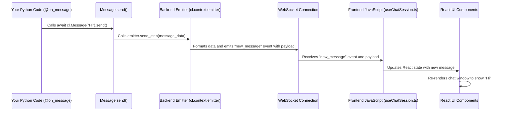

# Chapter 8: Emitter - The Real-Time Messenger

Welcome to Chapter 8! In [Chapter 7: Data Layer](07_data_layer.md), we saw how Chainlit can remember conversations and data permanently using persistence. But how does the information you create in your Python code (like messages, thinking steps, or images) actually show up in the user's chat window *instantly*? How does the backend "brain" talk to the frontend "face"?

That's the job of the **Emitter**.

## What is the Emitter? Why Do I Need It?

Imagine your Chainlit application has two main parts:

1.  **The Backend (Python):** Where your logic runs, where you process messages, call AI models, and decide what to show the user. This is like the application's "brain".
2.  **The Frontend (React UI):** The chat interface the user sees and interacts with in their web browser. This is like the application's "face".

These two parts need to talk to each other constantly. When your Python code decides to send a message, show a thinking step, or display an image, it needs a way to tell the frontend *right now* so the user sees the update immediately.

The **Emitter** is this communication channel. It's essentially a dedicated messenger service (using a technology called WebSockets) that connects the backend to the frontend.

Think of the emitter as the **internal mail system** of your Chainlit app. When your Python code has something new to show (a message, a step update, an element), it gives it to the emitter. The emitter instantly delivers this "mail" over the network to the user's browser, telling the frontend UI exactly what to display or update.

The **main use case** for understanding the Emitter is knowing **how real-time updates happen**. While you usually won't call the emitter directly very often, knowing it exists helps you understand:
*   Why messages appear instantly.
*   How loading indicators or intermediate [Steps](03_step.md) show up while your code is still running.
*   How [Elements](04_element.md) like images get displayed alongside messages.

It's the magic behind Chainlit's responsive, real-time feel.

## How Does It Work? Mostly Behind the Scenes!

The good news is that you rarely need to interact with the Emitter directly. Most of the core Chainlit features we've already learned about use the Emitter automatically under the hood:

*   When you call `await cl.Message(...).send()` ([Chapter 2: Message](02_message.md)), the `.send()` method uses the emitter internally to send the message data to the UI.
*   When you use `with cl.Step(...)` ([Chapter 3: Step](03_step.md)), the step context manager uses the emitter to send "step started" and "step ended" signals, along with the input/output data.
*   When an [Element](04_element.md) (like `cl.Image`) is created and associated with a message or step, the system uses the emitter to send the element's details to the UI.

You access the current context's emitter via `cl.context.emitter`. The `cl.context` object holds information about the current user's [Session](06_session_management.md), including the specific emitter instance responsible for communicating with *that* user's browser.

## Example: Implicit Usage in `Message.send()`

Let's look back at our simple echo bot:

```python
# app.py
import chainlit as cl

@cl.on_message
async def main(message: cl.Message):
    # Prepare the reply
    response_content = f"You said: {message.content}"
    reply_message = cl.Message(content=response_content)

    # Send the reply
    # *** The Emitter is used inside this .send() call! ***
    await reply_message.send()
```

**Explanation:**

1.  We create a `cl.Message` object called `reply_message`.
2.  We call `await reply_message.send()`.
3.  **Behind the scenes:** The `send()` method gets the current context's emitter (`cl.context.emitter`). It formats the `reply_message` object's data (content, author, ID, etc.) into a dictionary. Then, it calls a method on the emitter (like `emitter.send_step()`, because messages are a type of step internally) to send that dictionary over the WebSocket to the frontend.
4.  The frontend receives this data via its WebSocket listener and updates the UI to show the new message bubble.

You didn't write any code mentioning `emitter`, but it was the crucial component that made the message appear in the chat window.

## Example: Direct Usage (Sending a Toast Notification)

While most communication happens implicitly, there are a few cases where you might use the emitter directly. One common example is sending a "toast" notification – those little pop-up messages that appear briefly at the top or bottom of the screen.

```python
# app.py
import chainlit as cl

@cl.on_chat_start
async def start():
    await cl.Message(content="Welcome to the app!").send()

    # Directly use the emitter to show a toast notification
    await cl.context.emitter.send_toast(
        message="Chat started successfully!",
        type="success", # Can be 'info', 'success', 'warning', 'error'
        timeout=5      # Show for 5 seconds (default is 3)
    )

@cl.on_message
async def main(message: cl.Message):
    await cl.Message(content=f"Processing: {message.content}").send()
    # Maybe show a toast when processing is done
    await cl.context.emitter.send_toast(
        message="Processing complete.",
        type="info",
        timeout=3
    )
```

**Explanation:**

1.  `await cl.context.emitter.send_toast(...)`: Here, we are explicitly accessing the emitter through `cl.context` and calling its `send_toast` method.
2.  We provide the `message` text, the `type` (which controls the color/icon), and an optional `timeout`.
3.  The emitter sends a specific "toast" event over the WebSocket.
4.  The frontend has a listener for this event and displays the toast notification accordingly.

This shows how you *can* use the emitter directly for specific UI interactions not covered by the main abstractions like `Message` or `Step`.

## Under the Hood: The WebSocket Journey

Let's trace the journey of data from your Python code to the UI via the Emitter:

1.  **Connection:** When a user opens your Chainlit app in their browser, the frontend JavaScript code establishes a persistent WebSocket connection with the Chainlit backend server. Think of this as opening a dedicated phone line.
2.  **Event in Backend:** Your Python code decides to send something (e.g., `cl.Message(...).send()` is called).
3.  **Emitter Called:** The relevant backend function (like `Message.send`) calls a method on the `cl.context.emitter` object (e.g., `emitter.send_step(step_dict)`).
4.  **Data Formatting:** The emitter ensures the data (the message content, step details, element info) is in the correct dictionary format (JSON-like).
5.  **WebSocket Transmission:** The emitter uses the underlying WebSocket library (`socketio`) associated with that specific user's connection to send the formatted data packet over the network. The packet includes an `event` name (like `"new_message"`, `"update_step"`, `"element"`, `"toast"`) and the data payload.
6.  **Frontend Reception:** The Chainlit frontend JavaScript code, running in the user's browser, is constantly listening on its end of the WebSocket connection. It receives the packet.
7.  **Event Handling:** Based on the `event` name in the packet (`"new_message"`, etc.), the frontend triggers the corresponding handler function.
8.  **UI Update (React):** This handler function updates the state of the React application. For example, if the event is `"new_message"`, it adds the new message data to the list of messages. React then automatically re-renders the necessary parts of the chat interface to display the new information.

Here’s a simplified diagram of sending a message:



**Code Dive (Simplified):**

*   **`backend/chainlit/emitter.py`**: Defines `BaseChainlitEmitter` and the main `ChainlitEmitter` class.
    *   The `ChainlitEmitter` holds a reference to the specific user's `WebsocketSession`.
    *   Methods like `send_step`, `update_step`, `send_element`, `send_toast` format the data and ultimately call `self.emit(event_name, data)`.
    *   `self.emit` is a function provided by the `WebsocketSession` that uses the `socketio` library to send the event over the correct WebSocket connection (identified by `sid`).

    ```python
    # Simplified from backend/chainlit/emitter.py
    class ChainlitEmitter(BaseChainlitEmitter):
        session: WebsocketSession # Holds the specific user connection info

        def __init__(self, session: WebsocketSession) -> None:
            self.session = session

        # ... other methods ...

        def send_step(self, step_dict: StepDict):
            """Send a message/step to the UI."""
            # 'emit' comes from the WebsocketSession, linked to socketio
            return self.session.emit("new_message", step_dict)

        def send_element(self, element_dict: ElementDict):
            """Send an element to the UI."""
            return self.session.emit("element", element_dict)

        def send_toast(self, message: str, type: Optional[ToastType] = "info", timeout: int = 3):
             # timeout is handled frontend side in the toast library
            return self.session.emit("toast", {"message": message, "type": type})

    ```

*   **`backend/chainlit/context.py`**: This is where the `ChainlitContext` is created for each request/connection, holding the appropriate `session` and initializing the `emitter`.

    ```python
    # Simplified from backend/chainlit/context.py
    class ChainlitContext:
        emitter: "BaseChainlitEmitter"
        session: Union["HTTPSession", "WebsocketSession"]

        def __init__(self, session, ...):
            self.session = session
            # Chooses the right emitter based on session type
            if isinstance(self.session, WebsocketSession):
                self.emitter = ChainlitEmitter(self.session)
            else:
                # Fallback or different emitter for HTTP sessions
                self.emitter = BaseChainlitEmitter(self.session)

    # Global context variable, set per task/request
    context_var: ContextVar[ChainlitContext] = ContextVar("chainlit")

    # Helper to get the current context
    def get_context() -> ChainlitContext:
        return context_var.get()

    # The cl.context object you use accesses get_context()
    context: ChainlitContext = LazyProxy(get_context, ...)
    ```

*   **`libs/react-client/src/useChatSession.ts`**: This frontend file contains the React hook that sets up the WebSocket connection (`io(...)`) and registers listeners (`socket.on(...)`) for events sent by the backend emitter.

    ```typescript
    // Simplified concept from libs/react-client/src/useChatSession.ts
    const useChatSession = () => {
      // ... state setup (useRecoilState, etc.) ...
      const [session, setSession] = useRecoilState(sessionState);

      const connect = useCallback(() => {
        // ... setup socket connection using io() ...
        const socket = io(...);
        setSession({ socket });

        // *** Listen for events from the backend emitter ***
        socket.on('new_message', (message: IStep) => {
          // Update React state to add the message
          setMessages((oldMessages) => addMessage(oldMessages, message));
        });

        socket.on('element', (element: IElement) => {
          // Update React state to add the element
          setElements((old) => addOrUpdateElement(old, element));
        });

        socket.on('toast', (data: { message: string; type: string }) => {
          // Call the toast notification library (e.g., sonner)
          toast[data.type || 'info'](data.message);
        });

        // ... listeners for 'update_message', 'stream_token', 'task_start', etc. ...

      }, [/* dependencies */]);

      // ... return connect, disconnect ...
    };
    ```

The Emitter on the backend sends messages, and the corresponding `socket.on` listeners in the frontend receive them and update the UI.

## Conclusion

The **Emitter** is the vital communication link enabling the real-time, interactive experience in Chainlit. It acts as an internal messenger, using WebSockets to instantly send updates (messages, steps, elements, toasts) from your Python backend code to the user's browser frontend.

While you primarily interact with it indirectly through abstractions like `cl.Message`, `cl.Step`, and `cl.Element`, understanding its role helps clarify *how* information flows and appears dynamically in the chat interface. You learned that it's accessible via `cl.context.emitter` and can be used directly for specific tasks like sending toast notifications.

So far, we've focused heavily on the backend Python side of Chainlit. But what if you want to customize the frontend UI more deeply or build custom React components that interact with the Chainlit backend? The frontend also provides tools for this!

Ready to peek behind the curtain at the frontend? Let's explore [React Client Hooks](09_react_client_hooks.md).

---

Generated by [AI Codebase Knowledge Builder](https://github.com/The-Pocket/Tutorial-Codebase-Knowledge)