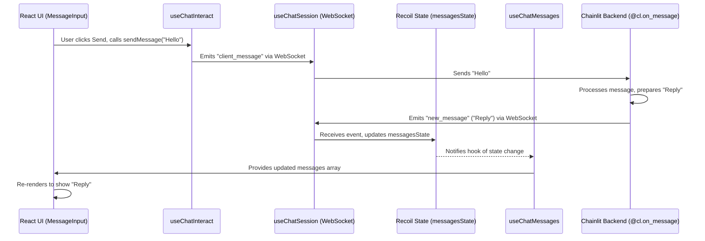

# Chapter 9: React Client Hooks - Building Your Custom Frontend

Welcome to the final chapter! In [Chapter 8: Emitter - The Real-Time Messenger](08_emitter.md), we saw how the Chainlit backend uses the Emitter to send real-time updates like messages and steps to the frontend user interface. That default UI is great, but what if you want to build your *own* chat interface using React? Or integrate Chainlit chat features into an existing React application?

That's where **React Client Hooks** come in. They are special tools provided by Chainlit specifically for frontend developers using React.

## What Are React Client Hooks? Why Do I Need Them?

Imagine you want to build a custom chat window. You need ways to:
*   Connect to the Chainlit backend.
*   Receive incoming messages and display them.
*   Send messages typed by the user.
*   Show loading indicators.
*   Handle errors.

Building all this communication logic (especially the real-time part using WebSockets) from scratch can be complicated.

The **`@chainlit/react-client`** package gives you pre-built **React Hooks** that handle these complexities for you. Think of them as **toolkits for your React frontend**:

*   `useChatSession`: Your connection manager.
*   `useChatMessages`: Your message display helper.
*   `useChatData`: Your status checker (loading, errors, etc.).
*   `useChatInteract`: Your interaction toolkit (sending messages, etc.).

The **main use case** is to **easily build custom React frontends that interact with a Chainlit backend**. These hooks abstract away the low-level details of WebSocket communication and state management (using a library called Recoil), letting you focus on building your UI components.

## Setting Up Your React Project

First, you need to add the Chainlit client library to your React project:

```bash
npm install @chainlit/react-client recoil
# or
yarn add @chainlit/react-client recoil
```

Because these hooks share information (like the connection status or the list of messages), they use a state management library called **Recoil**. You also need to tell the hooks where your Chainlit backend is running.

Here's how you typically set up your main React application file (like `App.tsx` or `main.tsx`):

```tsx
// src/main.tsx (or your app entry point)
import React from 'react';
import ReactDOM from 'react-dom/client';
import { RecoilRoot } from 'recoil'; // Import RecoilRoot

import { ChainlitAPI, ChainlitContext } from '@chainlit/react-client'; // Import Chainlit tools

import MyApp from './MyApp'; // Your main application component

// Replace with your actual Chainlit backend URL
const CHAINLIT_SERVER_URL = 'http://localhost:8000';

// Create an API client instance
const apiClient = new ChainlitAPI(CHAINLIT_SERVER_URL, 'webapp');

ReactDOM.createRoot(document.getElementById('root') as HTMLElement).render(
  <React.StrictMode>
    {/* Provide the API client to all components */}
    <ChainlitContext.Provider value={apiClient}>
      {/* Enable Recoil state management */}
      <RecoilRoot>
        <MyApp />
      </RecoilRoot>
    </ChainlitContext.Provider>
  </React.StrictMode>
);
```

**Explanation:**

1.  `npm install ...`: Installs the necessary packages.
2.  `RecoilRoot`: Wraps your application to enable Recoil's shared state features.
3.  `ChainlitAPI`: Creates an object to handle communication with the backend URL.
4.  `ChainlitContext.Provider`: Makes the `apiClient` available to all the Chainlit hooks within your app.

Now you're ready to use the hooks in your components!

## Connecting to the Chat: `useChatSession`

The first step is establishing a connection to the Chainlit backend's real-time service. `useChatSession` handles this.

```tsx
// src/components/ChatConnection.tsx
import React, { useEffect } from 'react';
import { useChatSession } from '@chainlit/react-client';

function ChatConnectionManager() {
  // Get connect and disconnect functions from the hook
  const { connect, disconnect } = useChatSession();

  // Connect when the component mounts
  useEffect(() => {
    console.log('Attempting to connect...');
    connect({
      // Optional: Pass user-specific environment variables if needed
      // userEnv: { "MY_API_KEY": "user_provided_key" }
    });

    // Disconnect when the component unmounts (cleanup)
    return () => {
      console.log('Disconnecting...');
      disconnect();
    };
  }, [connect, disconnect]); // Re-run if connect/disconnect change

  // This component doesn't render anything visible,
  // it just manages the connection lifecycle.
  return null;
}

export default ChatConnectionManager;
```

**Explanation:**

1.  `import { useChatSession } from '@chainlit/react-client';`: We import the hook.
2.  `const { connect, disconnect } = useChatSession();`: We get the `connect` and `disconnect` functions from the hook.
3.  `useEffect(() => { ... }, [connect, disconnect]);`: We use a React `useEffect` hook to run code when the component loads.
4.  `connect()`: Inside `useEffect`, we call `connect()`. This tells the hook to establish the WebSocket connection using the server URL provided earlier.
5.  `return () => { disconnect(); };`: The function returned from `useEffect` is a cleanup function. It runs when the component is removed, ensuring we disconnect cleanly.

You would typically include this `ChatConnectionManager` component somewhere high up in your application tree so the connection is managed globally.

## Displaying Messages: `useChatMessages`

Once connected, you need to display the chat messages. `useChatMessages` gives you access to the list of messages.

```tsx
// src/components/MessageList.tsx
import React from 'react';
import { useChatMessages } from '@chainlit/react-client';

function MessageList() {
  // Get the array of messages from the hook
  const { messages } = useChatMessages();

  return (
    <div>
      <h2>Messages</h2>
      {messages.length === 0 ? (
        <p>No messages yet.</p>
      ) : (
        <ul>
          {/* Map over the messages array */}
          {messages.map((message) => (
            // Display each message's content (output)
            // Use message.id as the key for React lists
            <li key={message.id}>
              <strong>{message.author || 'User'}:</strong> {message.output}
            </li>
          ))}
        </ul>
      )}
    </div>
  );
}

export default MessageList;
```

**Explanation:**

1.  `import { useChatMessages } from '@chainlit/react-client';`: We import the hook.
2.  `const { messages } = useChatMessages();`: We get the `messages` array. This array is automatically kept up-to-date by the Chainlit client library via the WebSocket connection and Recoil state.
3.  `{messages.map((message) => ...)}`: We loop through the `messages` array and render each one, showing the author and the main text content (`message.output`).

Whenever a new message arrives from the backend (sent via the [Emitter](08_emitter.md)), the `messages` array provided by this hook will update, and React will automatically re-render this component to show the new message.

## Handling Chat State: `useChatData`

How do you know if the app is connecting, if there was an error, or if the backend is busy processing something? `useChatData` provides access to this kind of state information.

```tsx
// src/components/ChatStatus.tsx
import React from 'react';
import { useChatData } from '@chainlit/react-client';

function ChatStatus() {
  // Get status flags from the hook
  const { loading, error, connected } = useChatData();

  if (error) {
    return <p style={{ color: 'red' }}>Error connecting to chat!</p>;
  }

  if (!connected) {
    return <p>Connecting...</p>;
  }

  if (loading) {
    return <p>Bot is thinking...</p>;
  }

  // If connected, not loading, and no error:
  return <p style={{ color: 'green' }}>Connected and ready.</p>;
}

export default ChatStatus;
```

**Explanation:**

1.  `import { useChatData } from '@chainlit/react-client';`: We import the hook.
2.  `const { loading, error, connected } = useChatData();`: We destructure the state variables we need.
3.  We use these boolean flags to display different status messages to the user.

This helps make your custom UI more informative about what's happening behind the scenes.

## Sending Messages: `useChatInteract`

Finally, how does the user send a message? `useChatInteract` provides functions for interacting with the backend, like sending messages.

```tsx
// src/components/MessageInput.tsx
import React, { useState } from 'react';
import { useChatInteract } from '@chainlit/react-client';
import { useChatData } from '@chainlit/react-client'; // To disable input when busy

function MessageInput() {
  const [inputValue, setInputValue] = useState('');
  // Get the sendMessage function
  const { sendMessage } = useChatInteract();
  // Get disabled state to prevent sending while loading
  const { disabled } = useChatData();

  const handleSubmit = (event: React.FormEvent) => {
    event.preventDefault(); // Prevent page reload on form submit
    if (!inputValue.trim() || disabled) {
      return; // Don't send empty messages or when disabled
    }

    // Construct the message object (only output is strictly needed)
    const messageToSend = {
      // id and createdAt will be added by the hook or backend
      output: inputValue,
      author: 'User', // Or derive from user login state
      type: 'user_message'
    };

    // Call sendMessage with the message object
    sendMessage(messageToSend);

    // Clear the input field
    setInputValue('');
  };

  return (
    <form onSubmit={handleSubmit}>
      <input
        type="text"
        value={inputValue}
        onChange={(e) => setInputValue(e.target.value)}
        placeholder="Type your message..."
        disabled={disabled} // Disable input when loading/disconnected
      />
      <button type="submit" disabled={disabled}>
        Send
      </button>
    </form>
  );
}

export default MessageInput;
```

**Explanation:**

1.  `import { useChatInteract } from '@chainlit/react-client';`: We import the hook.
2.  `const { sendMessage } = useChatInteract();`: We get the `sendMessage` function.
3.  `const [inputValue, setInputValue] = useState('');`: We use standard React state to manage the input field's content.
4.  `handleSubmit`: When the form is submitted:
    *   We prevent the default form action.
    *   We check if the input is empty or if the chat is disabled (`useChatData`).
    *   We create a basic message object containing the user's text (`inputValue`).
    *   `sendMessage(messageToSend)`: We call the function from the hook, passing our message object. This sends the message over the WebSocket to the Chainlit backend.
    *   We clear the input field.

## Under the Hood: How the Hooks Orchestrate Everything

These hooks work together seamlessly thanks to the WebSocket connection and the shared Recoil state:

1.  **User Types & Sends:** The user types a message in the `MessageInput` component and clicks "Send".
2.  **`useChatInteract`:** The `handleSubmit` function calls `sendMessage()` from `useChatInteract`. This hook gets the current WebSocket session (managed internally) and emits a `client_message` event to the backend.
3.  **Backend Processing:** Your Chainlit backend (running your Python code with `@cl.on_message`) receives the message, processes it, and prepares a reply (e.g., `await cl.Message("Reply").send()`).
4.  **Backend Emitter:** The backend's `cl.Message(...).send()` uses the [Emitter](08_emitter.md) to send the reply message back over the WebSocket (e.g., as a `new_message` event).
5.  **`useChatSession` Listens:** The `useChatSession` hook (or rather, the WebSocket connection it manages) receives the `new_message` event from the backend.
6.  **State Update (Recoil):** Internal listeners update the shared Recoil state, specifically adding the new message to the `messagesState` atom.
7.  **`useChatMessages` Reads State:** The `useChatMessages` hook is subscribed to `messagesState`. When the state updates, the hook gets the new array of messages.
8.  **UI Re-renders:** Because `useChatMessages` provides the updated `messages` array to the `MessageList` component, React detects the change and re-renders the list, displaying the new reply message to the user.

Here's a simplified sequence diagram:



This flow allows for a reactive UI where messages appear almost instantly after being sent by the backend.

## Code Dive (Simplified Pointers)

*   **Connection & Listeners (`useChatSession.ts`):** This hook uses the `socket.io-client` library (`io(...)`) to establish the connection. Crucially, it sets up listeners like `socket.on('new_message', ...)` and `socket.on('task_start', ...)` (as seen in the provided code). These listeners are responsible for catching events from the backend [Emitter](08_emitter.md).
*   **Shared State (`state.ts`):** This file defines Recoil atoms like `messagesState = atom<IStep[]>(...)`, `loadingState = atom<boolean>(...)`, etc. These atoms hold the application's state that needs to be shared across different components and hooks.
*   **Reading State (`useChatMessages.ts`, `useChatData.ts`):** These hooks use Recoil's `useRecoilValue(...)` function to read the current value from the corresponding atoms (`messagesState`, `loadingState`, etc.).
*   **Writing State & Emitting (`useChatInteract.ts`, `useChatSession.ts`):**
    *   `useChatInteract` uses `session?.socket.emit('client_message', ...)` to send data *to* the backend.
    *   The listeners set up in `useChatSession` use functions like `setMessages(...)` (which comes from `useSetRecoilState`) to update the Recoil atoms when data arrives *from* the backend.

## Conclusion

The **`@chainlit/react-client` hooks** (`useChatSession`, `useChatMessages`, `useChatData`, `useChatInteract`) provide a powerful yet simple way to build custom user interfaces for your Chainlit applications using React. They handle the complexities of real-time communication and state management, allowing you to focus on creating the look and feel you want. By combining these hooks, you can connect to your backend, display messages and status updates, and send user input effectively.

This concludes our journey through the core abstractions of Chainlit! From backend [Callbacks & Hooks](01_callbacks___hooks.md) to frontend React Client Hooks, you now have a foundational understanding of how Chainlit applications are built and how their different components interact. We hope this tutorial helps you create amazing conversational AI experiences! Happy coding!

---

Generated by [AI Codebase Knowledge Builder](https://github.com/The-Pocket/Tutorial-Codebase-Knowledge)