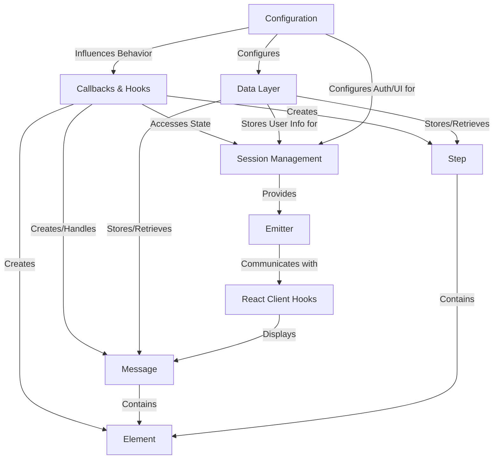

# Tutorial: chainlit

Chainlit is a *Python framework* designed to help you quickly build **conversational AI applications**.
It allows you to define your backend logic using Python functions (decorated as **Callbacks & Hooks**) that react to events like user messages.
You can send back *Messages*, visualize the AI's thought process using *Steps*, and display rich content like images or charts using *Elements*.
Chainlit provides a built-in web UI, handles communication between Python and the UI (*Emitter*, *Session Management*), supports configuration (*Configuration*), and can save chat history (*Data Layer*).
For custom frontends, it offers *React Client Hooks*.

**Source Repository:** [https://github.com/Chainlit/chainlit](https://github.com/Chainlit/chainlit)

## Chapters

1. [Callbacks & Hooks](01_callbacks___hooks.md)
2. [Message](02_message.md)
3. [Step](03_step.md)
4. [Element](04_element.md)
5. [Configuration](05_configuration.md)
6. [Session Management](06_session_management.md)
7. [Data Layer](07_data_layer.md)
8. [Emitter](08_emitter.md)
9. [React Client Hooks](09_react_client_hooks.md)

---

Generated by [AI Codebase Knowledge Builder](https://github.com/The-Pocket/Tutorial-Codebase-Knowledge)